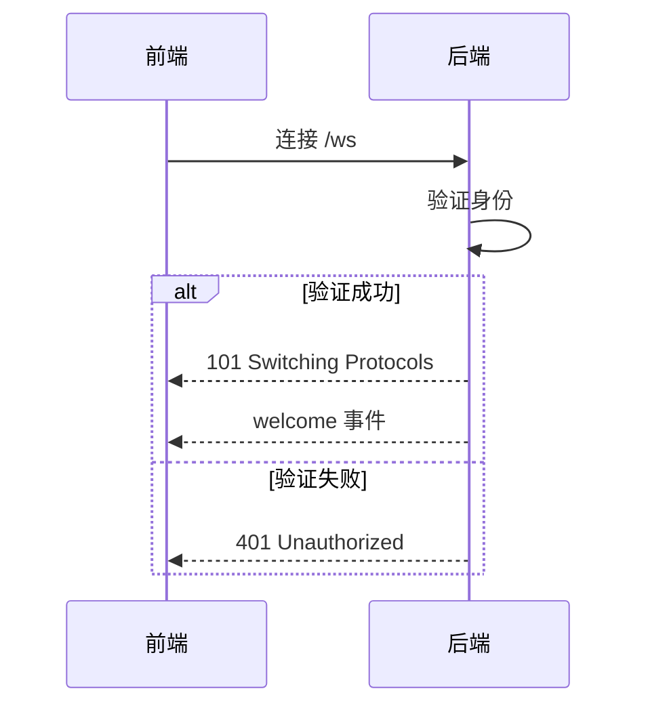
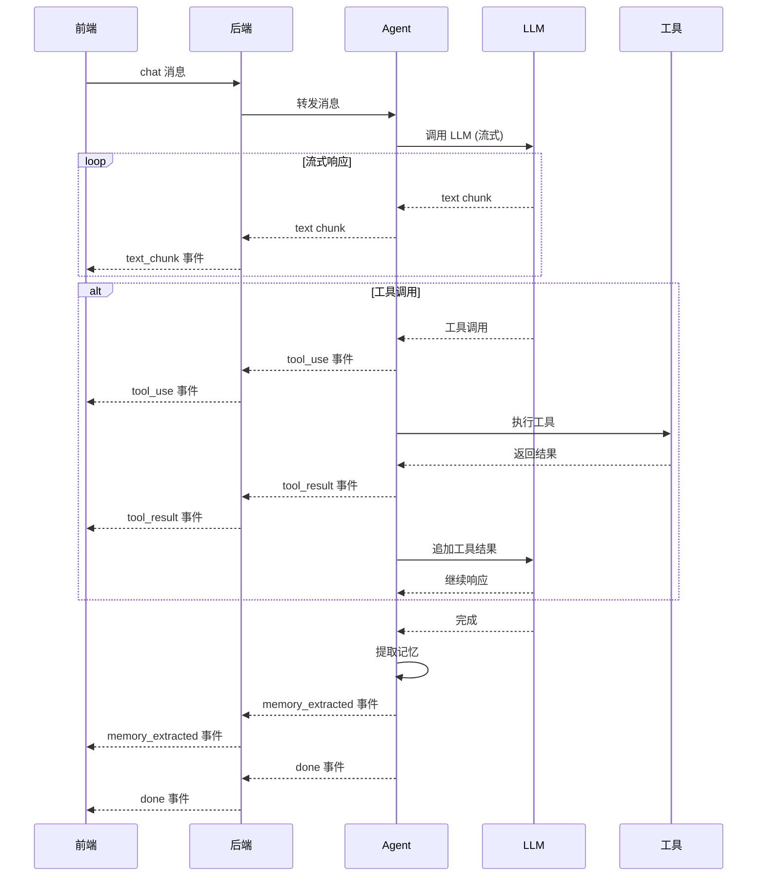
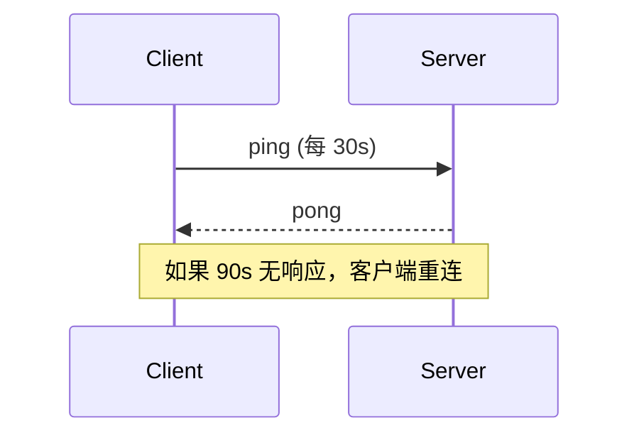

# WebSocket 通信协议

## 连接建立



---

## 客户端 → 服务端消息

### 消息类型定义

| type | 说明 | 必须字段 |
|------|------|---------|
| `chat` | 发送聊天消息 | `session_id`, `content` |
| `command` | 执行命令 | `session_id`, `command`, `args` |
| `soul_update` | 更新 SOUL.md | `session_id`, `content` |
| `memory_edit` | 编辑记忆 | `session_id`, `memory_id`, `content` |
| `ping` | 心跳检测 | 无 |

### Chat 消息

```typescript
interface ClientChatMessage {
  type: "chat";
  session_id: string;
  content: string;
  attachments?: Array<{
    type: "image" | "file";
    url: string;
    name: string;
  }>;
}
```

### Command 消息

```typescript
interface ClientCommandMessage {
  type: "command";
  session_id: string;
  command: string;  // 工具名称
  args: Record<string, any>;  // 工具参数
}
```

### Soul Update 消息

```typescript
interface ClientSoulUpdateMessage {
  type: "soul_update";
  session_id: string;
  content: string;  // SOUL.md 完整内容
}
```

### Memory Edit 消息

```typescript
interface ClientMemoryEditMessage {
  type: "memory_edit";
  session_id: string;
  memory_id: string;
  content: string;  // 更新后的内容
}
```

### Ping 消息

```typescript
interface ClientPingMessage {
  type: "ping";
  timestamp: number;
}
```

---

## 服务端 → 客户端事件

### 事件类型定义

| type | 说明 | 必须字段 |
|------|------|---------|
| `text_chunk` | 流式文本片段 | `session_id`, `content` |
| `tool_use` | 工具使用中 | `session_id`, `tool`, `args` |
| `tool_result` | 工具执行结果 | `session_id`, `tool`, `result` |
| `memory_extracted` | 记忆已提取 | `session_id`, `memories` |
| `done` | 对话完成 | `session_id` |
| `error` | 错误 | `session_id`, `message`, `code` |
| `welcome` | 欢迎信息 | `session_id`, `user_info` |
| `pong` | 心跳响应 | `timestamp` |

### Text Chunk 事件

```typescript
interface ServerTextChunkEvent {
  type: "text_chunk";
  session_id: string;
  content: string;
  timestamp: string;
}
```

### Tool Use 事件

```typescript
interface ServerToolUseEvent {
  type: "tool_use";
  session_id: string;
  tool: string;  // 工具名称
  args: Record<string, any>;  // 工具参数
  timestamp: string;
}
```

### Tool Result 事件

```typescript
interface ServerToolResultEvent {
  type: "tool_result";
  session_id: string;
  tool: string;
  result: any;  // 工具执行结果
  success: boolean;
  timestamp: string;
}
```

### Memory Extracted 事件

```typescript
interface ServerMemoryExtractedEvent {
  type: "memory_extracted";
  session_id: string;
  memories: Array<{
    id: string;
    content: string;
    category: string;
    timestamp: string;
  }>;
}
```

### Done 事件

```typescript
interface ServerDoneEvent {
  type: "done";
  session_id: string;
  timestamp: string;
}
```

### Error 事件

```typescript
interface ServerErrorEvent {
  type: "error";
  session_id: string;
  message: string;
  code: string;  // 错误码
  timestamp: string;
}
```

### Welcome 事件

```typescript
interface ServerWelcomeEvent {
  type: "welcome";
  session_id: string;
  user_info: {
    id: string;
    name: string;
    avatar?: string;
  };
  timestamp: string;
}
```

---

## 完整对话流程



---

## 错误码

| code | 说明 | HTTP 状态码 |
|------|------|-------------|
| `auth_failed` | 身份验证失败 | 401 |
| `rate_limited` | 触发速率限制 | 429 |
| `session_not_found` | Session 不存在 | 404 |
| `tool_not_found` | 工具不存在 | 404 |
| `tool_execution_failed` | 工具执行失败 | 500 |
| `model_call_failed` | 模型调用失败 | 500 |
| `security_blocked` | 安全策略拦截 | 403 |
| `invalid_message` | 消息格式无效 | 400 |
| `internal_error` | 内部错误 | 500 |

---

## 心跳机制



---

*文档版本: v1.0*  
*创建日期: 2026-05-05*
