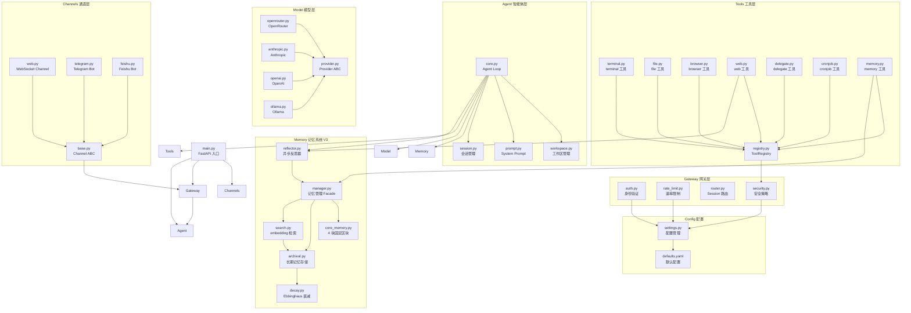
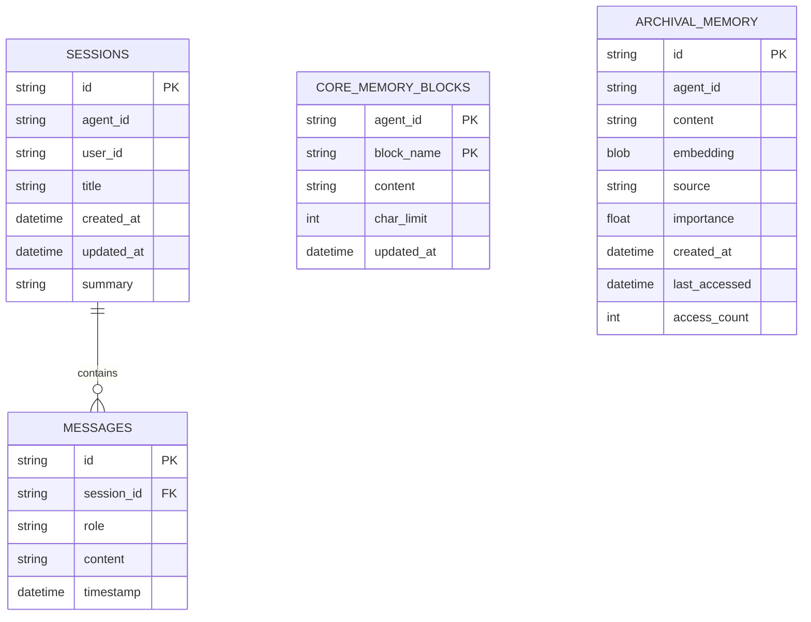

# 组件关系图

## 后端组件依赖关系

---

## 前端组件依赖关系

```mermaid
graph TB
    subgraph Pages 页面
        ChatPage[ChatPage.tsx<br/>聊天页]
        SoulPage[SoulPage.tsx<br/>人格编辑]
        MemoryPage[MemoryPage.tsx<br/>记忆管理]
        SkillsPage[SkillsPage.tsx<br/>技能市场]
        DashboardPage[DashboardPage.tsx<br/>工作看板]
        SettingsPage[SettingsPage.tsx<br/>系统设置]
    end
    
    subgraph Components 组件
        ChatWindow[ChatWindow.tsx<br/>聊天窗口]
        MessageBubble[MessageBubble.tsx<br/>消息气泡]
        StreamOutput[StreamOutput.tsx<br/>流式输出]
        ToolUseIndicator[ToolUseIndicator.tsx<br/>工具指示器]
        SoulEditor[SoulEditor.tsx<br/>SOUL 编辑器]
        ParamsSlider[ParamsSlider.tsx<br/>参数滑块]
        MemoryList[MemoryList.tsx<br/>记忆列表]
        MemoryEditor[MemoryEditor.tsx<br/>记忆编辑器]
        SkillCard[SkillCard.tsx<br/>技能卡片]
        SkillInstall[SkillInstall.tsx<br/>技能安装]
        TaskBoard[TaskBoard.tsx<br/>任务看板]
        StatsPanel[StatsPanel.tsx<br/>统计面板]
    end
    
    subgraph Stores 状态管理
        ChatStore[chatStore.ts<br/>聊天状态]
        SoulStore[soulStore.ts<br/>人格状态]
        WSStore[wsStore.ts<br/>WebSocket 状态]
    end
    
    subgraph Hooks
        UseWebSocket[useWebSocket.ts<br/>WS Hook]
        UseStream[useStream.ts<br/>流式 Hook]
    end
    
    %% App
    App[App.tsx] --> Pages
    App --> Stores
    
    %% Pages
    ChatPage --> ChatWindow
    ChatPage --> ChatStore
    SoulPage --> SoulEditor
    SoulPage --> ParamsSlider
    SoulPage --> SoulStore
    MemoryPage --> MemoryList
    MemoryPage --> MemoryEditor
    SkillsPage --> SkillCard
    SkillsPage --> SkillInstall
    DashboardPage --> TaskBoard
    DashboardPage --> StatsPanel
    
    %% Components
    ChatWindow --> MessageBubble
    ChatWindow --> StreamOutput
    ChatWindow --> ToolUseIndicator
    ChatWindow --> UseStream
    
    %% Stores
    ChatStore --> UseWebSocket
    WSStore --> UseWebSocket
```

---

## 完整项目文件结构

```mermaid
graph TB
    Root[TARS<br/>项目根目录] --> Frontend[frontend/<br/>前端]
    Root --> Backend[backend/<br/>后端]
    Root --> Docs[docs/<br/>文档]
    Root --> DesignDocs[DESIGN.md<br/>DESIGNV1.md]
    
    Frontend --> FrontendSrc[src/]
    Frontend --> FrontendPublic[public/]
    Frontend --> FrontendPackage[package.json]
    Frontend --> FrontendVite[vite.config.ts]
    
    FrontendSrc --> Components[components/]
    FrontendSrc --> Stores[stores/]
    FrontendSrc --> Hooks[hooks/]
    FrontendSrc --> Pages[pages/]
    FrontendSrc --> AppTs[App.tsx]
    FrontendSrc --> MainTs[main.tsx]
    
    Components --> ChatComp[Chat/]
    Components --> SoulComp[Soul/]
    Components --> MemoryComp[Memory/]
    Components --> SkillsComp[Skills/]
    Components --> DashboardComp[Dashboard/]
    
    Backend --> Tars[tars/<br/>核心包]
    Backend --> Data[data/<br/>数据目录]
    Backend --> PyProject[pyproject.toml]
    Backend --> Requirements[requirements.txt]
    
    Tars --> MainPy[main.py<br/>FastAPI 入口]
    Tars --> ChannelsDir[channels/<br/>通道层]
    Tars --> GatewayDir[gateway/<br/>网关层]
    Tars --> AgentDir[agent/<br/>智能体层]
    Tars --> MemoryDir[memory/<br/>记忆系统 V3<br/>core_memory/archival/<br/>reflector/decay/search/manager]
    Tars --> SkillsDir[skills/<br/>技能系统]
    Tars --> ToolsDir[tools/<br/>工具层]
    Tars --> ModelDir[model/<br/>模型层]
    Tars --> ConfigDir[config/<br/>配置]
    
    Data --> AgentsDir[agents/]
    Data --> SkillsDataDir[skills/]
    Data --> SessionsDir[sessions/]
    Data --> TarsDB[tars.db]
    
    Docs --> Doc01[01-项目概览/]
    Docs --> Doc02[02-技术方案/]
    Docs --> Doc03[03-实施计划/]
    Docs --> Doc04[04-运维文档/]
```

---

## 数据库 ER 图

> 记忆系统 V3 改为 SQLite 持久化：`core_memory_blocks` 存放 4 块固定区块（persona / user_profile / project_context / working_principles）；`archival_memory` 存放长期事实，使用 embedding 检索 + Ebbinghaus 衰减管理生命周期。Reflector 在 Agent 主循环结束后异步触发，自主更新两类记忆。

---

*文档版本: v1.0*  
*创建日期: 2026-05-05*
