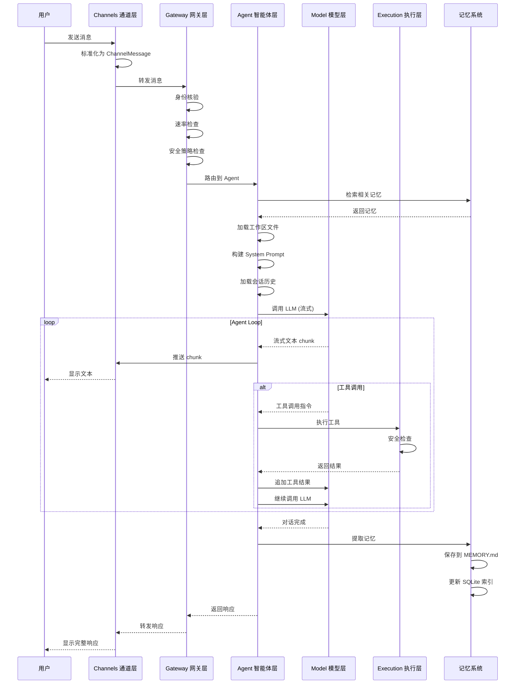
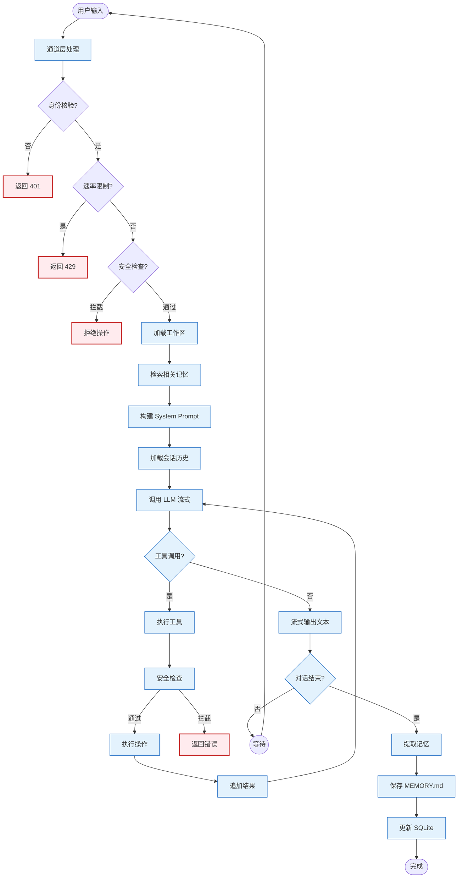
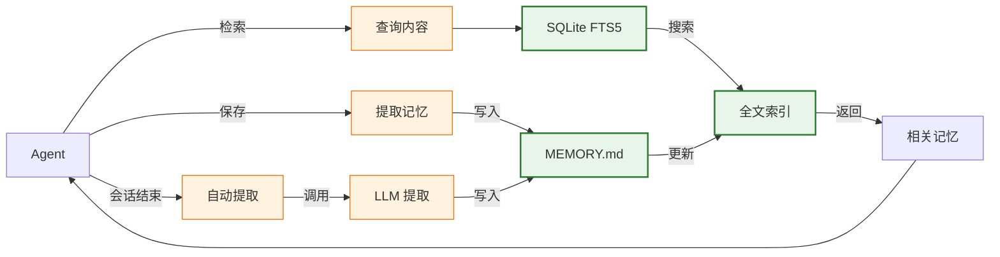
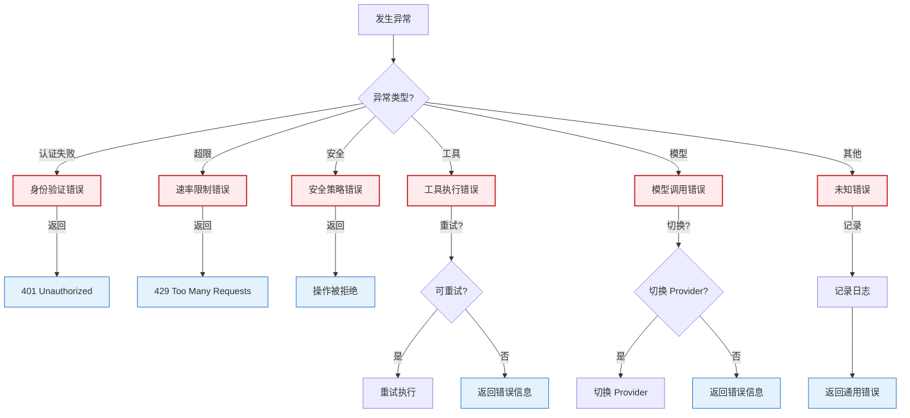

# TARS 数据流图

## 完整消息处理流程



---

## 请求数据流（正常对话流程



---

## 工具执行数据流

```mermaid
graph TB
    Agent[Agent] -->|调用工具| Registry[ToolRegistry]
    Registry -->|查找工具| ToolCheck{工具存在?}
    ToolCheck -->|否| NotFound[工具不存在错误]
    
    ToolCheck -->|是| SecurityCheck{安全策略?}
    SecurityCheck -->|拦截| Reject[拒绝执行]
    
    SecurityCheck -->|通过| Execute[执行工具]
    
    Execute -->|成功| Success[返回结果]
    Execute -->|失败| Fail[返回错误]
    
    Success -->|结果| Agent
    Fail -->|错误| Agent
    Reject -->|错误| Agent
    NotFound -->|错误| Agent
    
    subgraph 安全检查项
        PathCheck{路径白名单?
        CmdCheck{命令黑名单?}
        RateCheck{工具调用频率?}
    end
    
    SecurityCheck --> PathCheck
    PathCheck --> CmdCheck
    CmdCheck --> RateCheck
```

---

## 记忆系统数据流



---

## 异常处理流程



---

*文档版本: v1.0*  
*创建日期: 2026-05-05*
