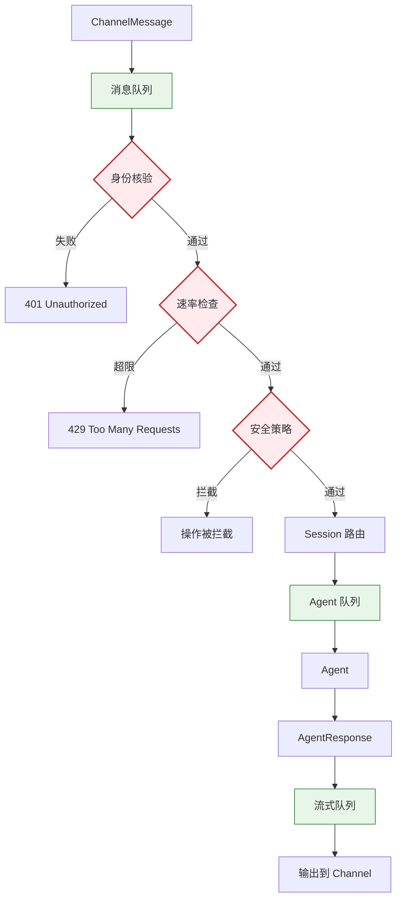
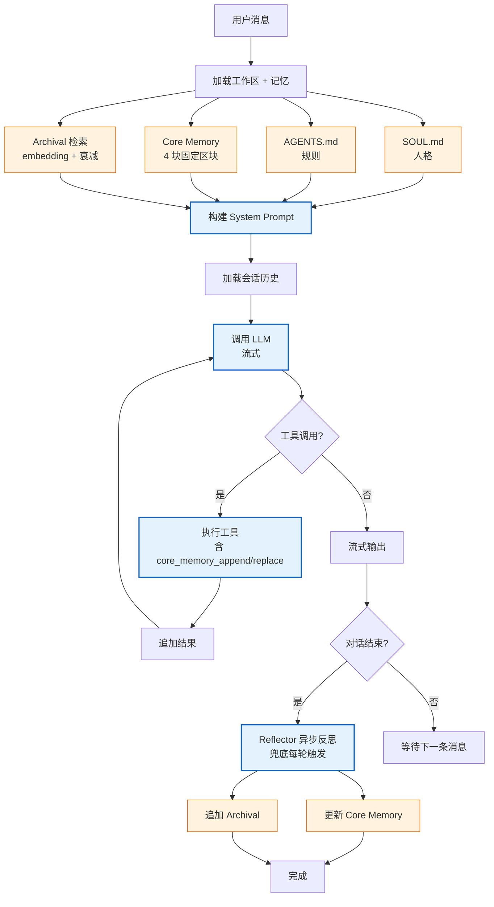
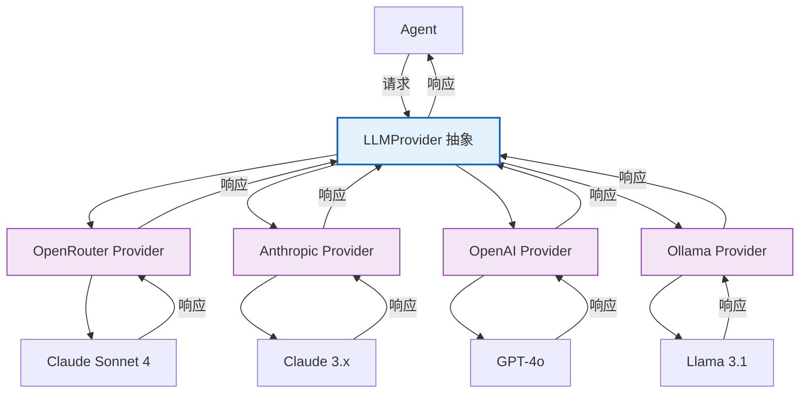
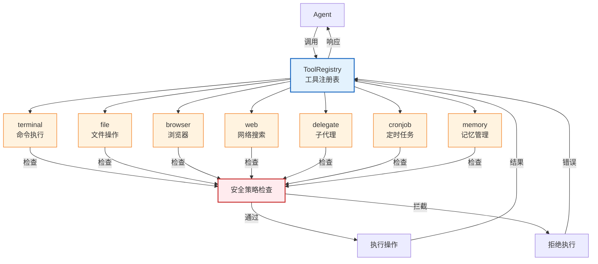
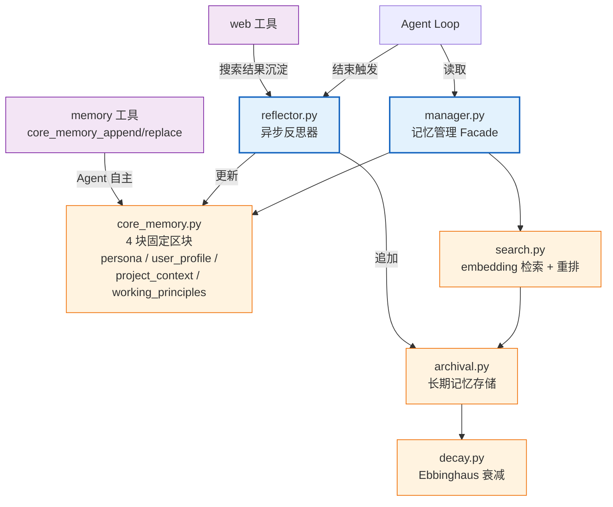

# TARS 各层详细设计

## Layer 1: Channels 通道层

```mermaid
graph LR
    UserInput[用户输入] -->|原始消息| Channel[Channel 抽象]
    
    Channel -->|receive()| Parser[消息解析]
    Parser -->|标准化| ChannelMsg[ChannelMessage]
    
    ChannelMsg --> Gateway
    
    Gateway -->|AgentResponse| Channel
    Channel -->|send()| UserOutput[用户输出]
    
    Channel -->|stream()| Stream[流式推送]
    Stream --> UserOutput
    
    subgraph 具体实现
        WebChannel[WebSocket Channel]
        TelegramChannel[Telegram Bot]
        FeishuChannel[飞书 Bot]
        WebhookChannel[Webhook API]
    end
    
    classDef abstract fill:#e3f2fd,stroke:#1565c0,stroke-width:2px;
    classDef impl fill:#fff3e0,stroke:#ef6c00,stroke-width:1px;
    
    class Channel abstract;
    class WebChannel,TelegramChannel,FeishuChannel,WebhookChannel impl;
```

**职责：** 接收用户输入，标准化为统一格式，转发给 Gateway

**Channel 抽象接口：**
```python
class Channel(ABC):
    @abstractmethod
    async def receive(self, raw_message: Any) -> ChannelMessage:
        """将原始消息标准化"""

    @abstractmethod
    async def send(self, session_id: str, response: AgentResponse) -> None:
        """发送完整响应"""

    @abstractmethod
    async def stream(self, session_id: str, chunk: str) -> None:
        """流式推送文本片段"""
```

---

## Layer 2: Gateway 网关层



**职责：** 中央协调器 - 身份核验、消息路由、安全策略

**核心模块：**
- **Auth & Identity** - 用户身份核验
- **Rate Limit** - Token Bucket 算法限流
- **Session Router** - Agent 路由分配
- **Security Policy** - 危险操作拦截

---

## Layer 3: Agent 智能体层



**职责：** 核心大脑 - 理解意图、规划任务、调用工具、生成回复

**Agent Loop 流程：**
1. 加载工作区（SOUL/AGENTS）+ 记忆系统（Core Memory 全量注入 + Archival embedding 检索召回 top-k）
2. 构建 System Prompt（包含 4 块 core memory：persona / user_profile / project_context / working_principles）
3. 加载会话历史
4. 调用 LLM（流式）
5. 工具调用 → 执行 → 追加结果 → 继续循环（Agent 可主动调用 `core_memory_append` / `core_memory_replace` 编辑核心记忆）
6. 会话结束 → Reflector 异步触发（兜底）→ 更新 Core Memory + 追加 Archival Memory（含 web 工具搜索结果沉淀）

---

## Layer 4: Model 模型层



**职责：** Provider 抽象 - 统一接口接入不同 LLM

**Provider 抽象：**
```python
class LLMProvider(ABC):
    @abstractmethod
    async def chat(self, messages: list, **kwargs) -> LLMResponse: ...

    @abstractmethod
    async def stream(self, messages: list, **kwargs) -> AsyncGenerator[Chunk, None]: ...

    @abstractmethod
    def get_schema(self) -> dict: ...
```

---

## Layer 5: Execution 执行层



**职责：** 手和脚 - 执行模型层规划的任务

**工具注册表：**
```python
class ToolRegistry:
    def __init__(self):
        self._tools: dict[str, Tool] = {}

    def register(self, name: str, schema: dict, handler: Callable, **kwargs):
        """注册工具"""

    def get_schema(self) -> list[dict]:
        """获取所有工具的 JSON Schema"""

    async def execute(self, name: str, args: dict) -> Any:
        """执行工具"""
```

---

## 记忆系统 V3（Letta 混合模式）



**职责：** 跨会话持久记忆 — 在 system prompt 中暴露 Agent 自我画像与上下文，并通过反思 + 衰减维护长期事实库

**模块职责：**
- **manager.py** — Facade，向 Agent Loop 暴露读写入口（构建 prompt 段、查询 archival、提交反思任务）
- **core_memory.py** — Core Memory 4 块区块的读写、字符上限校验，Agent 通过工具自主编辑
- **archival.py** — Archival Memory 持久化（CRUD、`source` 标签、`importance` 评分、访问统计）
- **search.py** — 基于 embedding 的相似度检索，可选重排策略
- **decay.py** — Ebbinghaus 衰减，结合 `last_accessed` / `access_count` / `importance` 计算保留分
- **reflector.py** — 每轮对话结束后异步运行：摘要 → 更新 core memory → 提取 archival 条目；作为 Agent 自主编辑的兜底

**Core Memory 区块约定：**

| 区块 | 内容 |
|------|------|
| `persona` | Agent 自身的人格定位 / 风格 / 长期准则 |
| `user_profile` | 用户身份、技术栈、偏好 |
| `project_context` | 当前项目目标、约束、关键决策 |
| `working_principles` | 协作过程中累积的原则、避坑经验 |

Agent 通过 `core_memory_append` / `core_memory_replace` 工具自主编辑核心记忆；Reflector 作为兜底每轮触发。Web 工具搜索结果通过 Reflector 自动沉淀为 `source=web` 的 archival 记忆。

详见 [docs/superpowers/specs/2026-05-06-memory-v3-letta-design.md](../../../superpowers/specs/2026-05-06-memory-v3-letta-design.md)

---

*文档版本: v1.0*  
*创建日期: 2026-05-05*
