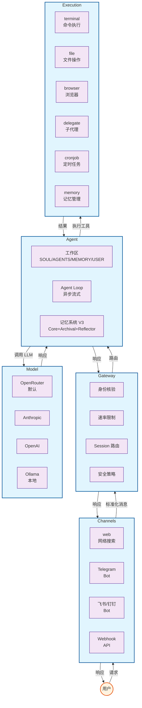
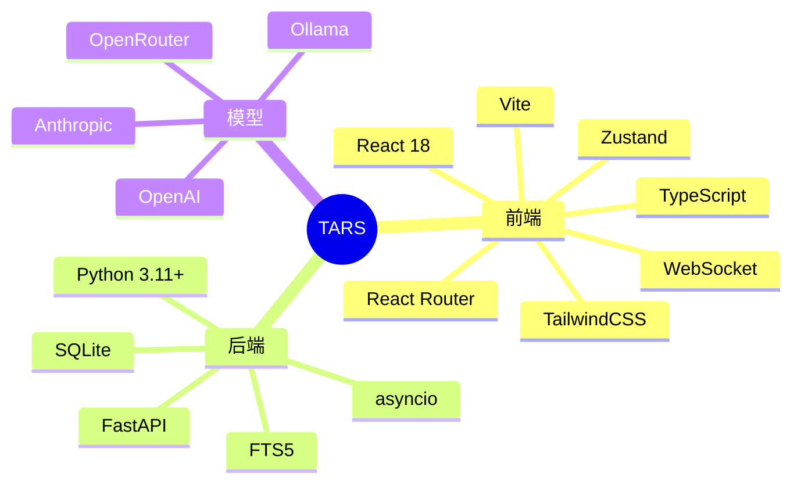

# TARS 系统全景图

## 五层架构总览



## 核心特性

| 特性 | 说明 |
|------|------|
| 🎭 可调人格 | honesty/humor/initiative/empathy 四参数实时调节 |
| 🧠 三层记忆 V3 | Core Memory（4 块固定区块注入 system prompt）+ Archival Memory（embedding 检索 + Ebbinghaus 衰减）+ Reflector（异步沉淀） |
| 🔌 模块化工具 | 自动发现，按需注册，安全隔离 |
| 🔀 Provider 抽象 | 不绑定特定 LLM，随时切换 |
| 🌐 多通道支持 | Web、Telegram、飞书、钉钉、Webhook |
| ⚡ 流式输出 | 实时响应，流畅交互 |

## 技术栈概览



## 工作区结构

```mermaid
graph LR
    AgentDir[~/.tars/agents/{agent_id}/] --> SOUL[SOUL.md<br/>人格定义]
    AgentDir --> AGENTS[AGENTS.md<br/>行动规则]
    AgentDir --> Skills[skills/<br/>技能目录]

    DB[(SQLite)] --> CoreBlocks[core_memory_blocks<br/>persona/user_profile/<br/>project_context/working_principles]
    DB --> Archival[archival_memory<br/>embedding 检索 + 衰减]

    classDef dir fill:#e8f5e9,stroke:#2e7d32,stroke-width:2px;
    classDef file fill:#fff3e0,stroke:#e65100,stroke-width:1px;
    classDef store fill:#e3f2fd,stroke:#1565c0,stroke-width:1px;

    class AgentDir dir;
    class SOUL,AGENTS,Skills file;
    class DB,CoreBlocks,Archival store;
```

> 记忆系统 V3：原 `MEMORY.md` / `USER.md` 已迁移到数据库 — Core Memory 的 `persona` / `user_profile` / `project_context` / `working_principles` 4 块区块由 Agent 自主通过 `core_memory_append` / `core_memory_replace` 编辑，Reflector 兜底每轮触发；长期事实进入 Archival Memory 通过 embedding 检索召回。

---

*文档版本: v1.0*  
*创建日期: 2026-05-05*
