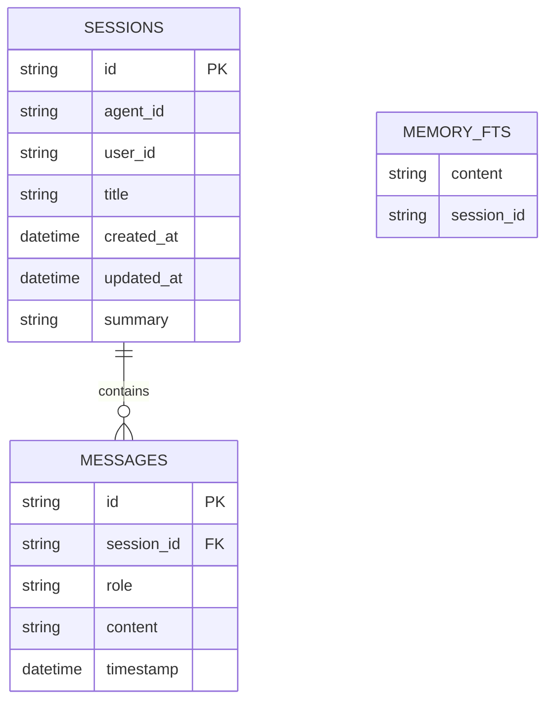

# 数据库设计

## SQLite Schema

```sql
-- 会话表
CREATE TABLE sessions (
    id TEXT PRIMARY KEY,
    agent_id TEXT NOT NULL,
    user_id TEXT NOT NULL,
    title TEXT,
    created_at TIMESTAMP NOT NULL DEFAULT CURRENT_TIMESTAMP,
    updated_at TIMESTAMP NOT NULL DEFAULT CURRENT_TIMESTAMP,
    summary TEXT
);

-- 消息表
CREATE TABLE messages (
    id TEXT PRIMARY KEY,
    session_id TEXT NOT NULL,
    role TEXT NOT NULL CHECK(role IN ('user', 'assistant', 'tool', 'system')),
    content TEXT NOT NULL,
    timestamp TIMESTAMP NOT NULL DEFAULT CURRENT_TIMESTAMP,
    FOREIGN KEY(session_id) REFERENCES sessions(id) ON DELETE CASCADE
);

-- FTS5 全文索引
CREATE VIRTUAL TABLE memory_fts USING fts5(
    content,
    session_id,
    tokenize = 'porter unicode61'
);

-- 索引
CREATE INDEX idx_sessions_agent_id ON sessions(agent_id);
CREATE INDEX idx_sessions_user_id ON sessions(user_id);
CREATE INDEX idx_sessions_updated_at ON sessions(updated_at);
CREATE INDEX idx_messages_session_id ON messages(session_id);
CREATE INDEX idx_messages_timestamp ON messages(timestamp);
```

---

## 触发器

```sql
-- 自动更新 updated_at
CREATE TRIGGER update_sessions_updated_at
AFTER UPDATE ON sessions
BEGIN
    UPDATE sessions SET updated_at = CURRENT_TIMESTAMP WHERE id = NEW.id;
END;

-- 消息插入时自动更新会话 updated_at
CREATE TRIGGER update_session_on_message
AFTER INSERT ON messages
BEGIN
    UPDATE sessions SET updated_at = CURRENT_TIMESTAMP WHERE id = NEW.session_id;
END;

-- FTS5 同步触发器
CREATE TRIGGER memory_fts_after_insert
AFTER INSERT ON messages WHEN NEW.role IN ('user', 'assistant')
BEGIN
    INSERT INTO memory_fts (content, session_id) VALUES (NEW.content, NEW.session_id);
END;
```

---

## ER 图



---

## 目录结构

```
~/.tars/
├── agents/
│   └── {agent_id}/
│       ├── SOUL.md
│       ├── AGENTS.md
│       ├── MEMORY.md
│       └── USER.md
├── skills/
│   └── {skill_id}/
│       └── SKILL.md
├── sessions/
│   └── {session_id}/  # (可选，用于附件)
└── tars.db
```

---

*文档版本: v1.0*  
*创建日期: 2026-05-05*
