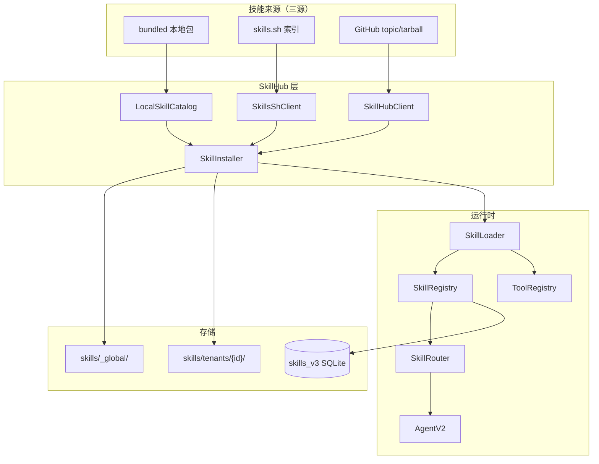
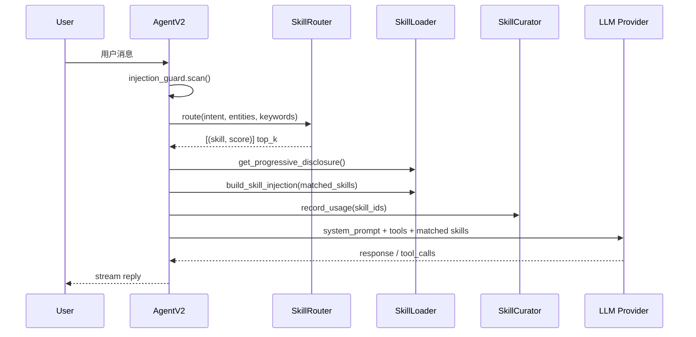

# TARS v4.1.0 技术方案 — Skill Ecosystem

## 文档信息

| 项 | 值 |
|----|-----|
| 版本 | v4.1.0 |
| 代号 | Skill Ecosystem |
| 状态 | Draft |
| 日期 | 2026-05-19 |
| 依赖 | v4.0.0 Hardened Base |

---

## 一、架构总览

### 1.1 技能生态数据流



### 1.2 Agent 技能激活流程（v4.1 目标态）



---

## 二、SkillHub 子系统

### 2.1 模块结构

```
backend/tars/skillhub/
├── __init__.py
├── models.py              # SkillHubPackage
├── client.py              # GitHub API
├── local_catalog.py       # bundled + catalog.json（v4.0.x 已有）
├── skills_sh_client.py    # [NEW] skills.sh 对接
├── installer.py           # 安装/卸载/更新
└── dependency_checker.py  # [NEW] bins + packages 检测

backend/data/
├── skillhub_catalog.json
└── skillhub/
    ├── skills/            # bundled .md 文件
    └── skills_sh_index.json  # [NEW] 搜索缓存
```

### 2.2 LocalSkillCatalog（已有，v4.1 扩展）

**职责**：管理 `catalog.json` + `bundle/*.md` + `skills/` 包目录。

**v4.1 扩展**：

```python
class LocalSkillCatalog:
    def load_entries(self) -> List[Dict]: ...
    def search(self, query: str) -> List[SkillHubPackage]: ...
    def get_featured(self) -> List[SkillHubPackage]: ...
    def resolve_install_source(self, skill_id: str) -> Optional[Dict]: ...
```

新增字段：

| 字段 | 类型 | 说明 |
|------|------|------|
| `featured` | bool | 精选展示 |
| `example_prompt` | str | 安装后试用文案 |
| `install_id` | str | 安全目录名（避免 `Excel / XLSX`） |
| `requires.bins` | list | CLI 依赖 |
| `source` | enum | bundled / package / github / skills_sh |

### 2.3 SkillsShClient（新增）

```python
class SkillsShClient:
    """对接 skills.sh 开放生态"""

    INDEX_CACHE = Path("data/skillhub/skills_sh_index.json")
    CACHE_TTL = 86400  # 24h

    async def search(self, query: str, limit: int = 20) -> List[SkillHubPackage]:
        """优先读缓存，过期则 subprocess 或 HTTP 刷新"""

    async def _fetch_via_cli(self, query: str) -> List[Dict]:
        """npx skills find {query} --json"""

    async def resolve_repo(self, package_ref: str) -> str:
        """skills.sh 包名 → owner/repo"""
```

**搜索 API 合并策略**（`/api/skillhub/search`）：

1. LocalSkillCatalog 本地结果（权重 +10）
2. skills.sh 缓存索引（dedupe by repo）
3. GitHub `topic:tars-skill` 补充（dedupe）
4. 标注 `installed` + `source` 字段

### 2.4 SkillInstaller 增强

**安装流程（统一）**：

```
resolve source (local | skills_sh | github)
    → dependency_checker.check()
    → download / copy
    → extract SKILL.md | skill.yaml
    → copy to skills/{scope}/{skill_id}/
    → skill_loader.load_one(skill_dir)
    → skill_registry.register()
    → invalidate manifest cache
    → curator.ensure_active(skill_id)
    → return { usage, example_prompt, ready: true }
```

**dependency_checker.py**：

```python
@dataclass
class DependencyReport:
    ok: bool
    missing_bins: List[str]
    missing_packages: List[str]
    install_hints: List[str]

class DependencyChecker:
    def check(self, meta: dict) -> DependencyReport:
        # shutil.which() for bins
        # importlib / pip show for packages
```

### 2.5 技能热重载

```python
# backend/tars/api/skills.py
@router.post("/reload")
async def reload_skills():
    skill_loader.invalidate_cache()
    skill_registry.clear()
    # tool_registry: 仅卸载 plugin 型 skill 对应的 tool
    skills = skill_loader.load_all()
    return {"success": True, "count": len(skills)}
```

**注意**：Builtin tools 不受影响；Plugin skill 的 tool 需按 skill_id 追踪后 unregister。

---

## 三、SkillRouter 接入

### 3.1 现状

| 组件 | 文件 | 状态 |
|------|------|------|
| SkillRouter | `skills/router.py` | 已实现，未接入 Agent |
| Scene Analyzer | `memory/scene_analyzer.py` | 异步，结果未反馈给 Router |
| keyword 注入 | `skills/loader.py` | v4.0.x 补丁，临时方案 |

### 3.2 同步快速路由（v4.1）

在 `AgentV2.handle_message` 构建 system prompt **之前**：

```python
def _route_skills_sync(self, user_content: str) -> List[Skill]:
    """不依赖 Scene Analyzer 的同步路由（keyword + intent 规则）"""
    if not self.skill_router:
        # fallback: loader.get_contextual_skill_injection
        return self._fallback_keyword_match(user_content)

    # 轻量 intent/keyword 提取（规则，非 LLM）
    intent, entities, keywords = self._extract_signals(user_content)
    routed = self.skill_router.route(intent, entities, keywords)
    return [s for s, score in routed]

def _extract_signals(self, text: str) -> tuple:
    """jieba/规则提取关键词；intent 来自 TaskDetector 或规则表"""
    ...
```

### 3.3 Prompt 构建（替换 v4.0.x 分支）

```python
def _build_static_prompt(self, user_content: str, ...) -> str:
    sp = self.workspace.build_context()

    # 1. 全量技能索引（渐进披露，仅 name + description）
    disclosure = self.skill_loader.get_progressive_disclosure()
    if disclosure:
        sp += f"\n\n{disclosure}"

    # 2. 路由命中的技能注入全文（top_k）
    matched = self._route_skills_sync(user_content)
    for skill in matched:
        if skill.prompt_template:
            sp += f"\n\n## 已激活技能: {skill.name}\n{skill.prompt_template}"
        if skill.id:
            skill_curator.record_activation(skill.id)

    # 3. sticky 技能（/skill activate 强制）
    if self._active_skill_id:
        sticky = self.skill_registry.get(self._active_skill_id)
        if sticky and sticky not in matched:
            sp += f"\n\n## 强制激活: {sticky.name}\n{sticky.prompt_template}"

    return sp
```

### 3.4 Scene Analyzer 联动（Phase 2 后期）

Scene Analyzer 异步结果写入 `working_context`，下一轮对话读取 refined intent 重新 route——不阻塞首 token。

### 3.5 配置

```yaml
# backend/config/skills.yaml
router:
  enabled: true
  top_k: 3
  min_score: 0.3
  auto_archive_days: 30
  sticky_override: true   # /skill activate 优先于 auto route
```

---

## 四、多租户技能隔离

### 4.1 目录与路径解析

```python
# backend/tars/skills/tenant_paths.py

def get_skills_dirs(tenant_id: str) -> List[Path]:
    base = Path("skills")
    dirs = [base / "_global"]
    tenant_dir = base / "tenants" / tenant_id
    if tenant_dir.exists():
        dirs.append(tenant_dir)
    return dirs

def install_target(tenant_id: str, skill_id: str, scope: str) -> Path:
    if scope == "global":
        return Path("skills/_global") / skill_id
    return Path("skills/tenants") / tenant_id / skill_id
```

### 4.2 SkillLoader 改造

```python
class SkillLoader:
    def __init__(self, skills_dirs: List[str], tenant_id: str = "default", ...):
        self.skills_dirs = [Path(d) for d in skills_dirs]

    def load_all(self) -> List[Skill]:
        for skills_dir in self.skills_dirs:
            for item in skills_dir.iterdir():
                ...
                skill.tenant_scope = "global" if "_global" in str(skills_dir) else self.tenant_id
```

### 4.3 Agent 租户上下文

`TenantContext` 扩展：

```python
@dataclass
class TenantContext:
    tenant_id: str
    skill_registry: SkillRegistry  # scoped view
    tool_registry: ToolRegistry    # scoped view
```

**Scoped SkillRegistry**：包装 global registry，`list_all()` 过滤 tenant 可见技能。

### 4.4 数据库

`skills_v3` 表新增列：

```sql
ALTER TABLE skills_v3 ADD COLUMN tenant_id TEXT DEFAULT 'global';
ALTER TABLE skills_v3 ADD COLUMN scope TEXT DEFAULT 'tenant';  -- global | tenant
```

---

## 五、前端技术方案

### 5.1 SkillHub Tab 增强

| 功能 | 组件 | 说明 |
|------|------|------|
| 精选筛选 | `ToolsView.vue` | ✅ v4.0.x 已有 |
| 来源标签 | `SkillHubCard` | 显示 bundled / skills.sh / GitHub |
| 依赖警告 | 安装确认 Modal | bins 缺失时展示 install_hints |
| 去试试 | `TrySkillButton` | 跳转 Chat + query param |

### 5.2 Chat 预填 prompt

```typescript
// router/index.ts
{ path: '/chat', component: ChatView, props: route => ({
    initialPrompt: route.query.prompt,
    activateSkill: route.query.skill,
})}

// ChatView.vue onMounted
if (props.initialPrompt) {
  chatStore.setInput(String(props.initialPrompt))
}
if (props.activateSkill) {
  // 可选：WS 发送 /skill activate
}
```

### 5.3 知识库引用卡片

```typescript
// utils/chatMarkdown.ts
interface KnowledgeCitation {
  doc_id: string
  title: string
  chunk_preview: string
}
// 解析 Agent 回复中的 [ref:doc_id] 标记渲染为可点击卡片
```

---

## 六、模块流水线

### 6.1 会议 → 知识库

**后端 API**：

```
POST /api/meeting/{id}/to-knowledge
Body: { collection_id?: string, auto_summarize?: bool }
Response: { doc_id, chunks_indexed }
```

**流程**：

1. 读取 meeting transcript + summary
2. 合并为 Markdown 文档
3. 调用 `knowledge.indexer.ingest_text()`
4. 更新 meeting 记录 `knowledge_doc_id`

**前端**：`TranscriptionDetail.vue` 增加「入库知识库」按钮。

### 6.2 knowledge_search 溯源

扩展 tool 返回：

```json
{
  "results": [{
    "content": "...",
    "doc_id": "abc",
    "doc_title": "2024-11-05 通话纪要",
    "source": "meeting",
    "score": 0.87
  }]
}
```

Agent system prompt 追加：

```
引用知识库内容时，在句末标注 [ref:doc_id]。
```

### 6.3 BI 数据源测试

```
POST /api/bi/datasources/{id}/test
Response: { ok: bool, latency_ms: int, error?: string }
```

SQL 审计扩展 `audit.log` action=`bi_query`，记录 `user_id`, `sql_hash`, `row_count`。

### 6.4 审计台

`AuditView.vue` 筛选器扩展：

```typescript
const actionGroups = {
  skill: ['skill_install', 'skill_uninstall', 'skill_activate'],
  tool: ['tool_call', 'tool_denied'],
  bi: ['bi_query'],
}
```

---

## 七、Provider Fallback

### 7.1 配置

```yaml
# config/providers.yaml
fallback:
  enabled: true
  chain:
    - { provider: deepseek, model: deepseek-chat }
    - { provider: ollama, model: llama3.2 }
  retry_on: [429, 500, 502, 503, 504, "timeout"]
  max_attempts: 3
```

### 7.2 实现位置

`ToolDispatcher` 不改动；在 `AgentV2._stream_llm` 或 `LLMProvider.chat` 包装层：

```python
async def chat_with_fallback(messages, tools, ...):
    for attempt, cfg in enumerate(fallback_chain):
        try:
            return await registry.get(cfg.provider).chat(...)
        except RetryableError as e:
            audit.log_model_fallback(from_provider=..., to_provider=..., reason=str(e))
    raise AllProvidersFailed()
```

### 7.3 用量统计

新表 `provider_usage`：

```sql
CREATE TABLE provider_usage (
  id INTEGER PRIMARY KEY,
  tenant_id TEXT,
  provider TEXT,
  model TEXT,
  tokens_in INTEGER,
  tokens_out INTEGER,
  created_at TEXT
);
```

---

## 八、API 变更汇总

| 方法 | 路径 | 变更 | Phase |
|------|------|------|-------|
| GET | `/api/skillhub/search` | 合并三源结果 + source 字段 | 1 |
| POST | `/api/skillhub/install` | + scope, + needs_setup 响应 | 1 |
| POST | `/api/skills/reload` | 真正实现 reload | 1 |
| GET | `/api/skills/` | tenant 过滤 | 3 |
| POST | `/api/meeting/{id}/to-knowledge` | 新增 | 4 |
| POST | `/api/bi/datasources/{id}/test` | 新增 | 4 |
| GET | `/api/audit` | + action_group 筛选 | 4 |
| GET | `/api/providers/usage` | 新增 | 5 |
| GET | `/api/memory/export` | 新增 | 5 |

---

## 九、数据库变更

```sql
-- Phase 3
ALTER TABLE skills_v3 ADD COLUMN tenant_id TEXT DEFAULT 'global';
ALTER TABLE skills_v3 ADD COLUMN scope TEXT DEFAULT 'tenant';

-- Phase 4
ALTER TABLE meetings ADD COLUMN knowledge_doc_id TEXT;

-- Phase 5
CREATE TABLE IF NOT EXISTS provider_usage (...);
```

迁移脚本：`backend/scripts/migrate_v410.py`

---

## 十、测试策略

| 层级 | 范围 | 目标 |
|------|------|------|
| 单元 | LocalSkillCatalog, DependencyChecker, SkillRouter.route | 100% 核心路径 |
| 集成 | install → reload → agent injection | 端到端 |
| API | skillhub/search 三源合并 | mock 外网 |
| E2E | 安装 PDF 技能 → Chat 触发 | Playwright（可选） |

新增测试文件：

```
backend/tests/test_skillhub_skills_sh.py
backend/tests/test_skill_router_integration.py
backend/tests/test_tenant_skills.py
backend/tests/test_meeting_to_knowledge.py
backend/tests/test_provider_fallback.py
```

---

## 十一、迁移指南（v4.0 → v4.1）

1. **skills 目录**：现有 `skills/*` 移至 `skills/_global/*`
2. **配置**：新增 `config/skills.yaml`
3. **环境变量**：`TARS_SKILLS_SH_ENABLED=true`（默认 true，内网可 false）
4. **数据库**：运行 `python scripts/migrate_v410.py`
5. **无需重启策略**：安装/卸载后调用 `/api/skills/reload`

---

## 相关文档

- 建设方案：[`docs/superpowers/plans/2026-05-19-tars-v4.1.0-plan.md`](../superpowers/plans/2026-05-19-tars-v4.1.0-plan.md)
- 执行计划：[`docs/03-实施计划/v4.1.0-implementation-plan.md`](../03-实施计划/v4.1.0-implementation-plan.md)
- Tools/Skills 重构（v2）：[`docs/superpowers/specs/2026-05-06-tools-skills-refactor-design.md`](../superpowers/specs/2026-05-06-tools-skills-refactor-design.md)
