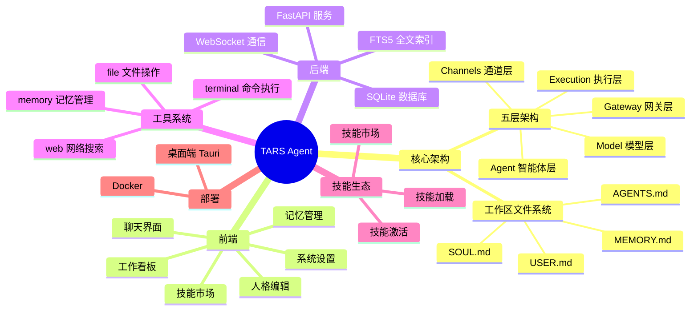
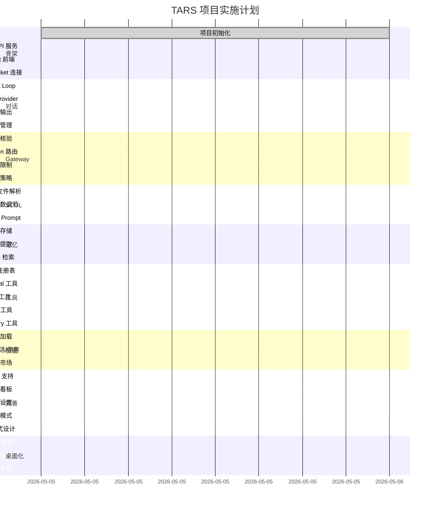

# TARS 项目路线图

## 功能模块思维导图

---

## 实施甘特图

---

## 里程碑清单

| 里程碑 | 目标 | 交付物 | 预计完成时间 |
|--------|------|--------|-------------|
| M1: 项目启动 | 基础项目结构、依赖配置 | 代码仓库、pyproject.toml、package.json | 2026-05-06 |
| M2: 可对话 | 完成基础聊天功能 | Web 界面、基本对话、流式输出 | 2026-05-15 |
| M3: 安全通道 | Gateway 层功能完整 | 身份核验、限流、安全策略 | 2026-05-20 |
| M4: 可调人格 | 工作区系统完整 | SOUL/AGENTS/MEMORY/USER 管理 | 2026-05-27 |
| M5: 有记忆 | 记忆系统完整 | 双层存储、自动提取、FTS5 检索 | 2026-06-03 |
| M6: 能执行 | 工具系统完整 | 4 个核心工具、安全隔离 | 2026-06-15 |
| M7: 可扩展 | 技能系统完整 | 技能加载、技能市场 | 2026-06-22 |
| M8: Web 产品 | 前端功能完整 | PWA、看板、设置、深色模式 | 2026-07-01 |
| M9: 桌面端 | 桌面应用完成 | Tauri 包装、系统集成 | 2026-07-10 |

---

## 分阶段实施计划详细

### Phase 1: 骨架 (✅ 完成)
**目标:** 项目初始化、基础架构搭建
**验收日期:** 2026-05-05
- ✅ 后端: FastAPI 项目、目录结构
- ✅ Channels 层抽象: Channel、ChannelMessage
- ✅ WebSocket 连接管理: ConnectionManager、心跳机制
- ✅ 前端: React + Vite + TypeScript + Tailwind + Zustand
- ✅ 通信: WebSocket 基础连接、Welcome 事件、Ping/Pong

### Phase 2: 对话 (✅ 完成)
**目标:** 基础对话功能
**验收日期:** 2026-05-05
- ✅ Agent Loop 实现
- ✅ LLM Provider 抽象
- ✅ 流式输出支持
- ✅ 会话管理（SQLite）
- ✅ 集成: Channels ↔ Agent ↔ Model
- ✅ 前端: 聊天界面、流式显示

### Phase 3: Gateway (✅ 完成)
**目标:** 安全可靠的消息通道
**验收日期:** 2026-05-05
- ✅ AuthManager: API Key 身份验证
- ✅ RateLimiter: Token Bucket 速率限制
- ✅ SecurityPolicy: 危险命令检测、路径白名单、内容过滤
- ✅ Gateway 主类: 整合所有网关功能

### Phase 4: SOUL (✅ 完成)
**目标:** 可配置的 Agent 人格
**验收日期:** 2026-05-05
- ✅ Soul 人格定义系统: SoulIdentity, SoulParameters, Soul
- ✅ SOUL.md 解析器
- ✅ USER.md 用户画像系统
- ✅ MEMORY.md 长期记忆系统
- ✅ WorkspaceManager: 工作区管理器
- ✅ System Prompt 动态构建

### Phase 5: 记忆 (✅ 完成)
**目标:** 持续学习和记忆
**验收日期:** 2026-05-05
- ✅ Database 扩展: memories 表 + memories_fts FTS5 索引
- ✅ Memory 数据类: id, content, category, importance, timestamp
- ✅ MemoryManager: 记忆管理器
- ✅ MemoryExtractor: 记忆提取器（正则匹配）
- ✅ FTS5 全文搜索: search_memories()
- ✅ 记忆自动提取: extract_and_save()
- ✅ 记忆上下文注入: get_context_for_query()

### Phase 6: 工具 (✅ 完成)
**目标:** 强大的执行能力
**验收日期:** 2026-05-05
- ✅ BaseTool: 工具抽象基类
- ✅ ToolRegistry: 工具注册表
- ✅ TerminalTool: 终端命令执行（安全检查）
- ✅ FileTool: 文件操作（read/write/list/delete/exists）
- ✅ WebTool: 网络搜索和网页获取
- ✅ MemoryTool: 记忆管理（add/search/list/delete）
- ✅ 安全隔离: 所有工具都经过 SecurityPolicy 检查

### Phase 7: 技能 (✅ 完成)
**目标:** 可扩展的技能生态
**验收日期:** 2026-05-05
- ✅ SKILL.md 格式解析器 (SkillParser)
- ✅ SkillLoader: 技能加载器
- ✅ 技能激活/停用功能
- ✅ 技能市场前端 UI
- ✅ 技能管理 API (GET/POST /api/skills)
- ✅ 5 个默认技能（天气查询/计算器/待办清单/故事生成器/代码助手）

### Phase 8: 完善 (✅ 完成)
**目标:** 完整的 Web 产品
- ✅ PWA 支持 (vite-plugin-pwa, manifest.json, 离线缓存)
- ✅ 工作看板页面 (UI 已完成)
- ✅ 系统设置页面
- ✅ 深色/浅色模式切换
- ✅ 响应式设计

### Phase 9: 桌面化
**目标:** 桌面客户端
- Tauri 包装
- 系统托盘
- 文件关联

### v4.0.5 "Skill Ecosystem Preview" (✅ 完成)
**目标:** SkillHub 本地可安装、知识库与 Agent 联动、Admin 管理台完善
**发布日期:** 2026-05-19

- ✅ SkillHub LocalSkillCatalog + bundled 10 技能可安装
- ✅ SKILL.md 格式安装 + Agent 上下文技能注入
- ✅ 知识库统一检索层 + Agent 主动检索
- ✅ 会议转写审批入库知识库
- ✅ AdminView 管理台（用户/角色/审计）
- ✅ SearXNG 私有搜索部署配置
- ✅ v4.1.0 规划文档三份

**文档：** [v4.0.5 发布说明](../01-项目概览/v4.0.5-release-notes.md)

### v4.1.0 "Skill Ecosystem" (✅ 完成)
**目标:** 技能装了就能用，SkillHub 三源生态，多租户技能隔离，模块流水线闭环
**发布日期:** 2026-05-19

- ✅ SkillHub：bundled + skills.sh + GitHub 三源搜索与安装
- ✅ SkillRouter 接入 Agent 主流程，按需注入技能
- ✅ 多租户 skills 目录隔离（`_global` + `tenants/{id}`）
- ✅ Provider fallback 链 + 记忆 export

**文档：**
- [建设方案](../superpowers/plans/2026-05-19-tars-v4.1.0-plan.md)
- [技术方案](../02-技术方案/v4.1.0-skill-ecosystem-design.md)
- [执行计划](./v4.1.0-implementation-plan.md)

### v4.1.1 "Experience Layer" (✅ 完成)
**发布日期:** 2026-05-19

- ✅ SkillHub 安装向导、聊天技能条、知识引用卡片
- ✅ 设置页版本升级 Changelog

**文档：** [v4.1.1 发布说明](../01-项目概览/v4.1.1-release-notes.md)

### v4.1.2 "Skill Ops & Platform UI" (✅ 完成)
**发布日期:** 2026-05-19

- ✅ SkillCurator 运维、待归档面板、Platform Tools Admin UI
- ✅ 技能目录扩展与 Router/Curator 测试

### v4.1.3 "Chat Polish & Remember" (✅ 完成)
**发布日期:** 2026-05-19

- ✅ 聊天顶栏精简、Ctrl/⌘+Enter 发送、回复复制
- ✅ 记住要点：`extract-from-turn` / `save-from-turn` + RememberMemoryDialog

### v4.1.4 "Memory Entity Tree" (✅ 完成)
**目标:** 记忆管理页按实体鸟瞰结构，保留原有人格/近期/长期/全部 Tab
**发布日期:** 2026-05-19

- ✅ `GET /api/memory/tree`（实体视图 + 压缩谱系 `view=provenance`）
- ✅ `GET /api/memory/tree/search`、`GET /api/memory/tree/relations`
- ✅ 记忆页「实体」Tab：左树右详情、搜索、Admin 用户联动
- ✅ 关系迷你 SVG 图；大树 >120 节点默认折叠顶层
- 📋 满屏力导向知识图谱（延后 v4.2+）

**文档：**
- [v4.1.4 发布说明](../01-项目概览/v4.1.4-release-notes.md)
- [设计说明](../superpowers/specs/2026-05-19-memory-tree-entity-view-design.md)
- [实施计划](../superpowers/plans/2026-05-19-memory-tree-entity-view-plan.md)

### InsightForge 鉴数 `INS-1.0.0` (✅ Phase 1 Profile 流水线 → Phase 2 指标问答)
**定位:** 业务场景深入阶段 — 独立能力线（与 TARS v4.x 主版本并行）
**Tag:** `@insight-forge` · Git `insight-v1.0.0`
**目标:** 连库冷启动建立业务知识；`insight_analyst` 只回答指标数值/口径/SQL
**数据库:** Oracle / MySQL / PostgreSQL / Doris（完整）+ JDBC（降级 Profile）
**原型图:** `analyst`/`developer` + `python_exec`；完整 BI 报表 → 未来报表模块

- 📐 产品设计、技术详设、实施计划（2026-05-19）
- ✅ Profile 流水线（Schema/统计/关系/LLM/知识库）INS-1.0.0-alpha
- 📋 Phase 2：`insight_ask_metric` + 鉴数工作台 UI
- 📋 角色 `insight_analyst`：禁用 `bi_generate_chart`
- 📋 导出 metrics.yaml 供报表/其他 Agent 消费

**文档：**
- [InsightForge 产品设计](../superpowers/specs/2026-05-19-insightforge-design.md)
- [技术详设 INS-1.0.0](../02-技术方案/insightforge-ins-v1-design.md)
- [实施计划](./insightforge-ins-v1-implementation-plan.md)

---

*文档版本: v1.12*
*创建日期: 2026-05-05*
*更新日期: 2026-05-19*
