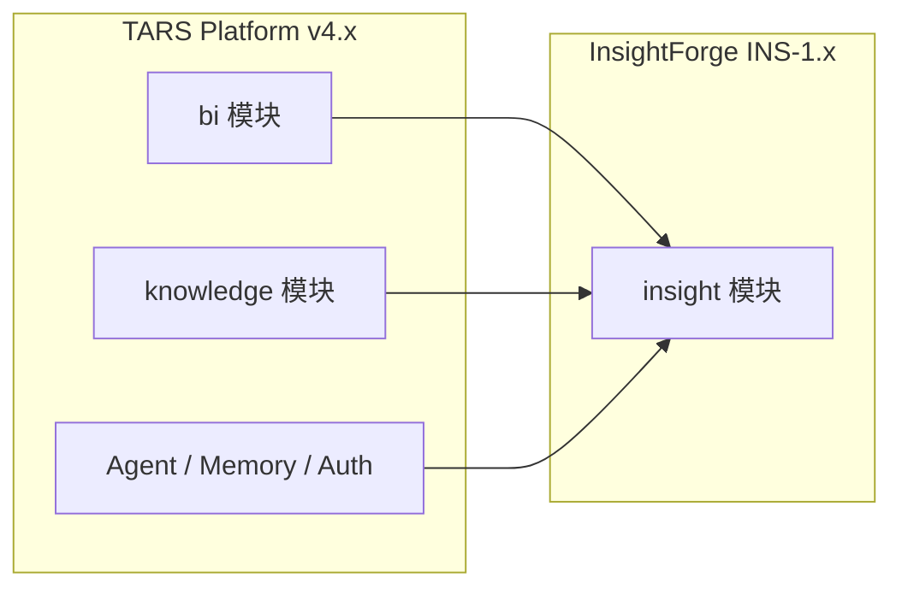
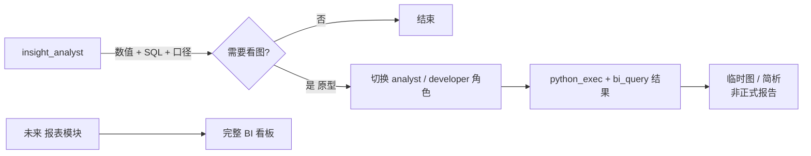
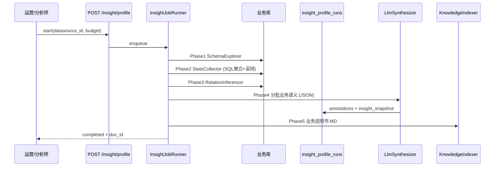
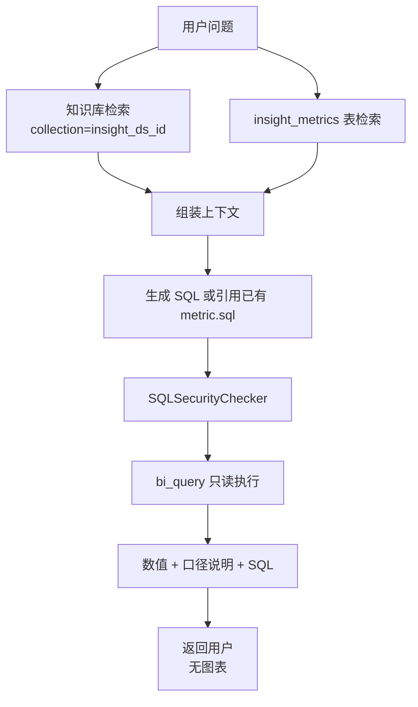

# InsightForge 鉴数 — 业务数据冷启动与指标问答

> **产品线代号**: InsightForge（鉴数）  
> **独立版本线**: `INS-1.0.0`  
> **能力 Tag**: `@insight-forge` · `tars.capability=insight-forge`  
> **Git 里程碑 Tag（建议）**: `insight-v1.0.0`  
> **平台基座**: TARS `v4.1.x+`（不替代主版本号，并行演进）  
> **文档日期**: 2026-05-19  
> **状态**: ✅ 评审通过（2026-05-19）→ 可进入实施

---

## 一、为什么单独成能力线

TARS 进入 **业务场景深入阶段**：目标不是「能连库、能画图」，而是：

1. **连上业务库 → 自动建立可检索的业务知识**（表义、关系、指标口径候选）
2. **对话只回答「数是多少、怎么算、用哪张表」** — 数值 / SQL / 口径说明
3. **正式 BI 报表、看板** — 未来独立模块；**简单原型图/分析** 可交给 TARS `python_exec`（见 §3.4）
4. InsightForge 核心输出 **可复用的计算契约**（数值、SQL、口径）

因此 InsightForge 是 **独立业务能力线**，与 `bi_analytics`（通用 BI 工作台）解耦：

| 维度 | `bi` 模块 | **InsightForge (`insight`)** |
|------|-----------|------------------------------|
| 定位 | 数据源管理 + 查询 + 可选图表 | **业务冷启动 + 指标问答引擎** |
| 用户动作 | 配数据源、标注 Schema、问数 | **一键鉴数（Profile）** → 之后只问指标 |
| 输出 | 查询结果、图表 | **数值、SQL、口径文档**（本角色不画图） |
| 版本 | 随 TARS v4.x | **INS-x.y.z 独立版本线** |

---

## 二、品牌与标识

### 2.1 名称

| 项 | 值 |
|----|-----|
| **英文名** | **InsightForge** |
| **中文名** | **鉴数** |
| **全称** | **TARS InsightForge · 鉴数** |
| **Slogan** | *连库即懂业务，问数即有依据。* |

「Forge」= 把原始库表 **熔炼** 成可用的业务知识；「鉴」= 鉴别、洞察。

### 2.2 版本与 Tag 规范

```
INS-<major>.<minor>.<patch>[-<qualifier>]

示例:
  INS-1.0.0          首个 GA（冷启动 + 指标问答）
  INS-1.1.0-beta.1   关系推断增强
  INS-1.0.1          仅修复，无行为变更
```

| Tag 类型 | 格式 | 用途 |
|----------|------|------|
| **能力 Tag** | `@insight-forge` | Skill、API、审计、前端路由命名空间 |
| **元数据 Tag** | `tars.capability=insight-forge` | 知识库 chunk、审计日志、配置项 |
| **Git Tag** | `insight-v1.0.0` | 发布里程碑，与 `v4.1.x` 解耦 |
| **模块 ID** | `insight` | `modules.yaml`、环境变量、特性开关 |

**响应头 / 健康检查**（可选）:

```http
X-TARS-Capability: insight-forge
X-TARS-Insight-Version: INS-1.0.0
```

### 2.3 与 TARS 主版本关系



- **依赖**: `bi.enabled=true` 且 `knowledge.enabled=true`
- **不依赖**: meeting、skillhub
- 主版本 changelog 中增加 **「InsightForge INS-x」** 小节，不混入 v4.2 功能描述 unless 平台级改动

---

## 三、产品边界（必须遵守）

### 3.1 InsightForge 做什么

| # | 能力 | 说明 |
|---|------|------|
| 1 | **鉴数冷启动（Profile）** | 连库 → Schema → 统计 → 关系候选 → LLM 业务摘要 → 知识库 |
| 2 | **业务知识沉淀** | `schema_annotations` + 知识库 collection + 机器可读 `insight_snapshot` |
| 3 | **指标问答** | 自然语言 → 口径检索 → SQL（只读）→ **数值结果** + 解释 |
| 4 | **计算契约导出** | SQL + 指标定义 YAML 片段，供报表/其他 Agent 消费 |
| 5 | **增量刷新** | 表结构变化后局部重跑 Profile |

### 3.2 InsightForge 不做什么（正式能力边界）

| 不做 | 交给 |
|------|------|
| **完整 BI 报表**（排版、订阅、权限发布、固定看板） | 未来 **报表模块** / Metabase / Superset |
| **Insight 角色内建图表** | `insight_analyst` 禁用 `bi_generate_chart`（硬约束） |
| 前端页面开发 | Cursor / 前端 Agent |
| 数据写入、ETL | 数仓团队 / 专用流水线 |
| 替代企业级 Data Catalog | 二期可对接 OpenMetadata API，首期不自建 |

### 3.3 对话角色：Metric Analyst（指标分析师）

专用角色模板 `insight_analyst`：

- **允许工具**: `insight_ask_metric`, `insight_explain_metric`, `insight_list_sources`, `bi_query`（只读）, `knowledge_search`
- **禁止工具**: `bi_generate_chart`, `python_exec`, 文件写入, shell（硬约束，保持「只问数」）
- **系统约束**: 回答必须包含「口径来源」；若知识库无定义则标注 `待业务确认`，禁止编造指标

### 3.4 原型验证：`python_exec` 协作（已确认）

**原则**: InsightForge **不负责画图**；拿到数之后，如需 **简单原型**（matplotlib/seaborn、pandas 二次分析、非正式说明），由 **其他 TARS 角色** 通过现有 `python_exec` 完成。



| 层级 | 方式 | 产出 |
|------|------|------|
| **鉴数（INS）** | `insight_analyst` | 数值、SQL、口径、metric YAML |
| **原型验证** | `analyst` / `developer` + `python_exec` | 临时图表、探索性分析脚本（**非完整报告**） |
| **正式 BI（未来）** | 独立报表模块 | 固定看板、订阅、权限、发布 |

**推荐用户话术（产品提示）**:

1. 先在鉴数模式问：「上周华东 GMV 是多少？」→ 得 SQL + 数  
2. 再切分析师：「用刚才的 SQL 结果画一张折线图，只做原型」→ `python_exec`  

**实现注意（INS-1.0）**:

- Chat 元数据可携带 `last_insight_sql` / `last_insight_result`，供 `python_exec` 引用，避免重复查库  
- 审计区分 `insight_ask` vs `python_exec`  
- 不在 INS 模块内嵌图表 API

### 3.5 支持的数据库（已确认）

**INS-1.0.0 GA 一等公民**（完整 Profile 统计 SQL + Metric QA）:

| 类型 | `db_type` | SQLAlchemy 驱动示例 |
|------|-----------|---------------------|
| **Oracle** | `oracle` | `oracle+oracledb://` 或 `oracle+cx_oracle://` |
| **MySQL** | `mysql` | `mysql+pymysql://` |
| **PostgreSQL** | `postgresql` | `postgresql+psycopg2://` |
| **Apache Doris** | `doris` | `mysql+pymysql://`（FE MySQL 协议，默认端口 9030） |

**JDBC 可连库（同期 best-effort）**:

- 凡可通过 **JDBC 桥接为 SQLAlchemy URL** 或项目统一配置的 `connection_url` 接入者，均允许 **Schema 抓取 + 只读查询**  
- Profile 统计层走 **`GenericStatsDialect`** 降级：通用 `COUNT` / `NULL` / 限行采样，不做方言专属优化  
- 文档要求运维提供：**只读账号 + 已验证的 connection_url**（含 JDBC 桥，如 JayDeBeApi / 内部网关）

```yaml
# insight.yaml — 数据库能力矩阵
databases:
  tier1: [oracle, mysql, postgresql, doris]   # 完整 profile（doris 走 MySQL 方言）
  tier2: [jdbc]                        # schema + 基础统计 + query
  tier2_note: "jdbc 需预置驱动与 URL 模板，见运维文档"
```

**与现有 `bi` 对齐**: 实施时扩展 `SchemaExplorer.SUPPORTED_TYPES` 与 `CreateDataSourceRequest` 校验；`sqlserver`、`clickhouse` 沿用 BI 已有能力，Profile 按 tier1/tier2 同样支持。

---

## 四、总体架构

### 4.1 逻辑架构

```mermaid
flowchart TB
  subgraph ui [前端]
    IFPage[鉴数工作台 /insight]
    DS[数据源列表]
    Run[冷启动任务]
    QA[指标问答入口]
  end

  subgraph api [API Layer]
    IR[/api/insight/*]
  end

  subgraph core [InsightForge Core]
    Job[InsightJobRunner]
    Pipe[ProfilePipeline]
    Stats[StatsCollector]
    Rel[RelationInferencer]
    LLM[LlmSynthesizer]
    Pub[KnowledgePublisher]
    Ask[MetricQaEngine]
  end

  subgraph store [存储]
    BIDS[(bi_datasources)]
    Runs[(insight_profile_runs)]
    Metrics[(insight_metrics)]
    KB[(knowledge vectors)]
  end

  subgraph external [外部]
    BizDB[(业务库只读)]
  end

  ui --> api --> core
  Pipe --> Stats --> Rel --> LLM --> Pub
  Job --> Pipe
  Pub --> KB
  Pub --> BIDS
  Ask --> KB
  Ask --> BIDS
  Ask --> BizDB
  Stats --> BizDB
```

### 4.2 代码目录（新建，不污染 `bi/` 语义）

```
backend/tars/insight/
  __init__.py
  version.py              # INS_VERSION = "1.0.0"
  config.py               # InsightBudget, 读 insight.yaml
  models.py               # ProfileRun, TableProfile, MetricDef
  sampler.py
  stats_collector.py
  relation_inferencer.py
  role_classifier.py        # fact/dimension/config/log
  llm_synthesizer.py
  knowledge_publisher.py
  profile_pipeline.py
  job_runner.py
  metric_qa_engine.py       # 指标问答编排
  exporters.py              # SQL / metric YAML 导出
  api/
    router.py               # /api/insight
  tools/
    insight_profile.py      # Agent 工具
    insight_ask_metric.py
    insight_explain_metric.py

backend/config/insight.yaml
skills/_global/insight_analyst/
  SKILL.md
  main.py

frontend/src/views/InsightView.vue
frontend/src/api/insight.ts
```

**与 `bi` 关系**: `insight` **调用** `SchemaExplorer`、`SQLAgent`、`DataSourceStore`，不 fork 实现。

---

## 五、核心流程

### 5.1 鉴数冷启动（Profile Pipeline）



**阶段定义**:

| Phase | 名称 | 输入 | 输出 | 可失败策略 |
|-------|------|------|------|------------|
| P0 | 预检 | connection_url | ok / error | 失败即终止 |
| P1 | Schema | inspector | tables/columns/fk | 跳过失败表 |
| P2 | Stats | budget | 每列 null%/distinct/样本 | 单表超时跳过 |
| P3 | Relations | fk + 启发式 | relations[] + confidence | 仅 core 表 |
| P4 | Synthesize | 压缩 JSON | annotations + metrics 候选 | 重试 2 次 |
| P5 | Publish | markdown | knowledge doc + metadata | 失败告警，不丢 P1-P4 |

### 5.2 指标问答（Metric QA）



**回答模板（强制结构）**:

```markdown
## 结果
{数值} {单位}

## 口径
{指标定义，引用 knowledge 文档章节或 metric_id}

## SQL
```sql
...
```

## 说明
{过滤条件、时间范围、数据新鲜度}

## 待确认
{若无口径则列出 open_questions}
```

---

## 六、数据模型

### 6.1 表 `insight_profile_runs`

```sql
CREATE TABLE insight_profile_runs (
  id TEXT PRIMARY KEY,
  datasource_id TEXT NOT NULL,
  tenant_id TEXT NOT NULL,
  capability_version TEXT NOT NULL DEFAULT 'INS-1.0.0',
  status TEXT NOT NULL,           -- pending|running|completed|failed|cancelled
  budget_json TEXT NOT NULL,
  progress_json TEXT NOT NULL DEFAULT '{}',
  insight_snapshot_json TEXT,     -- 机器可读全量结果
  knowledge_doc_id TEXT,
  error TEXT,
  started_at TEXT,
  finished_at TEXT,
  created_at TEXT NOT NULL,
  FOREIGN KEY (datasource_id) REFERENCES bi_datasources(id)
);

CREATE INDEX idx_insight_runs_ds ON insight_profile_runs(datasource_id, tenant_id);
CREATE INDEX idx_insight_runs_status ON insight_profile_runs(status);
```

### 6.2 表 `insight_metrics`（指标契约库）

```sql
CREATE TABLE insight_metrics (
  id TEXT PRIMARY KEY,
  datasource_id TEXT NOT NULL,
  tenant_id TEXT NOT NULL,
  metric_key TEXT NOT NULL,        -- 如 gmv_daily
  display_name TEXT NOT NULL,      -- 如日 GMV
  definition TEXT NOT NULL,        -- 自然语言口径
  sql_template TEXT,               -- 参数化 SQL，如 :start_date
  tables_json TEXT,                -- 依赖表列表
  status TEXT NOT NULL DEFAULT 'draft',  -- draft|approved|deprecated
  source TEXT NOT NULL,            -- profile|manual|conversation
  confidence REAL DEFAULT 0.0,
  created_at TEXT NOT NULL,
  updated_at TEXT NOT NULL,
  UNIQUE(datasource_id, tenant_id, metric_key)
);
```

### 6.3 扩展 `bi_datasources.schema_snapshot`

增加子树 `insight`（与 `profile` 设计合并为 `insight_snapshot` 引用）:

```json
{
  "insight": {
    "capability_version": "INS-1.0.0",
    "last_run_id": "uuid",
    "last_completed_at": "2026-05-19T10:00:00+08:00",
    "table_tiers": {
      "core": ["orders", "users"],
      "reference": ["products"],
      "skipped": ["tmp_import_202401"]
    },
    "relations": [
      {
        "from": "orders.user_id",
        "to": "users.id",
        "type": "fk_declared",
        "confidence": 1.0
      }
    ],
    "quality_flags": [
      {"table": "orders", "column": "amount", "issue": "null_rate_high", "value": 0.12}
    ]
  }
}
```

`schema_annotations` 结构 **保持与现有 SchemaAnnotator 兼容**。

### 6.4 知识库元数据约定

| 字段 | 值 |
|------|-----|
| `collection_id` | `insight_{datasource_id}` |
| `file_name` | `insightforge_{datasource_name}_v{run_short}.md` |
| `tars.capability` | `insight-forge` |
| `insight.version` | `INS-1.0.0` |
| `datasource_id` | UUID |
| `tenant_id` | 租户 |

Agent 检索时优先过滤 `tars.capability=insight-forge`。

---

## 七、性能与配额（InsightBudget）

配置文件 `backend/config/insight.yaml`:

```yaml
capability:
  name: insight-forge
  version: INS-1.0.0

profile:
  max_tables: 80
  max_columns_per_table: 60
  sample_rows_per_table: 500
  core_table_top_n: 20
  stats_timeout_sec: 15
  table_timeout_sec: 120
  parallel_tables: 3
  llm_batch_tables: 8
  llm_max_tokens_per_batch: 6000
  skip_table_patterns: ["^_", "^tmp_", "^bak_"]
  enable_incremental: true
  incremental_ttl_hours: 24

metric_qa:
  max_sql_rows: 1000
  sql_timeout_sec: 30
  require_metric_citation: true
  allow_ad_hoc_sql: true          # 无已批准 metric 时是否允许临时 SQL

publish:
  chunk_size: 400
  chunk_overlap: 80
  auto_approve_metrics: false     # true 则 profile 产出的 metric 直接 approved
```

**规模预估（默认 budget）**:

| 规模 | 表数 | 预计耗时 | 内存 |
|------|------|----------|------|
| 小 | ≤30 | 3–8 min | <500MB |
| 中 | 30–80 | 8–20 min | <1GB |
| 大 | >80 | 仅 Top80 + 告警 | 可控 |

---

## 八、API 设计

前缀: `/api/insight`  
依赖: `require_insight_module` + 租户 Header `X-Tenant-Id`

| 方法 | 路径 | 说明 |
|------|------|------|
| GET | `/version` | 返回 `INS-1.0.0` + 能力 tag |
| POST | `/datasources/{id}/profile` | 启动冷启动，`body: { budget?, force? }` |
| GET | `/datasources/{id}/profile/runs` | 历史任务列表 |
| GET | `/profile/runs/{run_id}` | 进度 + 结果摘要 |
| POST | `/profile/runs/{run_id}/cancel` | 取消 |
| GET | `/datasources/{id}/snapshot` | 机器可读 insight_snapshot |
| GET | `/datasources/{id}/metrics` | 指标契约列表 |
| POST | `/datasources/{id}/metrics` | 人工新增/修订指标 |
| PATCH | `/metrics/{metric_id}` | 审批 `draft → approved` |
| POST | `/datasources/{id}/ask` | 同步指标问答（短问题） |
| POST | `/datasources/{id}/ask/stream` | 流式问答（走 Agent） |
| GET | `/datasources/{id}/export` | 导出 `{ metrics.yaml, glossary.md }` |

**错误码**:

| code | 含义 |
|------|------|
| `INSIGHT_MODULE_DISABLED` | modules.yaml 未启用 insight |
| `INSIGHT_BI_REQUIRED` | bi 模块未启用 |
| `INSIGHT_NOT_PROFILED` | 未完成冷启动却调用 ask |
| `INSIGHT_BUDGET_EXCEEDED` | 超时/超表数 |
| `INSIGHT_METRIC_NOT_FOUND` | 要求引用 metric 但不存在 |

---

## 九、Agent 工具契约

### 9.1 `insight_profile_datasource`

```yaml
name: insight_profile_datasource
description: 对数据源执行鉴数冷启动，建立业务知识与指标候选。INS-1.0.0
parameters:
  datasource_id: string
  force: boolean  # 默认 false
```

### 9.2 `insight_ask_metric`（核心）

```yaml
name: insight_ask_metric
description: |
  回答业务指标数值问题。仅返回数值、口径、SQL，不生成图表。
  必须先有已完成的 profile 或已 approved 的 metric。
parameters:
  datasource_id: string
  question: string
  as_of_date: string  # 可选，ISO date
```

### 9.3 `insight_explain_metric`

```yaml
name: insight_explain_metric
description: 解释指标口径、依赖表字段，不执行查询
parameters:
  datasource_id: string
  metric_key: string  # 或自然语言 metric_name
```

### 9.4 角色模板 `insight_analyst`

```yaml
id: insight_analyst
display_name: 鉴数分析师
allowed_tools:
  - insight_ask_metric
  - insight_explain_metric
  - insight_profile_datasource
  - insight_list_sources
  - bi_query              # 内部由 insight_ask_metric 调用
  - knowledge_search
denied_tools:
  - bi_generate_chart
  - python_exec           # 原型图/analysis 请切换 analyst/developer
  - write_file
  - run_shell
system_addon: |
  你是 TARS InsightForge 鉴数分析师 (@insight-forge INS-1.0.0)。
  只回答数值、口径与 SQL。不制作报表、不画图、不执行 Python。
  若用户需要图表或探索性脚本，提示切换到「数据分析师」角色使用 python_exec 做原型验证。
  口径必须引用知识库或 insight_metrics；不确定时明确标注待业务确认。
```

**原型角色（平台已有，不新建）**: `analyst` / `developer` — 保留 `python_exec` + `bi_query`，可读 Session `insight_last`。

---

## 十、前端「鉴数工作台」

路由: `/insight`  
导航名: **鉴数** · 角标 `INS`

| 区域 | 功能 |
|------|------|
| 数据源卡片 | 连接状态、上次鉴数时间、INS 版本 |
| 一键鉴数 | 触发 profile，进度条（phase + %） |
| 指标契约表 | draft/approved 筛选，人工审批 |
| 问答侧栏 | 跳转 Chat 并带上 `role=insight_analyst` + `datasource_id` |
| 导出 | 下载 `metrics.yaml` + `glossary.md` 给报表工具 |

**不在此页**: 图表编辑器、仪表盘布局。

---

## 十一、安全与审计

| 项 | 措施 |
|----|------|
| 连接 | 强制只读账号；connection_url 加密存储（沿用 bi） |
| SQL | `SQLSecurityChecker` 白名单 SELECT/WITH |
| 审计 action | `insight_profile`, `insight_ask`, `insight_metric_approve` |
| 审计字段 | `datasource_id`, `run_id`, `metric_key`, `sql_hash`, `row_count` |
| 多租户 | 所有表带 `tenant_id`；知识库 collection 隔离 |
| LLM | 发送前脱敏连接串；样本值最多 5 个/列 |

---

## 十二、模块注册

`backend/config/modules.yaml` 新增:

```yaml
optional:
  insight:
    enabled: true
    description: "InsightForge 鉴数 — 业务冷启动与指标问答 INS-1.0"
    requires: [bi, knowledge]
    routes: ["/api/insight"]
    capability_tag: "insight-forge"
    version: "INS-1.0.0"
```

`ModuleRegistry.OPTIONAL_MODULES` 增加 `insight`；`load()` 时校验 `requires`。

---

## 十三、实施里程碑（INS 版本线）

| 里程碑 | 版本 | 交付 | 工期 |
|--------|------|------|------|
| **M0 设计评审** | INS-1.0.0-rc0 | 本文档 + API mock | — |
| **M1 冷启动** | INS-1.0.0 | Profile P1-P5 + 工作台进度 | 1.5 周 |
| **M2 指标问答** | INS-1.0.0 | ask API + insight_analyst + 三工具 | 1 周 |
| **M3 契约治理** | INS-1.0.0 | metrics 表 + 审批 + 导出 | 0.5 周 |
| **M4 加固** | INS-1.0.1 | 增量 profile、审计、压测 | 1 周 |
| **M5 增强** | INS-1.1.0 | 值域 overlap 关系、OpenMetadata 同步（可选） | 2 周 |

**GA 标准（INS-1.0.0）**:

- [ ] 100 表库默认 budget 20 分钟内完成 profile
- [ ] 知识库检索 + 5 道指标题 ≥4 准确（业务方验收）
- [ ] `insight_analyst` 零 `bi_generate_chart` / `python_exec` 调用
- [ ] Oracle / MySQL / PG 至少各 1 次 profile 冒烟；JDBC generic 模式不崩溃
- [ ] `analyst` + `python_exec` 基于 `insight_last` 原型路径 E2E 通过 1 例
- [ ] 审计链完整

---

## 十四、与报表 / 其他 Agent 的协作协议

InsightForge 导出 **Metric Contract**（YAML）:

```yaml
# insight_export/metrics.yaml — INS-1.0.0
apiVersion: insightforge.tars/v1
datasource_id: "..."
capability_version: INS-1.0.0
metrics:
  - key: gmv_daily
    display_name: 日 GMV
    definition: 已支付订单 amount 之和，不含退款
    sql_template: |
      SELECT COALESCE(SUM(amount), 0) AS value
      FROM orders
      WHERE status = 'paid'
        AND created_at >= :start AND created_at < :end
    tables: [orders]
    status: approved
```

报表 Agent **只读** 该文件执行，不在 TARS Chat 里画图。

---

## 十五、风险与对策

| 风险 | 对策 |
|------|------|
| LLM 编造口径 | 强制 citation；metric 需 approved 才可标「官方口径」 |
| 大库 profile 超时 | budget + 跳过 + 增量 |
| 与 bi 图表能力混淆 | 独立模块、独立角色、独立路由 |
| 知识库陈旧 | 定时/手动 re-profile；`last_completed_at` 展示 |
| 多数据源口径冲突 | metric_key 带 `datasource_id` 命名空间 |

---

## 十六、文档索引

| 文档 | 路径 |
|------|------|
| 本文（产品+架构） | `docs/superpowers/specs/2026-05-19-insightforge-design.md` |
| 技术详设 | `docs/02-技术方案/insightforge-ins-v1-design.md` |
| 实施计划 | `docs/03-实施计划/insightforge-ins-v1-implementation-plan.md` |
| 依赖的 BI 设计 | `docs/superpowers/specs/2026-05-15-bi-analytics-skill-design.md` |

---

## 十七、评审确认项（2026-05-19 已定稿）

- [x] 能力名 **InsightForge / 鉴数** — **确认**
- [x] 独立版本线 **INS-1.0.0** 与 Git tag **insight-v1.0.0** — **确认**
- [x] **`insight_analyst` 只问数、不画图** — **确认**（硬约束）；简单原型图/分析 → **`python_exec`**（`analyst` / `developer` 角色）；完整 BI 报表 → **未来报表模块**
- [x] 首期数据库 — **Oracle、MySQL、PostgreSQL、Doris（一等公民）** + **JDBC 可连库（best-effort 降级 Profile）**
- [x] `auto_approve_metrics` 默认 `false` — **确认**（metric 需人工 approved 方为官方口径）

---

*InsightForge — 业务场景深入阶段的第一个独立能力线。*
