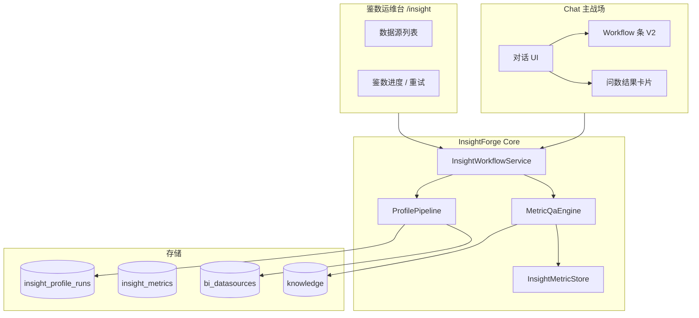
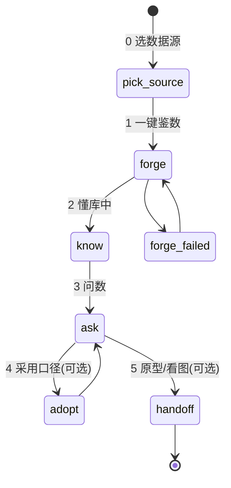
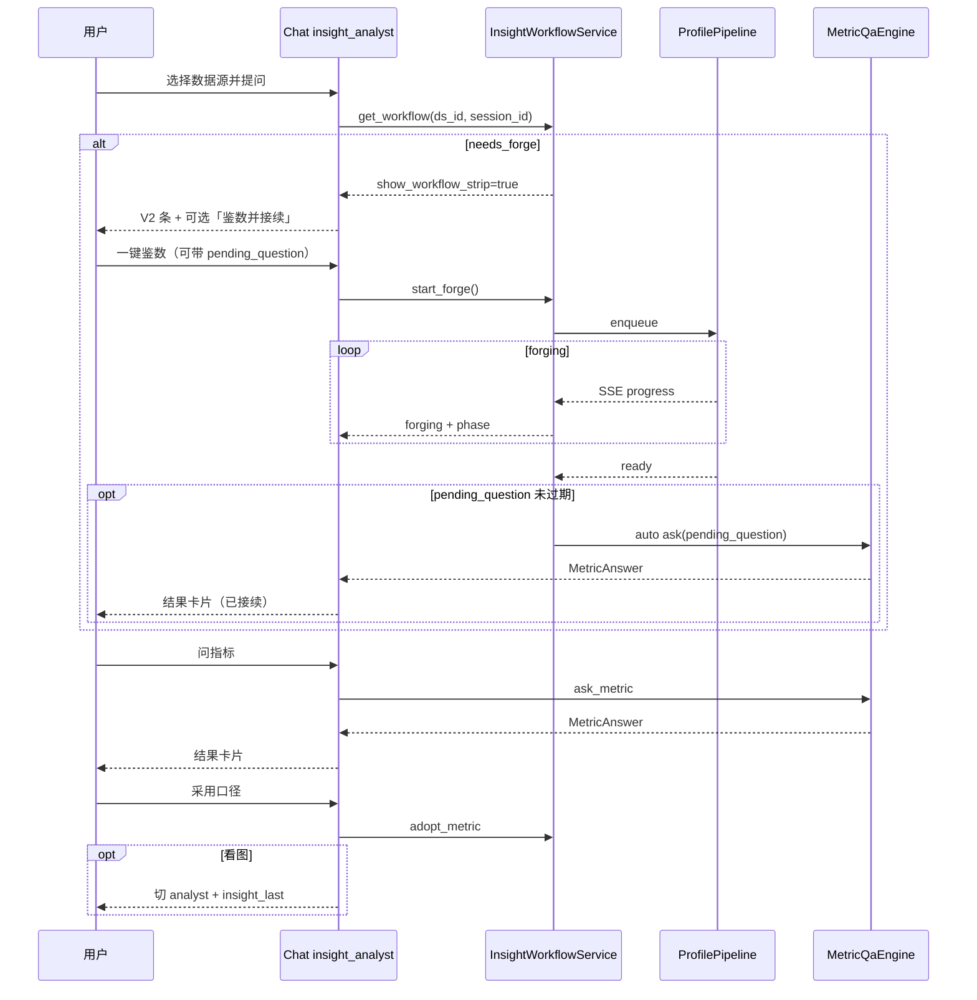
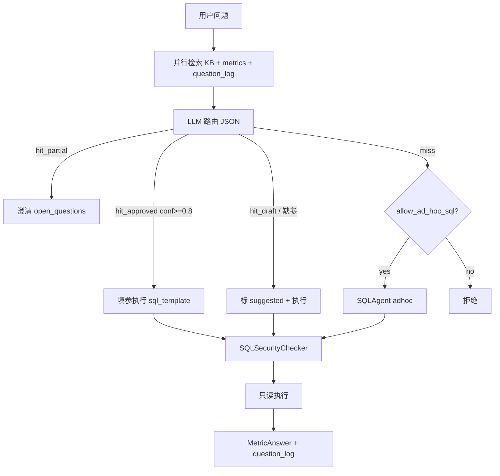

# InsightForge 鉴数 INS-2.0 — 对话优先重设计

> **产品线代号**: InsightForge（鉴数）  
> **版本线**: `INS-2.0.0`（相对 INS-1.0 为 major UX/流程变更）  
> **能力 Tag**: `@insight-forge` · `tars.capability=insight-forge`  
> **平台基座**: TARS `v4.1.x+`  
> **文档日期**: 2026-05-20（含 review + 二/三次修订 + H9 补遗）  
> **状态**: ✅ 评审通过定稿（2026-05-20）  
> **前置文档**: [INS-1.0 产品设计](./2026-05-19-insightforge-design.md)

---

## 评审决策摘要（2026-05-20）

| 维度 | 决策 |
|------|------|
| 战略（E） | **E2** — 业务 Copilot，对话优先 |
| 冷启动触发（P） | **P4** — 保留显式「一键鉴数」+ §3.3.1 首问自动接续 |
| 工作台（W） | **W1** — 运维面板（进度/失败/重跑），保留 Schema 速览抽屉 |
| 口径治理（G） | **G4 简化 + Chat「采用」** — 三档标签；默认 Chat 直采 official；§4.1 |
| Workflow 展示（V） | **V2** — 仅阻塞时显示步骤条 |
| 架构 | **方案 A** — `InsightWorkflowService` 中枢 + Chat/W1 门面 + **双层状态机** |

**驱动力**: 业务流程不顺（A）、前端体验差（D）、战略重定位为 Copilot（E）。

### 本次 review 关键修订（2026-05-20）

| # | 修订 | 章节 |
|---|------|------|
| P0-1 | 状态机拆为数据源级 + 会话级双层 | §3.1 |
| P0-2 | M1–M5 顺序：ask 能力先于 UI 改造 | §十二 |
| P0-3 | MetricQaEngine 三分支路由决策树 | §6.1–6.3 |
| P1-4 | 采用口径权限矩阵 + 并发 + 版本字段 | §4.1.1–4.1.3 |
| P1-5 | SSE `/forge/events` 事件协议 | §7.1 |
| P1-6 | MetricAnswer 扩展字段 | §6.4 |
| P1-7 | W1 瘦身保留 Schema 速览 + LLM 迁运维 | §9.2 |
| P2-A | 首问自动接续体验 | §3.3.1 |
| P2-B | InsightForge vs BI 对话路由 | §1.4 |
| P2-C | ChromaDB collection 兼容迁移 | §10.3 |
| 新增 | 问答日志 few-shot（借鉴 Vanna.ai） | §6.6 |
| 新增 | 业内方案对标与差异化 | §十四 |

### 二次修订（2026-05-20，评审合入）

| # | 修订 | 章节 |
|---|------|------|
| R1 | §1.2 与双层状态机 / W1 LLM 迁运维对齐 | §1.2 |
| R2 | §五 LLM 上下文改为 `datasource_state` + `session_state` | §五 |
| R3 | §3.3 与 §3.3.1 触发策略表述统一 | §3.3 |
| R4 | 默认 `adoption.require_review: false` | §4.1.1 |
| R5 | `/profile` 作为 `/forge` 兼容别名至 M5 | §七 |
| R6 | SSE 环形缓冲：进程内实现，非 DB 列 | §7.1、§10.2 |
| R7 | `insight_metrics` 版本唯一约束迁移 SQL | §10.3 |
| R8 | Agent 工具补全 + `bi_query` 兜底标注约束 | §八 |

### 三次修订（2026-05-20，可操作性二审）

| # | 修订 | 章节 |
|---|------|------|
| H1 | SSE 部署约束（workers=1 或 sticky session） | §7.1 |
| H2 | 同步 `/ask` 不写 `asking`；仅流式接口设置 | §3.1.2 |
| H3 | 👎 降级：30 天窗口 + ≥30% 占比 + 7 天防抖 | §4.1.2 |
| H4 | few-shot ≤5 条 / ≤2000 tokens / 200ms 超时跳过 | §6.6 |
| H5 | `pending_question` TTL 从 `ready` 起算 | §3.3.1 |
| H6 | `hit_partial` 二轮硬降级 | §6.1 |
| H7 | `/schema_preview` 不新建，前端用 `/brief` | §七、§9.2 |
| H8 | `tests/insight/eval_set.yaml` + CI | §十二 |
| H9 | `MetricAnswer.candidates` + `AskMetricRequest` + §9.2 注明 `/brief` | §6.4、§七 |

---

## 一、产品重定位

### 1.1 是什么

**InsightForge = 业务只读库上的指标 Copilot**

- 用户主路径在 **Chat**（`insight_analyst`）：问数、追问、解释口径、**在对话中「采用」即升为官方指标**（默认无需审批队列，见 §4.1.1）。
- **鉴数冷启动（Profile）** 仍通过显式「一键鉴数」触发（P4），但执行与进度由统一 Workflow 管理。
- **`/insight` 运维台（W1）** 仅服务运维：数据源状态、鉴数进度、失败重试，不承担问数与指标审批 UI。

**Slogan（建议）**: *连库、鉴数、在对话里问清每一个数。*

### 1.2 与 INS-1.0 的差异

| INS-1.0 | INS-2.0 |
|---------|---------|
| 鉴数工作台为主界面 | Chat 为主界面 |
| 工作台内 LLM 配置、表注解/关系主路径 | LLM 迁 `/admin/insight/llm`；Schema **速览抽屉**（只读）；问表走 Chat 工具 |
| 指标契约表 + 工作台审批 | Chat「采用口径」+ 档级标签（默认直采） |
| 无统一 workflow | `InsightWorkflowService` **双层**状态机（数据源 + 会话，§3.1） |
| 问数主要在 Chat（规划） | 问数为唯一主路径；同步 API 供卡片 |

### 1.3 边界（继承并收紧）

**做**: 只读 Profile、知识沉淀、指标问答（数值/口径/SQL）、Chat 采用指标、导出 YAML（按需）。

**不做**: 内建图表、完整 BI 报表、ETL、企业级 Data Catalog UI。

**协作**: 原型图 → 切换 `analyst`/`developer` + `python_exec` + `insight_last`（同 INS-1.0 §3.4）。

### 1.4 与 BI 模块的对话路由

| 库状态 | 优先工具 | 兜底 |
|--------|---------|------|
| `ready`（已鉴数） | `insight_ask_metric` | 仅口径完全 miss 时 LLM 可选用 `bi_query`（须标 adhoc） |
| `needs_forge` / `forge_failed` | strip 引导鉴数 | 用户坚持时退化为 `bi_query`（无 official 标签） |
| 临时连库（无 datasource_id） | `bi_query` | 不出 `insight_ask_metric` |

**实现**：`insight_analyst` system prompt 约束「优先 `insight_ask_metric`；仅在 `INSIGHT_NOT_PROFILED` 或 `miss + !allow_ad_hoc_sql` 时用 `bi_query`」。

**`bi_query` 兜底约束（R8）**：凡经 `bi_query` 返回的数值，**不得**标为 `official`；须明示 `caliber_tier=adhoc` 或「未走鉴数口径」。

---

## 二、总体架构



**原则**: Chat 与 W1 **不各自维护**业务状态；一律读写 `InsightWorkflowService`。

### 2.1 代码目录增量

```
backend/tars/insight/
  workflow_service.py      # 新建：状态机 + 阻塞判定 + 事件
  workflow_context.py      # 新建：LLM 压缩上下文包
  metric_qa_engine.py        # 新建：问数编排（INS-1.0 Phase 2 欠账）
  store.py                   # 扩展现有 InsightMetricStore：CRUD + adopt（勿新建 metric_store.py）
  profile_pipeline.py        # 改：完成/失败写 workflow.state
  api/router.py                # 扩展 workflow / ask / adopt / events
  tools/
    insight_get_workflow.py
    insight_start_forge.py
    insight_profile_datasource.py   # 与 INS-1.0 同名，封装 start_forge
    insight_list_sources.py
    insight_ask_metric.py
    insight_adopt_metric.py
    insight_explain_metric.py
    insight_give_feedback.py          # 👍/👎 → question_log

frontend/src/
  components/insight/WorkflowStrip.vue   # V2 阻塞条
  components/insight/MetricAnswerCard.vue
  views/InsightView.vue                  # 瘦身为 W1
  views/ChatView.vue                     # 集成 strip + 卡片
```

---

## 三、Workflow 状态机

> 状态机按**作用域**拆为两段，避免多会话并发问数时相互覆盖（P0-1）。

### 3.1 状态拆分（双层 state）

#### 3.1.1 数据源级 `DataSourceWorkflowState`

持久化于 `bi_datasources.schema_snapshot.insight.workflow`，**一数据源一份**：

| `state` | 含义 | V2 步骤条 |
|---------|------|-----------|
| `needs_forge` | 未完成鉴数 | 显示 |
| `forging` | Profile 运行中 | 显示 + phase% |
| `forge_failed` | 鉴数失败 | 显示 + 错误 + 重试 |
| `ready` | 可问数 | **隐藏** |

#### 3.1.2 会话级 `SessionInsightState`

持久化于 `chat_sessions.metadata.insight`，**一会话一份**：

| `state` | 含义 | UI |
|---------|------|-----|
| `no_source` | 未绑定数据源 | strip：选择数据源 |
| `idle` | 已绑定，无未完事务 | 不显示 strip |
| `asking` | **流式 ask 进行中**（仅 `/ask/stream` 设置） | 卡片骨架屏 |
| `adopting` | 等待确认采用 | 卡片底部 CTA（非全条） |

> **H2**：同步 `POST /ask` **不**写 `asking`——前端 in-flight loading 即可；避免 session metadata 三次写入的脆弱同步。仅 `/ask/stream` 跨多帧时有必要持久化 `asking`。

#### 3.1.3 合成状态（前端 / API）

`GET /datasources/{id}/workflow?session_id={sid}`：

```json
{
  "datasource_state": "ready",
  "session_state": "idle",
  "show_workflow_strip": false,
  "block_reason": null,
  "forge_progress": null
}
```

**`show_workflow_strip`**：`datasource_state ∈ {needs_forge, forging, forge_failed}` **或** `session_state == no_source` → `true`；`asking` / `adopting` 不影响 strip。

### 3.2 步骤（用户心智模型）



| 步骤 | 代号 | Chat | W1 |
|------|------|------|-----|
| 0 | `pick_source` | 提示选择数据源 | 列表 |
| 1 | `forge` | 条上「开始鉴数」/ 自然语言 | **一键鉴数** |
| 2 | `know` | 阶段文案 | phase + % |
| 3 | `ask` | 主战场 | 显示「可问数」 |
| 4 | `adopt` | 「采用为官方口径」 | 无表格 |
| 5 | `handoff` | 提示切 `analyst` | — |

### 3.3 P4 触发

- Chat / W1：步骤条或「鉴数/懂一下这个库」→ `POST .../forge`（兼容别名 `POST .../profile`，§七）
- **不**采用连库后**无用户确认**的全自动鉴数（原 brainstorm P1）
- **不**采用用户未点击、系统在后台静默启动的首问鉴数（原 brainstorm P2）；§3.3.1 为**显式一键**后的自动接续，不算 P2

#### 3.3.1 首问自动接续（P2-A）

- 首问且 `needs_forge` 时，strip 提供「**一键鉴数并自动接续我的问题**」
- 记下 `pending_question { text, ttl_ready_seconds }` → 鉴数完成 → 自动 `ask` 一次
- **TTL 起算（H5）**：`forging` 期间不计时；从 `datasource_state` 变为 `ready` 起算（默认 1800s，配置 `insight.yaml` → `forge.pending_question_ttl_seconds`）
- 等待期间用户改聊其他话题 → 清空 `pending_question`
- 鉴数失败 → 清空 `pending_question`；strip 提示可重试并保留原问题文案

---

## 四、业务流程



### 4.1 口径治理（G4 简化）

| 档级 | `insight_metrics.status` | 回答标签 | 说明 |
|------|--------------------------|----------|------|
| 官方 | `approved` | `official` | Chat「采用」或运维批量 API |
| 建议 | `draft` | `suggested` | Profile 默认产出 |
| 临时 | 无 metric | `adhoc` | 允许 ad hoc SQL；必须含 `open_questions` |

- Profile 完成 → `metric_candidates` 写入为 `draft`（`source=profile`）。
- 用户话术「采用 / 确认 / 就用这个算法」→ `adopt_metric` → `approved`（默认直采，见下）。
- **禁止**将 `suggested`/`adhoc` 表述为「官方口径」。

#### 4.1.1 采用权限矩阵（P1-4，R4）

| 角色 | adhoc → draft | draft → approved | approved 修订 | approved → deprecated |
|------|---------------|------------------|---------------|----------------------|
| 普通用户 | ✅ | ✅（`require_review=false` 时）/ ⚠️ 待审（`true` 时） | ❌ | ❌ |
| `insight_curator` | ✅ | ✅ | ✅（version+1） | ✅ |
| `tenant_admin` | ✅ | ✅ | ✅ | ✅ |

- **默认 `adoption.require_review: false`**（Chat 直采，符合 E2「简便」）；企业租户可在 `insight.yaml` 或租户配置设为 `true` 启用待审。
- **`insight_curator`**：建议映射为具备 `insight:curate` 权限的用户；小部署可仅用 `tenant_admin`，不强制新建角色。
- 审计：晋升/降级写 `insight_metric_status_change`。

#### 4.1.2 并发冲突

| 场景 | 策略 |
|------|------|
| 同 key 已 approved，定义相同 | 幂等，刷新 `updated_at` |
| 同 key 已 approved，定义不同 | 新建 `version+1`，原版本 `superseded_by` 指向新版 |
| 并发采用同一 adhoc | 行级锁；后写 409 `INSIGHT_ADOPTION_CONFLICT` |
| 👎 自动降级 | 见下（H3）；替代单纯「连续 3 次」 |

**👎 降级触发条件（H3）**：
- 滚动窗口 **30 天**（`feedback.downgrade_window_days`）
- **同时**满足：`down_count ≥ 3` 且 `down_count / (up_count + down_count) ≥ 0.30`（仅同 `metric_key` 累计）
- 降级后 **7 天**内同一 `metric_key` 不再自动降级（防抖）；curator 可手动操作

#### 4.1.3 metric 版本字段

```sql
ALTER TABLE insight_metrics ADD COLUMN version INTEGER NOT NULL DEFAULT 1;
ALTER TABLE insight_metrics ADD COLUMN superseded_by TEXT;
-- 新唯一约束见 §10.3
```

### 4.2 配置策略

- **用户侧**: 零 UI 配置（无工作台 LLM 面板、无 per-datasource 开关）。
- **运维侧**: `backend/config/insight.yaml`（budget、超时、`allow_ad_hoc_sql`、`adoption.require_review` 等）；**不算**「用户配置」。

---

## 五、LLM 上下文包

每轮注入**固定 schema**（R2，与 §3.1.3 对齐）：

```json
{
  "insight_workflow": {
    "datasource_state": "ready",
    "session_state": "idle",
    "show_workflow_strip": false,
    "datasource_id": "uuid",
    "datasource_name": "订单库",
    "forge_progress": null,
    "approved_metrics": 12,
    "draft_metrics": 8,
    "last_forge_at": "2026-05-20T10:00:00+08:00",
    "block_reason": null
  }
}
```

- `forging`：`forge_progress` = `{ "phase": "P2", "percent": 45, "message": "..." }`
- `forge_failed`：`block_reason` = 简短错误摘要

**不**注入完整 `insight_snapshot`；表/列经 `insight_explain_metric` / `knowledge_search` 按需拉取。

---

## 六、Metric QA 与最终输出

### 6.1 `MetricQaEngine` 路由决策树（P0-3）



| 分支 | 触发 | `caliber_tier` | 改 sql_template？ |
|------|------|----------------|------------------|
| `hit_approved` | approved + 参数完备 | official | ❌ 仅填参 |
| `hit_draft` | draft 命中 | suggested | ❌ |
| `adhoc` | miss + allow | adhoc | SQLAgent 生成 |
| `hit_partial` | 多候选低分 | — | 不执行，先澄清 |

**`hit_partial` 澄清后回路（H6）**：
1. 返回 `MetricAnswer`（`value: null`, `branch: 'hit_partial'`, `candidates[]`, `open_questions`）
2. 用户澄清后，前端拼接「原 question + 澄清」并带 `candidate_metric_keys` 再调 `POST /ask`（§七）
3. 后端收到 hint 时优先在候选集合内路由
4. 二轮仍 `hit_partial` → 降级 `adhoc`（`allow_ad_hoc_sql=true`）或 `rejected`，避免无限澄清

### 6.2 复用 `SQLAgent` 边界

仅 `miss → adhoc` 走 SQLAgent；`hit_approved` / `hit_draft` **禁止**经 SQLAgent 改口径。

### 6.3 路由输出（LLM JSON）

`{ branch, metric_key?, confidence, reasoning, open_questions }`

### 6.4 响应结构 `MetricAnswer`（P1-6）

```typescript
type MetricAnswer = {
  value: number | string | null
  unit?: string
  caliber_tier: 'official' | 'suggested' | 'adhoc'
  metric_key?: string
  definition: string
  sql: string
  filters_summary: string
  as_of?: string
  lag_seconds?: number
  confidence: number
  branch: 'hit_approved' | 'hit_approved_partial' | 'hit_draft'
         | 'hit_partial' | 'adhoc' | 'rejected'
  reasoning?: string
  open_questions?: string[]
  candidates?: string[]              // H6：hit_partial 时供二轮澄清的 metric_key 列表
  error?: { code: string; message: string }
}
```

### 6.5 Chat 展示（结果卡片）

1. **结果** — 数值 + 单位 + 新鲜度（`as_of` / `lag_seconds`）  
2. **口径** — 定义 + 档级徽章 + confidence  
3. **SQL** — 折叠 + 复制  
4. **说明** — 过滤、`open_questions`；可展开 `reasoning`  

操作：`采用口径`、`复制 SQL`、`👍` / `👎`。

### 6.6 问答日志 few-shot（借鉴 Vanna.ai）

表 `insight_question_log`（§10.2）：每次 ask 写入；检索最近 20 条 `success` 且 `feedback>=0` 作 **候选**；👎 不进 few-shot。

**Token budget（H4）**：注入路由的 few-shot **≤5 条 / ≤2000 tokens**（`qa.fewshot_max_items` / `fewshot_max_tokens`）；召回 **>200ms** 则跳过 few-shot，避免拖慢同步 ask。

### 6.7 鉴数完成输出

- Chat：系统消息 — 短摘要 + `open_questions` 要点  
- W1：仅进度/状态  

### 6.8 导出（可选）

- `GET /datasources/{id}/export` → `metrics.yaml` + `glossary.md`  
- 建议兼容 dbt MetricFlow / Cube semantic schema 子集  

---

## 七、API 设计

前缀 `/api/insight`；依赖 `require_insight_module` + 租户（Principal）。

| 方法 | 路径 | 说明 |
|------|------|------|
| GET | `/version` | `INS-2.0.0` + capability tag + `phase` |
| GET | `/datasources/{id}/workflow?session_id=` | 合成状态（§3.1.3） |
| POST | `/datasources/{id}/forge` | 启动鉴数（**canonical**） |
| POST | `/datasources/{id}/profile` | **兼容别名**（R5，与 INS-1.0 前端一致；M5 前保留） |
| GET | `/datasources/{id}/forge/events` | SSE（§7.1） |
| GET | `/datasources/{id}/profile/runs` | 历史 run 列表（保留） |
| GET | `/profile/runs/{run_id}` | run 详情（保留） |
| POST | `/profile/runs/{run_id}/cancel` | 取消 |
| POST | `/datasources/{id}/ask` | 同步问数 → `MetricAnswer`（请求体见下） |
| POST | `/datasources/{id}/ask/stream` | 流式（可选；请求体同 `/ask`） |
| POST | `/ask/{question_log_id}/feedback` | 👍/👎 |
| POST | `/metrics/{metric_id}/adopt` | 采用（§4.1.1） |
| GET | `/metrics/pending_adoption` | 待审（`require_review=true`） |
| GET | `/datasources/{id}/metrics` | 列表（工具按需） |
| GET | `/datasources/{id}/brief` | 工作台摘要（现有）；**W1 Schema 速览唯一数据源（H7）** |
| GET | `/datasources/{id}/export` | YAML + glossary |

> **H7**：**不实现** `GET /schema_preview`。OpenAPI/类型若保留该名称，仅表示 `/brief` 响应字段子集；W1 只请求 `/brief` 并在前端裁剪（§9.2）。

**`POST /datasources/{id}/ask` 请求体（H6 / H9）**：

```typescript
type AskMetricRequest = {
  question: string
  candidate_metric_keys?: string[]   // hit_partial 二轮澄清
  as_of_date?: string                // ISO date，可选
}
```

响应：`MetricAnswer`（§6.4）。`candidate_metric_keys` 非空时优先在该集合内路由（§6.1 H6）。

### 7.1 SSE `/forge/events`（P1-5，R6）

```
GET /api/insight/datasources/{datasource_id}/forge/events
Headers: X-Tenant-Id, Last-Event-ID (optional)
```

| event | data | 触发 |
|-------|------|------|
| `progress` | `{run_id, phase, percent, message, ts}` | phase 推进 / 2s 节流 |
| `state_change` | `{run_id, from, to, ts}` | 数据源状态迁移 |
| `completed` | `{run_id, doc_id, metrics_count, open_questions_count, ts}` | 成功 |
| `failed` | `{run_id, error_code, message, retriable, ts}` | 失败 |
| `heartbeat` | `{ts}` | 30s |

- 按 `datasource_id` 单频道；多 tab 用 `BroadcastChannel` 共享连接  
- **断线重连（R6）**：`Last-Event-ID` 从**进程内**环形缓冲补发（每 `run_id` 最多 100 条，存于 `InsightWorkflowService` / JobRunner 内存，**非** `insight_profile_runs` 表列）。多副本 INS-2.1 改 Redis pub/sub。  
- **部署约束（H1）**：GA 环境须 **`uvicorn --workers 1`** 或 Ingress **sticky session**（同 `datasource_id` 落同一 worker）；否则跨 worker 重连时 `Last-Event-ID` 失效，依赖 `GET /workflow` 兜底（功能可用、事件级精度下降）。Helm/docker-compose 须注释此约束。  
- 超 5 分钟未重连：丢弃缓冲事件，客户端 `GET /workflow` 全量同步  
- 每 datasource 最多 50 连接，超出 429  

**错误码**（补充）:

| code | 含义 |
|------|------|
| `INSIGHT_WORKFLOW_BLOCKED` | 不允许 ask |
| `INSIGHT_NOT_PROFILED` | `needs_forge` |
| `INSIGHT_ADOPTION_PENDING_REVIEW` | `require_review=true` 且走待审 |
| `INSIGHT_ADOPTION_CONFLICT` | 并发采用 409 |
| `INSIGHT_SSE_RATE_LIMITED` | SSE 429 |
| 其他 | 同 INS-1.0 |

---

## 八、Agent 工具与角色

### 8.1 工具（薄封装 Workflow / QA，R8）

| 工具 | 说明 |
|------|------|
| `insight_get_workflow` | 合成 context bundle |
| `insight_list_sources` | 列出可问数数据源 |
| `insight_start_forge` / `insight_profile_datasource` | P4 启动鉴数（同名兼容 INS-1.0） |
| `insight_ask_metric` | 问数 → MetricAnswer |
| `insight_adopt_metric` | 采用口径 |
| `insight_explain_metric` | 解释口径，不执行 SQL |
| `insight_give_feedback` | 👍/👎 → question_log |

### 8.2 `insight_analyst`

- **允许**: 上表 + `bi_query`（只读）+ `knowledge_search`  
- **禁止**: `bi_generate_chart`, `python_exec`, `write_file`, `run_shell`  
- **系统约束**: 注入 §五 `insight_workflow`；遵守三档标签；§1.4 路由与 `bi_query` 标注；阻塞时引导鉴数  
- **交付**: M4 新增 `skills/_global/insight_analyst/` + `role_template`  

### 8.3 Session 协作

- 问数成功后写入 `insight_last`（sql, result, metric_key）供 `analyst` + `python_exec` 原型路径使用。

---

## 九、前端规格

### 9.1 Chat

| 元素 | 规格 |
|------|------|
| `WorkflowStrip.vue` | V2：仅 `show_workflow_strip=true` 时渲染；含步骤与 CTA |
| `MetricAnswerCard.vue` | 绑定 `MetricAnswer` |
| 路由/query | `role=insight_analyst` + `datasource_id` |
| 移除 | 依赖大工作台浏览 schema 的主路径 |

### 9.2 `/insight` 运维台 W1（P1-7）

| 保留 | 删除 | 调整 |
|------|------|------|
| 数据源、连接状态 | LLM `<details>` 主面板 | LLM 迁 `/admin/insight/llm`（`tenant_admin`） |
| 鉴数进度、错误、重试 | 可编辑注解网格 | **Schema 速览**只读抽屉 |
| forge 时间、INS 版本 | 关系长列表、指标明细表 | 关系收进抽屉 |
| approved/draft 计数 | open_questions 长列表 | 收进抽屉底部 |
| 「去 Chat」、打开 BI | — | curator：待审采用计数 |

**Schema 速览抽屉（H7 / H9）**：数据**仅**来自 `GET /api/insight/datasources/{id}/brief`（不请求 `/schema_preview`）；前端裁剪 `insight_snapshot`、`schema_annotations`、`open_questions` 等字段展示。内容：表分层（core/reference/skipped）→ 列与样本 → 关系 Mermaid → open_questions；「在 Chat 问这张表」深链。

**迁移**：`insight_llm_settings` 表保留；M3 去主面板按钮；M5 上 `/admin/insight/llm`；首次打开 W1 提示迁移。

导航副标题：**数据源运维**。

### 9.3 Phase 能力旗标（API）

```json
{
  "phase": {
    "profile": true,
    "workflow": true,
    "metric_qa_in_chat": true,
    "workbench": "ops_only"
  }
}
```

---

## 十、数据模型变更

### 10.1 `schema_snapshot.insight.workflow`

数据源级 `workflow`（会话级在 `chat_sessions.metadata.insight`）：

```json
{
  "insight": {
    "capability_version": "INS-2.0.0",
    "workflow": {
      "state": "ready",
      "last_run_id": "uuid",
      "last_transition_at": "2026-05-20T10:00:00+08:00",
      "forge_progress": null,
      "block_reason": null
    },
    "last_completed_at": "...",
    "table_tiers": { }
  }
}
```

### 10.2 表结构

- `insight_profile_runs` — INS-1.0 基础不变（**无** `events` 列；SSE 缓冲见 §7.1 R6）
- `insight_metrics` — 增 `version`、`superseded_by`（§4.1.3）
- **新增** `insight_question_log`（§6.6）
- **新增** `insight_metric_adoptions`（`require_review=true` 时）：

```sql
CREATE TABLE insight_question_log (
  id TEXT PRIMARY KEY,
  datasource_id TEXT NOT NULL,
  tenant_id TEXT NOT NULL,
  question TEXT NOT NULL,
  question_embedding BLOB,
  metric_key TEXT,
  sql TEXT NOT NULL,
  branch TEXT NOT NULL,
  outcome TEXT NOT NULL,
  feedback INTEGER,
  caliber_tier TEXT NOT NULL,
  user_id TEXT NOT NULL,
  created_at TEXT NOT NULL
);
CREATE INDEX idx_qlog_ds ON insight_question_log(datasource_id, tenant_id, created_at DESC);

CREATE TABLE insight_metric_adoptions (
  id TEXT PRIMARY KEY,
  metric_id TEXT NOT NULL,
  proposed_by TEXT NOT NULL,
  status TEXT NOT NULL,
  reviewer_id TEXT,
  review_note TEXT,
  created_at TEXT NOT NULL,
  reviewed_at TEXT
);
```

### 10.3 数据迁移（R7）

1. **workflow.state**：最近 `completed` run → `ready`，否则 `needs_forge`  
2. **metrics 版本**：现有行 `version=1`，`superseded_by=NULL`  
3. **唯一约束（R7）**：

```sql
-- SQLite：重建唯一索引示例
CREATE UNIQUE INDEX IF NOT EXISTS idx_insight_metrics_key_ver
  ON insight_metrics(datasource_id, tenant_id, metric_key, version);
-- 迁移前确保无 (ds, tenant, key) 重复；若有则 bump version
```

4. **ChromaDB（P2-C）**：collection `insight_{datasource_id}` 命名不变；新 chunk 带 `ins_version: "INS-2.0.0"`；Profile 完成软删旧 doc 后写入；M5 后可 filter `ins_version>=2.0.0`

---

## 十一、安全与审计

| 项 | 措施 |
|----|------|
| SQL | 只读 + `SQLSecurityChecker` |
| 审计 action | `insight_forge`, `insight_ask`, `insight_adopt`, `insight_workflow_transition`, `insight_feedback`, `insight_adoption_review`, `insight_metric_status_change` |
| 审计字段 | `datasource_id`, `run_id`, `metric_key`, `sql_hash`, `caliber_tier`, `branch`, `version` |
| 多租户 | 不变 |

---

## 十二、实施里程碑（INS-2.0.0，P0-2）

| 阶段 | 交付 | 依赖 | 上线后 |
|------|------|------|--------|
| **M1** | `InsightWorkflowService`（后端 only）+ workflow API + §10.3 迁移；旧 W1 不动 | Profile 已有 | 不影响现 UI |
| **M2** | `MetricQaEngine` + `/ask` + `MetricAnswerCard` + Chat 集成 | M1 | **问数先可用** |
| **M3** | `WorkflowStrip` V2 + W1 瘦身（Schema 抽屉） | M2 | Chat 主战场 |
| **M4** | adopt + 全工具 + `insight_analyst` + feedback | M3 | 治理闭环 |
| **M5** | 删旧 UI、`/admin/insight/llm`、GA、`/profile` 别名评估 | M2–M4 | GA |

**回滚**：feature flag `insight.chat_first_enabled`；M3 前 M2 ask 稳定 ≥7 天。

**评测集（H8）**：M2 末尾产出 `tests/insight/eval_set.yaml`（≥10 题，覆盖五类 `branch` + `expected_metric_key` + `expected_value_tolerance`）；M4 GA 跑集合，**取代原「5 题 ≥4」主观验收**，门槛 **≥80%**，CI：`pytest -m insight_eval`。

**GA 验收**:

- [ ] E2：选源 → 鉴数 → 问数 → 采用，可不打开 W1
- [ ] V2 + §3.3.1 首问接续（TTL 从 `ready` 起算，H5）
- [ ] 双层状态：同步 `/ask` 不写 `asking`（H2）
- [ ] **eval_set.yaml ≥80%**；三档标签正确（H8）
- [ ] `insight_analyst` 零 chart/python
- [ ] W1 无 LLM 主面板；SSE 重连 + `/workflow`；workers=1 或 sticky（H1）
- [ ] `require_review=false` 时 Chat 一键 official
- [ ] few-shot token budget ≤2000；👎 降级可配置（H3/H4）

---

## 十三、风险与对策

| 风险 | 对策 |
|------|------|
| 用户不知要鉴数 | V2 条 + §3.3.1 接续 |
| Chat/W1 不一致 | 单一 WorkflowService + 合成 API |
| 多会话状态覆盖 | 双层 state（§3.1） |
| LLM 编造 official | `caliber_tier` + `hit_approved` 禁改 template |
| 并发采用冲突 | §4.1.2 + 409 |
| M3 前无 ask | M2 先于 M3（P0-2） |
| SSE 断连 | §7.1 + GET `/workflow` |
| 多 worker 无 sticky（H1） | `Last-Event-ID` 跨 worker 失效 → 依赖 `/workflow` 全量同步；GA 部署须 workers=1 或 Ingress sticky |
| vector 兼容 | §10.3 |
| 文档分叉 | 本文 supersede 产品/前端；管线参考 INS-1 技术详设直至 INS-2 技术详设 |

---

## 十四、业内方案对标与差异化

| 方案 | 核心思想 | INS-2.0 取舍 |
|------|---------|-------------|
| **dbt MetricFlow** | metric YAML + Git PR 治理 | ✅ §6.8 导出兼容子集 |
| **Cube.dev** | 先定义后问数 | ❌ 差异化：先问 → 采用 → 官方 |
| **Snowflake Cortex** | semantic + thumbs | ✅ §6.5–6.6 |
| **Vanna.ai** | 问题-SQL few-shot | ✅ `insight_question_log` |
| **WrenAI** | MDL 人工建模 | 🔜 INS-2.1+ |
| **Databricks Genie** | 细粒度工具链 | 🔜 INS-2.1+ 可拆工具 |

**差异化**：鉴数冷启动 + 三档晋升，介于「重语义层」与「纯 RAG 问数」之间，适合业务方自运维库、缺专职建模团队。

---

## 十五、文档索引

| 文档 | 路径 |
|------|------|
| INS-1.0 产品+架构 | `docs/superpowers/specs/2026-05-19-insightforge-design.md` |
| **INS-2.0 重设计（本文）** | `docs/superpowers/specs/2026-05-20-insightforge-ins-2-redesign.md` |
| INS-1.0 技术详设 | `docs/02-技术方案/insightforge-ins-v1-design.md` |
| INS-1.0 实施计划 | `docs/03-实施计划/insightforge-ins-v1-implementation-plan.md` |

---

*InsightForge INS-2.0 — 对话优先的指标 Copilot，运维台只负责「懂库」过程。*
