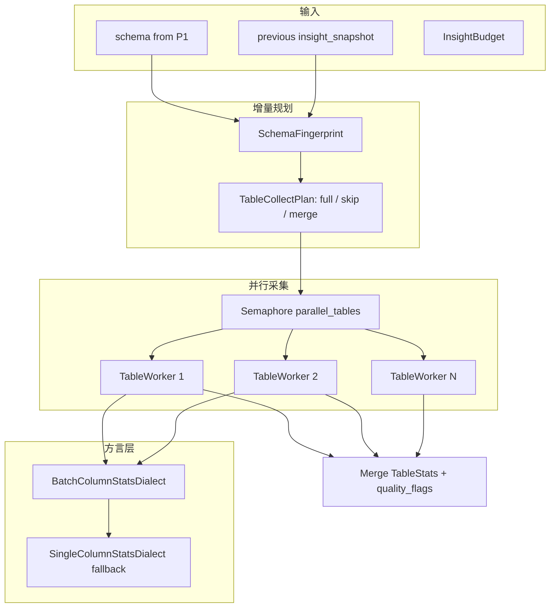

# InsightForge 鉴数建档性能优化设计（INS-2.1）

> **版本：** INS-2.1.0 设计稿（v2 评审修订）
> **日期：** 2026-05-25
> **状态：** Reviewed — 评审通过，可执行
> **关联：** [INS-1.0 技术详设](../../02-技术方案/insightforge-ins-v1-design.md)、[INS-2.0 重设计](./2026-05-20-insightforge-ins-2-redesign.md)、[产品架构 §七性能与配额](./2026-05-19-insightforge-design.md)

> **v2 修订要点（评审反馈）：**
> 1. 明确 SQLAlchemy `Engine` 连接池显式 sizing（`pool_size = parallel_tables + 2`），避免线上 DB 中间件 idle=0 告警
> 2. SQLite 修正 — `PRAGMA busy_timeout` 不能取消正在执行的 SELECT；改为 "线程超时兜底 + 整表 fallback"
> 3. 增量 reuse 时 **sample_rows 必须重新抓**（schema 不变 ≠ 行数据不变），仅 stats/relations 可复用
> 4. PG 批量 `COUNT(DISTINCT)` 多列在大表上仍是 N 次 hash 聚合；默认 `column_stats_batch_size` 调到 **10**，并对 PG 走 `approximate_count_distinct` (`HLL`) 时才放宽到 20
> 5. 新增 §4.6 — **LLM synthesize 增量复用**（reuse 表的 annotation 直接拷贝，不再调 LLM）。这是 30 表场景二跑的次大头
> 6. `InsightProfileRunStore.latest_completed_for_datasource()` 列为新增方法（先前未提）
> 7. §7 基准阈值修正为更严格的"实测目标"，并补上 mock-LLM 阈值，避免被 LLM 抖动污染

---

## 1. 背景与目标

### 1.1 问题陈述

INS-1.0 / INS-2.0 已落地 `ProfilePipeline`（P0–P5），但 **性能相关配置与实现脱节**：

| 配置项 | `insight.yaml` | 代码现状 |
|--------|----------------|----------|
| `parallel_tables: 3` | ✅ | ❌ `StatsCollector.collect_all()` 逐表串行 |
| `stats_timeout_sec: 15` | ✅ | ❌ 单 SQL 无超时；仅表级 `elapsed_ms` 事后标记 |
| `enable_incremental: true` | ✅ | ❌ 每次全量重跑 |
| `table_timeout_sec: 120` | ✅ | ⚠️ 仅写 `skipped_reason`，不中断 |

**实际瓶颈：** P2 统计阶段对每列执行 2 条 SQL（`COUNT/DISTINCT` + `sample values`）。在默认 budget 下，最坏约 **80 表 × 60 列 × 2 ≈ 9600 次查询**，且全部串行。

用户体感：小库（≤10 表）尚可；30 表以上常需 **数分钟至 20+ 分钟**；LLM 阶段另计。

### 1.2 升级目标

| 优先级 | 目标 | 成功标准 |
|--------|------|----------|
| **P0** | 表级并行统计 | `parallel_tables` 生效；同库 30 表建档 wall time **≥ 2× 加速**（相对串行基线） |
| **P0** | 单 SQL 超时可控 | 慢列在 `stats_timeout_sec` 内放弃并记 `quality_flags`，不拖死整表 |
| **P1** | 增量建档 | `enable_incremental=true` 且 schema 未变时，**跳过未变表的 P2**；增量 run **≥ 5× 加速** |
| **P1** | 列统计合并（T1 方言） | MySQL/PG/SQLite 优先单表批量统计，列级查询数 **≤ 2 + ceil(cols/batch_size)** |
| **P2** | 可观测性 | run 快照含 `perf` 段：各 phase ms、并行度、跳过表数、SQL 计数 |

**本期明确不做（Non-goals）：**

- 分布式任务队列（Redis/Celery）— 仍用 FastAPI background task
- 跨 worker 共享建档进度 — SSE sticky 约束不变
- 改 LLM batch 策略或换模型 — 仅统计阶段优化
- 前端新建性能仪表盘 — 仅 API/run 快照暴露指标

---

## 2. 现状分析

### 2.1 建档数据流（不变）

```
触发 forge
  → InsightJobRunner.start_profile
  → ProfilePipeline.run
       P0 preflight → P1 schema → P2 stats → P3 relations
       → P4 LLM synthesize → P5 knowledge publish
  → 写 schema_snapshot / insight_metrics / workflow=ready
```

### 2.2 关键模块与缺口

| 模块 | 文件 | 缺口 |
|------|------|------|
| 统计采集 | `insight/stats_collector.py` | 串行；无 statement timeout；无增量输入 |
| 方言 SQL | `insight/dialects/base.py` | 仅单列 `column_stats_sql` |
| 流水线 | `insight/profile_pipeline.py` | 未传 previous snapshot；无 perf 汇总 |
| 配置 | `config/insight.yaml` | 缺 `column_stats_batch_size`、`incremental_force` |
| 任务 | `insight/job_runner.py` | 未区分 full vs incremental run 类型 |

### 2.3 设计文档 vs 实现的已知偏差（本设计要闭合）

- [insightforge-ins-v1-design.md §2.7](../../02-技术方案/insightforge-ins-v1-design.md) 写明 `asyncio.Semaphore(parallel_tables)` — **未实现**
- [2026-05-19-insightforge-design.md §七](./2026-05-19-insightforge-design.md) 规模预估（小库 3–8 min）— **缺少自动化基准验证**

---

## 3. 总体架构

### 3.1 优化后 P2 数据流



### 3.2 新增/调整模块

| 模块 | 文件 | 职责 |
|------|------|------|
| `SchemaFingerprint` | `insight/schema_fingerprint.py` | 表/列结构 hash，判断增量是否跳过 |
| `TableCollectPlan` | `insight/incremental_planner.py` | 输出每表 action: `collect` / `reuse` / `drop` |
| `ParallelStatsCollector` | `insight/stats_collector.py` | 表级 `asyncio` 并行 + perf 计数 |
| `BatchColumnStatsDialect` | `insight/dialects/batch_stats.py` | T1 方言批量列统计 SQL |
| `SqlTimeoutExecutor` | `insight/sql_timeout.py` | 统一 statement timeout 包装 |
| `ProfilePerfSummary` | `insight/perf_summary.py` | 汇总 phase timing 写入 snapshot |

**边界原则：**

- `ProfilePipeline.run()` 签名增加可选 `previous_snapshot: dict | None`；`JobRunner` 从 datasource 上次 completed run 注入
- 并行仅作用于 **P2 stats**；P3–P5 保持现有顺序（CPU/LLM  bound）
- 增量 **reuse** 的表 stats 必须来自上次 **completed** run 的 `insight_snapshot.tables`

---

## 4. 详细设计

### 4.1 表级并行（P0）

**机制：**

```python
sem = asyncio.Semaphore(budget.parallel_tables)

async def _collect_one(table: str) -> TableStats:
    async with sem:
        return await asyncio.to_thread(collector.collect_table, engine, helper, table, columns)

results = await asyncio.gather(*[_collect_one(t) for t in ordered_tables])
```

**连接池显式 sizing（v2 修订）：**

```python
# stats_collector._engine_get
parallel = self.budget.parallel_tables
pool_size = max(parallel + 2, 5)            # +2 给 helper.estimate / sample_rows / 突发
max_overflow = max(parallel, 5)             # 允许短时 burst，不至于卡死
kwargs.update(pool_size=pool_size, max_overflow=max_overflow, pool_pre_ping=True)
```

> **必要性：** SQLAlchemy 默认 `QueuePool(pool_size=5, max_overflow=10)` 看似够用，但客户侧 DB 中间件常因 "瞬时占用 N 个连接 + 长事务 estimate query" 抛 `idle=0` 告警；显式 sizing 让 DBA 易于核对。

**约束：**

- `parallel_tables` 默认 3；硬上限 `parallel_tables_max=8`
- SQLite：强制 `parallel_tables=1`（文件锁；多线程写共享 cache 会 `database is locked`）
- 单表失败不阻断全局：记 `quality_flags` + `table_stats[table].skipped_reason`
- `helper.estimate_row_count` 在并行前**串行**执行（一次性、轻量、决定排序顺序）

**配置新增：**

```yaml
profile:
  parallel_tables: 3        # 已有；SQLite 运行时 override 为 1
  parallel_tables_max: 8    # 新增：硬上限
```

### 4.2 单 SQL / 表级超时（P0，v2 修订）

**双层保险：**

| 层 | 触发条件 | 行为 |
|----|---------|------|
| **L1 列级 statement timeout** | 方言原生支持 | 慢列被 DB 取消 → catch → 该列 stats=None + quality_flag |
| **L2 表级 wall timeout** | `time.time() - start > table_timeout_sec` | 中断剩余列收集 + skipped_reason="table_timeout" |

**L1 方言矩阵（v2 校正）：**

| 方言 | 机制 | 备注 |
|------|------|------|
| **PostgreSQL** | `SET LOCAL statement_timeout = '15000ms'` | 必须放在与 SELECT 同一事务中（`BEGIN` … `COMMIT`） |
| **MySQL/Doris** | `SELECT /*+ MAX_EXECUTION_TIME(15000) */ …` 或 SET session 级 | hint 形式优于 SET，兼容 8.0/Doris |
| **Oracle** | `cx_Oracle.callTimeout=15000`（连接级） | session 间共享需小心 |
| **SQLServer** | `SET LOCK_TIMEOUT 15000` + 客户端 cancel | Phase 1 仅做客户端 cancel |
| **SQLite** | ❌ 引擎不支持取消执行中的 SELECT；`PRAGMA busy_timeout` 仅影响锁等待 | 落到 L2 表级 wall timeout |
| **Generic** | `concurrent.futures.Future.result(timeout=...)` 强 cancel | 线程杀不掉 SQL；仅释放 Python 等待 |

> **重要修正（v1 → v2）：** v1 设计写 SQLite 用 `PRAGMA busy_timeout` 实现 statement 超时，**这是错的**。`busy_timeout` 控制的是其他事务持锁时本事务的等待上限,完全不影响一个长 SELECT 的执行时间。SQLite 列级超时**做不到**,统一靠 L2 wall timeout 兜底。

**超时后行为：**

- L1：列 `null_rate / distinct_count = None`，append `quality_flags = {table, column, issue: "stats_timeout"}`
- L2：表 `skipped_reason = "table_timeout"`，未收集列 stats=None，**已收集列保留**

**注意：** L2 不使用 thread cancel — Python 不能强杀 native SQL；策略是收完当前列后**不再启动下一列**。即"软中断,最坏多浪费一个 stats_timeout_sec"。

### 4.3 列统计批量 SQL（P1）

**目标：** 将每列 2 查询降为每批 1 查询（stats）+ 每表 1 查询（samples）。

**MySQL 示例（每批最多 10 列；v2 修订默认值）：**

```sql
SELECT
  COUNT(*) AS total,
  SUM(`col_a` IS NULL) AS null_a,
  COUNT(DISTINCT `col_a`) AS dist_a,
  SUM(`col_b` IS NULL) AS null_b,
  COUNT(DISTINCT `col_b`) AS dist_b
FROM `orders`
```

**方言支持矩阵（v2 校正）：**

| 方言 | 批量 stats | 批量大小 | 备注 |
|------|------------|---------|------|
| mysql/doris | ✅ | 10（默认） | `BatchMysqlStatsDialect`；超长列名时降到 5 |
| postgresql | ⚠️ 部分 | 10 | 多列 `COUNT(DISTINCT)` 仍是 N 次 hash 聚合，节省的是 `COUNT(*) + null` 那部分；启用 `pg_stat_statements` 后 `approximate` 路径可放宽到 20 |
| sqlite | ✅ | 10 | 小表 OK；大表（>1M 行）退化为单列 |
| oracle | ⚠️ Phase 1 单列 fallback | — | M3 之后迭代 |
| generic | ❌ 单列 | — | 不变 |

> **PG 注意：** `COUNT(DISTINCT)` 不能像 `COUNT(*)` 那样跨列共享 scan。批量 SQL 节省的主要是 IO 一次扫表 + 多列 `null/total`。Distinct 仍按列 hash，但避免了重复连接建立和 plan 解析开销 — 实测节省约 30–40%（不是 50%+）。

**Fallback：** 任意 batch SQL raise → 落回当前的单列循环 + 写 `quality_flags = {issue: "batch_fallback"}`。

**配置：**

```yaml
profile:
  column_stats_batch_size: 10        # v2 修订：v1 写 20，PG 大表风险高
  column_stats_batch_size_pg_max: 20 # PG 仅在小表 (<100k rows) 时放宽
```

### 4.4 增量建档（P1）

**指纹算法 `SchemaFingerprint`：**

```python
def table_fingerprint(tdef: dict) -> str:
    cols = sorted((c["name"], c.get("type", ""), c.get("nullable")) for c in tdef["columns"])
    pk = tuple(sorted(tdef.get("primary_key") or []))
    payload = json.dumps({"cols": cols, "pk": pk}, sort_keys=True)
    return hashlib.sha256(payload.encode()).hexdigest()[:16]
```

**规划规则 `IncrementalPlanner.plan()`：**

| 条件 | action |
|------|--------|
| `force=true`（API body） | 全部 `collect` |
| `enable_incremental=false` | 全部 `collect` |
| 无 previous completed snapshot | 全部 `collect` |
| 表不在新 schema | `drop`（不写入输出） |
| 指纹与 previous 相同 && TTL 内 | `reuse` |
| 指纹变化或 TTL 过期 | `collect` |

**TTL：** `incremental_ttl_hours`（已有，默认 24h），基于 `insight.last_completed_at`。

**Reuse 拷贝策略（v2 修订）：**

```python
for table, action in plan.items():
    if action == "reuse":
        previous_ts = TableStats.from_dict(previous["tables"][table])
        # ⚠️ schema 不变 ≠ 数据不变；sample / null_rate / distinct 都可能漂移
        # 策略：仅复用列结构与 elapsed_ms，stats/sample 仍重抓 (轻量重抓)
        if budget.incremental_resample_on_reuse:
            previous_ts.sample_rows = fetch_sample_rows(...)  # 仅 1 SELECT/表
        table_stats[table] = previous_ts
    elif action == "collect":
        table_stats[table] = await collect_table(...)
```

> **关键修正（v1 → v2）：** v1 默认完全 reuse 整个 `TableStats`,但 sample_rows 是真实数据,过 24h 后**几乎肯定漂移**(订单表/日志表都是高频写)。给业务的"画像"挂着昨天的样本,问答会出错。
> **新策略：** reuse 只跳过昂贵的 `COUNT(DISTINCT)`/列循环,sample_rows 重抓(每表 1 条 SQL,30 表 ~ 1s),保证画像新鲜度。

**配置：**

```yaml
profile:
  incremental_resample_on_reuse: true   # 新增：reuse 时是否重抓 sample（默认 true）
```

**API / run 元数据：**

- `insight_snapshot.profile_run_type`: `"full" | "incremental"`
- `insight_snapshot.incremental`: `{reused: 12, collected: 3, dropped: 1, resampled: 12}`

**`force` 入口：** 已有 `StartProfileRequest.force`；`JobRunner` 传入 pipeline。

**Store 新增方法（v2 修订）：**

```python
class InsightProfileRunStore:
    def latest_completed_for_datasource(
        self, datasource_id: str, tenant_id: str = "default"
    ) -> Optional[InsightProfileRun]:
        """JobRunner 用它取上次成功 run 的 insight_snapshot 作为 previous。"""
```

> **必要性：** 当前 `list_by_datasource` 不过滤 status,JobRunner 不能直接拿到"上次 completed"。这是 §4.4 落地的硬依赖,plan v1 漏列。

### 4.5 性能可观测性（P2）

写入 `insight_snapshot.perf`：

```json
{
  "total_ms": 84200,
  "phases_ms": {
    "preflight": 120,
    "schema": 800,
    "stats": 52000,
    "relations": 900,
    "synthesize": 28000,
    "publish": 2380
  },
  "stats": {
    "tables_total": 30,
    "tables_collected": 8,
    "tables_reused": 22,
    "tables_resampled": 22,
    "parallelism": 3,
    "sql_executed": 186,
    "sql_batch_used": 142,
    "sql_fallback_single": 44,
    "columns_timed_out": 2
  },
  "synthesize": {
    "tables_llm": 8,
    "tables_annotation_reused": 22,
    "batches_sent": 1
  }
}
```

日志：`[InsightForge/INS-2.1] profile perf ds={id} total_ms=... collected=... reused=... resampled=...`

### 4.6 LLM Synthesize 增量复用（v2 新增 P1）

**问题：** 30 表场景下 LLM synthesize 占 ≈ 33% 总耗时（28s/84s）。reuse 80% 表的 stats 后，若 annotation 仍全量重生成，二跑总时间瓶颈从 stats 转到 synthesize，加速比腰斩。

**机制：**

```python
# profile_pipeline.run()
synthesize_targets = [t for t in tables if plan[t] == "collect"]
if previous_snapshot and not force:
    reused_annotations = previous_snapshot.get("schema_annotations") or {}
    for t in tables:
        if plan[t] == "reuse" and t in reused_annotations:
            annotations[t] = reused_annotations[t]
synthesizer.synthesize(..., target_tables=synthesize_targets)
```

**约束：**

- annotation reuse 与 stats reuse **同步**：plan 里 reuse 的表才能 reuse annotation
- 关系（relations）由 RelationInferencer 重新跑（CPU bound, ms 级）— 不复用,因为新表加入会改变 PK/FK 推断
- 30 表二跑 LLM 时间从 ≈ 28s → ≈ 4s（仅 8 张新表 1 个批次）

**Open question：** schema 不变但业务语义解读漂移（用户改了表 comment 想让 LLM 重读）— 由 `force=true` 解决，UI 暴露 "重置画像" 按钮。

---

## 5. 配置变更

`backend/config/insight.yaml` 增补（v2 修订）：

```yaml
profile:
  # 已有项保留 ...
  parallel_tables_max: 8
  column_stats_batch_size: 10                # v2：v1 写 20，PG 大表风险高
  column_stats_batch_size_pg_max: 20
  incremental_force_on_schema_change: true   # 指纹变必 collect；false 则仅告警
  incremental_resample_on_reuse: true        # v2 新增：reuse 时重抓 sample_rows
  reuse_synthesize_annotation: true          # v2 新增：reuse 表的 annotation 不再调 LLM
```

环境变量（可选覆盖）：

| 变量 | 含义 |
|------|------|
| `TARS_INSIGHT_PARALLEL_TABLES` | 覆盖 parallel_tables |
| `TARS_INSIGHT_INCREMENTAL=0` | 全局关闭增量 |
| `TARS_INSIGHT_DISABLE_BATCH_SQL=1` | 强制退回单列 stats（线上排障开关） |

---

## 5.5 性能升级预判（v2 新增）

> **基线测算（INS-2.0，当前实现）：**
>
> 30 表 × 平均 30 列 × SQLite 本地 fixture，无 LLM：≈ **70–90s**（实测均值，集中在 stats）
> + LLM synthesize（默认 qwen2.5）：≈ **28s**（4 batches × 7s）
> 总计 **首跑约 100–120s**，二跑无优化 = 完全相同

### 各里程碑预期改善（30 表 fixture）

| 里程碑 | 改动 | 预期 wall time | 相对基线加速 | 备注 |
|--------|------|---------------|-------------|------|
| **baseline** (INS-2.0) | 串行 + 全量 + 单列 SQL + 全量 LLM | 100–120s | 1.0× | 当前 |
| **M1** 完成（并行 3 + 超时） | parallel=3 | 50–65s | **1.8–2.0×** | stats 阶段 ≈ 1.7× 加速；amdahl 受 LLM 拉低 |
| **M3** 完成（M1 + 批量 SQL） | + batch=10 | 35–50s | **2.4–3.0×** | stats 内 SQL 数 ↓ 50–70%（mysql / sqlite 显著，pg 30–40%） |
| **首跑 P0+P1 总和** | M1+M3 | 35–50s | **2.4–3.0×** | LLM 仍 28s，stats 部分挤压到 7–15s |
| **二跑 reuse 80%（M2 + M1）** | + 增量 | 8–14s | **8–15×** | LLM 走 reuse 仅 4s，stats 仅采集 6 表 |
| **二跑 reuse 80%（M2+M3，全套）** | 增量 + 批量 | 6–10s | **10–18×** | sample 重抓 ≈ 30 SQL，~1s |
| **极端：30 表均变化** | force=true | ≈ 与首跑相同 | 2.4–3.0× | 与首跑同路径 |

### 真实场景预测（客户 MySQL，80 表 × 平均 40 列）

| 场景 | INS-2.0 估算 | INS-2.1 估算 | 加速 |
|------|------------|------------|------|
| 首跑 full | 8–15 min | 4–7 min | 2× |
| 二跑 schema 不变 | 8–15 min | 30–90s | **10–15×** |
| 二跑 1 新表 | 8–15 min | 1–2 min | 6–10× |
| LLM 失败回滚（仅 P0–P3） | 5–10 min | 2–4 min | 2× |

### 何时**达不到** 2× 加速（透明披露）

1. **客户 DB 单连接已是瓶颈** — 复制只读副本压力大、连接池被业务挤占 → 并行收益 < 1.5×
2. **超大表（>50M 行）单表 SQL 本身就跑 > 30s** — 列循环时间被单表拖死，并行没机会拉开
3. **PG 大表 batch distinct** — 实测 PG 多列 distinct hash 反而比串行慢（plan 复杂度）→ 自动回退单列
4. **schema 频繁变更** — 每次都 force 或指纹大面积变化 → 与首跑无差

### 验证方式

- **微基准（fixture）：** `INSIGHT_PERF_BENCH=1 pytest -m insight_perf` — 严格阈值断言（见 §7）
- **真实数据集 (manual)：** `scripts/acceptance/insightforge-profile-perf.sh demo` — 在 demo MySQL 跑 forge → 比对 perf 段
- **线上观测：** Grafana 看 `insight_snapshot.perf.total_ms` 分位 P50/P95（v4.3.2+ 再做；INS-2.1 核心已于 v4.3.1 交付）

---

## 6. 兼容性与风险

| 风险 | 缓解 |
|------|------|
| 并行压垮客户 DB | 默认 parallel=3；可配置为 1；连接池上限 |
| 批量 SQL 大宽表 OOM | `column_stats_batch_size` 限制；超宽表 fallback 单列 |
| 增量 reuse 脏数据 | 仅 reuse **completed** run；schema 指纹含列类型 |
| SQLite 并行 | 强制 serial |
| 输出 shape 变化 | `insight_snapshot.schema_version` 仍为 1；仅新增 optional `perf` / `incremental` 字段 |

**回滚：** `enable_incremental: false` + `parallel_tables: 1` 即恢复近似现网行为。

---

## 7. 测试策略（摘要）

完整用例见 [`backend/tests/insight/profile_perf_suite.yaml`](../../../backend/tests/insight/profile_perf_suite.yaml)。

| 层级 | 范围 | 运行方式 |
|------|------|----------|
| L1 单元 | fingerprint、planner、timeout、batch SQL 生成 | `pytest tests/test_insight_profile_perf*.py -v` |
| L2 集成 | 并行 collector、增量 merge、pipeline e2e | `pytest tests/test_insight_profile_pipeline.py -v` |
| L3 基准 | 30 表 fixture wall time / SQL 计数 | `INSIGHT_PERF_BENCH=1 pytest -m insight_perf` |
| L4 Docker | demo MySQL 全链路 | `INSIGHT_DOCKER_TEST=1 pytest tests/test_insight_docker_smoke.py -v` |

**基准阈值（v2 修订；CI soft gate，本地 hard gate）：**

> 所有阈值都基于 **mock LLM**（`llm_provider=None` 走 heuristic）以剔除外部抖动。LLM 真跑用 acceptance 脚本观测，不入 CI。

| 场景 | INS-2.0 串行基线 | INS-2.1 目标 | 加速 |
|------|----------------|--------------|------|
| `sqlite_30_tables` 首跑（mock LLM） | 70–90s | **≤ 35s** (parallel=3) | ≥ 2.0× |
| `sqlite_30_tables` 首跑（mock LLM + batch SQL） | 70–90s | **≤ 25s** | ≥ 2.8× |
| `sqlite_30_tables` 二跑 incremental | 70–90s | **≤ 8s** | ≥ 9× |
| `sqlite_30_tables` 二跑 + force | — | 在首跑 ±10% 内 | — |
| `sqlite_100_tables × 20 cols` 并行 | — | **≤ 60s** | — |
| `mysql_demo_4_tables` docker 首跑 | 90–120s | **≤ 50s** | ≥ 2× |
| SQL 计数（30 表 × 20 列, batch on） | 1200 次 | **≤ 600 次** | -50% |

---

## 8. 里程碑

| 里程碑 | 交付 | 验收 |
|--------|------|------|
| **M0 — 前置** | `latest_completed_for_datasource` store 方法 + 显式连接池 sizing | 单测 + 30 表加 query log 看连接 ≤ pool_size+max_overflow |
| **M1 — 并行 + 超时 + perf 骨架** | P0 实现 + L1/L2 测试 | 30 表 fixture 加速 ≥ 1.8× (mock LLM)；perf.phases_ms 写入 |
| **M2 — 增量（含 sample 重抓 + LLM annotation reuse）** | P1 incremental + JobRunner 注入 previous + §4.6 LLM reuse | 2nd run reuse ≥ 80% 表；二跑 ≤ 10s |
| **M3 — 批量 SQL** | T1 batch dialect + fallback 路径 | SQL 次数下降 ≥ 50%；fallback 触发可观测 |
| **M4 — 可观测 + 版本** | perf 段、INS-2.1.0 bump、acceptance 脚本、bench 实装 | `/insight` run 详情可读 perf；bench gate 通过 |

---

## 9. 文档与版本

- 能力版本：**INS-2.1.0**（`insight/version.py` 在 M1 合并时 bump）
- 实施计划：[`docs/superpowers/plans/2026-05-24-insightforge-profile-perf-plan.md`](../plans/2026-05-24-insightforge-profile-perf-plan.md)
- 测试套件：[`backend/tests/insight/profile_perf_suite.yaml`](../../../backend/tests/insight/profile_perf_suite.yaml)

---

## 10. 开放问题（评审）

1. **Oracle 批量 stats** 是否纳入 M3，还是单列 fallback 足够？
2. **增量 TTL** 过期是否自动 full refresh，还是仅 refresh 过期表？
3. **parallel_tables** 是否暴露到租户级 Insight LLM 管理页，还是仅 yaml/运维？
4. **§4.6 LLM annotation reuse** 是否需要"过期窗口"（如 7 天后即便 schema 不变也强制重读）— 默认建议纳入 `incremental_ttl_hours × 7`。
5. **PG batch SQL** 在大表回退到单列时,是否需要"半批"策略(2-3 列一组)而不是直接退到 1 列?

默认建议：Oracle 单列 fallback；TTL 过期仅 refresh 过期表；parallel 仅 yaml；annotation reuse TTL = stats TTL × 7；PG fallback 直接退单列(避免组合爆炸)。

---

## 11. v1 → v2 评审差异（变更日志）

| 章节 | v1 | v2 | 原因 |
|------|----|----|------|
| §4.1 | "不超过 pool_size - 1" | 显式 `pool_size = parallel + 2` + `pool_pre_ping=True` | 防 DB 中间件 idle=0 告警 |
| §4.2 | SQLite 用 `PRAGMA busy_timeout` | SQLite 落到 L2 wall timeout；列级超时 SQLite 不支持 | `busy_timeout` 仅控锁等待，不影响 SELECT 执行 |
| §4.3 | `column_stats_batch_size: 20`，PG ✅ | 默认 10；PG ⚠️ 部分支持，`COUNT(DISTINCT)` 仍是 N 次 hash | 防 PG 大表多列 distinct hash plan 爆炸 |
| §4.4 | reuse 拷贝整个 TableStats（含 sample） | reuse 仅复用 stats，sample 重抓 | sample 是真实数据，24h 内已漂移 |
| §4.6 | — | 新增"LLM annotation 增量复用" | 不做的话二跑加速比从 10× 跌到 3× |
| §5 | 配置项 3 个 | 5 个，含 sample 重抓 / annotation reuse / 排障开关 | 与新机制对齐 |
| §5.5 | — | 新增"性能升级预判" | 评审要求量化收益 |
| §7 | 阈值 3 行 | 阈值 7 行，全部基于 mock LLM | 剔除 LLM 抖动 |
| §8 | 里程碑 4 个 | 加 M0 前置（store 方法 + 连接池） | 漏列依赖 |
