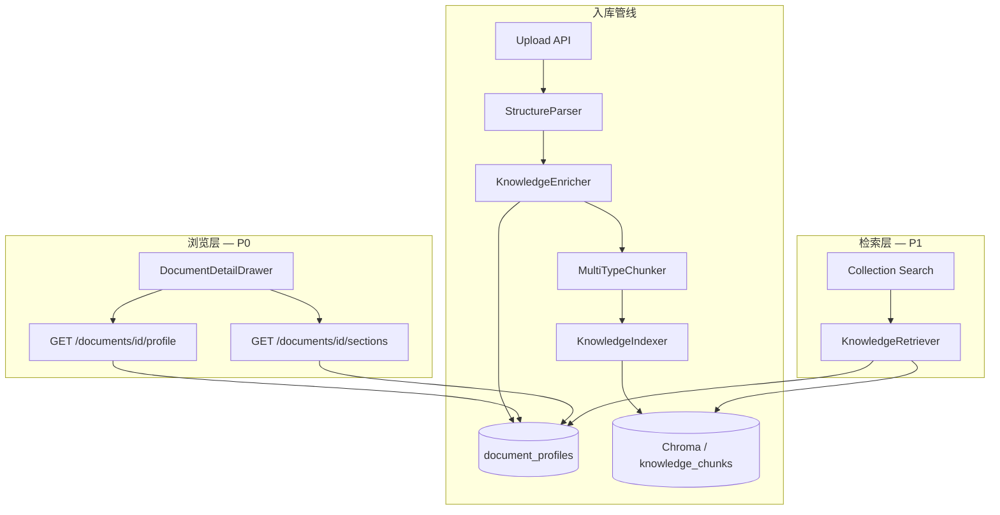

# 知识库深度入库与文档浏览升级设计（v4.3.1）

> **版本：** v4.3.1（已于 2026-05-25 patch 交付；原稿标 v4.4，已与平台版本对齐）  
> **日期：** 2026-05-24  
> **状态：** ✅ 已交付 — [v4.3.1-release-notes.md](../../01-项目概览/v4.3.1-release-notes.md)  
> **关联：** [向量搜索与知识库升级设计](./2026-05-16-vector-search-knowledge-upgrade-design.md)、[会议纪要入知识库设计](./2026-05-16-meeting-to-knowledge-design.md)

---

## 1. 背景与目标

### 1.1 问题陈述

当前 TARS 知识库入库链路为：**解析 → 机械分块（约 300 字）→ 向量索引**。系统记住的是原文碎片的字面相似度，而非文档的语义结构。用户反馈：

- 上传 PDF 制度、PPT 方案、Excel 指标表后，**关键点未被提炼**
- 知识库页面只能看到文件名和 chunk 数量，**无法浏览文档摘要与结构**
- 引用卡片 `/api/knowledge/ref/{doc_id}` 仅返回第一个 chunk 的前 400 字，**不能代表文档主旨**

### 1.2 升级目标

| 优先级 | 目标 | 成功标准 |
|--------|------|----------|
| **P0** | 文档浏览/摘要准确 | 打开任意已入库文档，3 秒内看到：一句话摘要、5–10 条要点、章节目录 |
| **P0** | 入库深度理解 | 入库时 LLM 生成结构化画像，不只存原文碎片 |
| **P1** | 多格式结构保留 | PDF/DOCX/PPT/XLSX 按类型保留标题、幻灯片、Sheet 结构 |
| **P1** | 检索质量提升 | 浏览页内搜索、集合内搜索优先命中 summary/key_facts |
| **P2** | 对话引用增强 | Agent 引用时附带 doc_summary，聊天体验顺带提升 |

**本期明确不做（Non-goals）：**

- 知识图谱可视化、实体关系推理
- 全自动文档版本 diff 与增量合并
- 替换现有 Embedding 模型（bge-small-zh 保留）
- 多租户独立 enrichment 模型配置 UI

### 1.3 支持文档类型

| 类型 | 扩展名 | 业务场景 | 入库策略代号 |
|------|--------|----------|--------------|
| 制度规范 | `.pdf`, `.docx` | 条款、流程、权责 | `policy` |
| 方案演示 | `.pptx`, `.pdf` | 卖点、架构、案例 | `proposal` |
| 指标口径 | `.xlsx`, `.csv` | 字段定义、计算公式 | `metrics` |
| 通用文档 | `.md`, `.txt`, `.docx` | 混合内容 | `generic` |

---

## 2. 现状分析

### 2.1 当前数据流

```
上传文件
  → DocumentParser.parse()        # 纯文本抽取，MD 去标题
  → DocumentChunker.chunk(300)    # 机械分块
  → Chroma / SQLite 向量索引       # chunk_type 无区分
  → document_files.chunk_count    # 前端仅展示块数
```

### 2.2 已有可复用模式与现状校正

> **事实校正：** `meeting-to-knowledge-design` 提出过 `chunk_type=summary/transcript` 双轨索引，但**仓库中尚未落地**：
> - [chunker.py](../../../backend/tars/knowledge/chunker.py) 不写 `chunk_type`
> - [indexer.py:44-50](../../../backend/tars/knowledge/indexer.py#L44-L50) `metadata_base` 仅含 `doc_id/collection_id/file_name/file_type/tenant_id`
> - [access.py:19-23](../../../backend/tars/knowledge/access.py#L19-L23) 仅靠**文件名包含 "meeting/会议"** 区分来源
>
> 因此本设计承担"从零落地双轨/多轨 chunk_type 体系"的工作量，会议纪要场景一并受益。

本设计目标：
- 建立统一的 `chunk_type` 元数据规范（doc_summary / section_summary / key_fact / synthetic_qa / glossary / passage）
- 新增 **文档画像表** 供浏览 UI 直读
- 老的会议纪要写入路径迁移到同一套元数据上

### 2.3 关键缺口

| 模块 | 文件 | 缺口 |
|------|------|------|
| 解析 | `knowledge/parsers.py` | 无 PPT；MD  strip 标题；PDF 无目录/页码 |
| 分块 | `knowledge/chunker.py` | 无结构感知；无 parent-child |
| 索引 | `knowledge/indexer.py` | 无 LLM enrichment |
| 存储 | `document_files` | 无 summary/profile 字段 |
| 前端 | `KnowledgeManager.vue` | 无文档详情/摘要浏览 |
| API | `knowledge.py` | 无 `GET /documents/{id}/profile` |

---

## 3. 总体架构

### 3.1 升级后数据流

```
上传文件
  │
  ├─① Parse（结构感知）
  │    └─ ParsedDocument { plain_text, sections[], doc_type_hint }
  │
  ├─② Enrich（LLM 深度理解）          ← 新增 KnowledgeEnricher
  │    └─ DocProfile { summary, key_points, sections, glossary, qa_pairs }
  │
  ├─③ Chunk（多类型分块）             ← 升级 DocumentChunker
  │    ├─ passage chunks（原文，parent_id）
  │    ├─ summary chunk（文档级）
  │    ├─ section_summary chunks（章节级）
  │    ├─ key_fact chunks（关键事实）
  │    └─ synthetic_qa chunks（潜在问答）
  │
  ├─④ Index（向量 + 画像持久化）
  │    ├─ Chroma/SQLite（全部 chunk 可检索）
  │    └─ document_profiles 表（浏览 UI 直读）
  │
  └─⑤ Browse / Search
       ├─ 文档详情页：读 document_profiles（不走向量）
       └─ 集合内搜索：多路召回 summary + passage → rerank
```

### 3.2 模块关系



---

## 4. 结构感知解析层（Parse）

### 4.1 新增 `ParsedDocument` 模型

```python
@dataclass
class DocumentSection:
    section_id: str          # "s0", "s1" ...
    title: str               # 章节/幻灯片/Sheet 名
    level: int               # 0=根, 1=章, 2=节
    text: str
    page_or_slide: int | None
    source_range: str | None # "p3-p5" / "slide-4" / "Sheet1!A1:D20"

@dataclass
class ParsedDocument:
    plain_text: str
    sections: list[DocumentSection]
    doc_type_hint: str       # policy | proposal | metrics | generic
    parse_warnings: list[str]
```

### 4.2 按格式解析策略

| 格式 | 解析器 | 结构提取 |
|------|--------|----------|
| **PDF** | `PDFParser` 升级 | 逐页文本 + 字体大小启发式标题 + 书签目录（若有） |
| **DOCX** | `DOCXParser` 升级 | `paragraph.style` 识别 Heading 1–6，保留层级 |
| **PPTX** | `PPTXParser` 新增 | 每页 slide → 一个 section（标题 + 正文 + 备注） |
| **XLSX/CSV** | `XLSXParser` 升级 | 每 Sheet → section；**首行为表头**；走 §5.2.1 结构化抽取专路，不再"全表平铺成长文本喂 LLM" |
| **MD** | `MarkdownParser` 修复 | **保留** `#` 标题层级，不再 strip |
| **TXT** | `TextParser` | 空行分段落为 section |

### 4.3 文档类型自动推断

```python
def infer_doc_type(file_name: str, ext: str, sections: list) -> str:
    # 1. collection 级别 override（用户创建集合时可选默认类型）
    # 2. 扩展名启发：xlsx/csv → metrics；pptx → proposal
    # 3. 文件名关键词：制度/规范/办法 → policy；方案/汇报/提案 → proposal
    # 4. 默认 generic
```

---

## 5. LLM 深度理解层（Enrich）

### 5.1 `KnowledgeEnricher`

新增 `backend/tars/knowledge/enricher.py`，入库时调用当前租户 LLM Provider。

**Provider 注入路径（重要）：**

当前 [api/knowledge.py:26-37](../../../backend/tars/api/knowledge.py#L26-L37) `init_knowledge_api(db, vector_store, embedding_provider)` 是进程级 singleton，**不携带 LLM Provider**。本设计**复用 Insight 模块已有的 LLM 解析机制**：

```python
# backend/tars/knowledge/enricher.py
from tars.insight.llm_resolver import resolve_insight_llm  # 复用
from tars.insight.llm_settings_store import InsightLlmSettingsStore

class KnowledgeEnricher:
    def __init__(self, llm_settings_store: InsightLlmSettingsStore, config: dict):
        self._llm_store = llm_settings_store
        self._config = config

    def enrich(self, parsed: ParsedDocument, *, tenant_id: str, doc_type: str,
               llm_override: dict | None = None) -> DocProfile | None:
        if not self._config.get("enabled", True):
            return None
        tenant_settings = self._llm_store.get(tenant_id)
        resolved = resolve_insight_llm(tenant_settings, override=llm_override)
        if resolved.provider is None:
            return None                                  # 降级：无 provider
        # ... 调用 resolved.provider.complete(...)
```

**入库主流程改为：** 上传 endpoint 内解析 → 同步触发 enrichment → 把 `DocProfile | None` 传给 `indexer.index_document(parsed, profile, ...)`。Indexer 不再持有 provider，保持 stateless。

**输入：** `ParsedDocument` + `doc_type` + `file_name` + `tenant_id`  
**输出：** `DocProfile`

```python
@dataclass
class DocProfile:
    doc_id: str
    doc_type: str
    title: str                    # LLM 提炼标题（可不同于文件名）
    one_liner: str                # 一句话摘要（≤80 字）
    summary: str                  # 结构化摘要（200–600 字）
    key_points: list[str]         # 5–12 条要点
    sections: list[SectionSummary]  # 与 DocumentSection 对齐
    key_facts: list[str]          # 数字、定义、规则、例外
    glossary: list[GlossaryItem]  # 术语 → 解释
    qa_pairs: list[QAPair]        # 3–8 组「用户可能问的问题」
    tags: list[str]               # 自动标签
    confidence: float             # 见下文，启发式合成而非 LLM 自评
    enriched_at: str
    model_id: str
    token_usage: dict
```

> **`confidence` 字段语义说明：** 不让 LLM 自评（无意义），而是入库流程末尾按以下启发式合成：
> ```python
> confidence = min(
>     1.0 - 0.3 * has_parse_warnings,        # 解析告警扣 0.3
>     1.0 - 0.4 * truncation_ratio,          # 截断比例越高越低
>     section_coverage,                       # LLM 输出 section 数 / 解析得到的 section 数
>     1.0 - 0.5 * json_repair_used,          # 触发 repair retry 扣 0.5
> )
> ```
> 低于 `confidence_threshold`（默认 0.6）时 UI 显示「建议核对原文」徽章。

### 5.2 分类型 Prompt 模板

每种 `doc_type` 独立 system prompt，强调不同提取目标：

| doc_type | Prompt 侧重点 |
|----------|---------------|
| `policy` | 适用范围、生效条件、禁止事项、审批流程、违规后果、例外条款 |
| `proposal` | 背景痛点、解决方案、核心卖点、技术架构、ROI/案例、实施路径 |
| `metrics` | **不走通用 enrich prompt**，参见 §5.2.1 结构化抽取专路 |
| `generic` | 主题、结论、论据、行动项 |

#### 5.2.1 metrics 类专路（XLSX/CSV）

> **背景：** 用户反馈"上传指标表，关键点未提炼"——把宽表平铺成长文本喂 LLM 是**幻觉率最高**的反模式（行列对应错位、公式被截断）。本期为 metrics 单开结构化抽取通道。

**步骤：**
1. 解析阶段直接产出 `MetricsTable`（每 sheet 一项）：
   ```python
   @dataclass
   class MetricsTable:
       sheet_name: str
       headers: list[str]               # 首行表头
       rows: list[dict[str, Any]]       # header→cell typed value
       inferred_schema: dict[str, str]  # 列名→类型/语义猜测（数字/日期/口径文本）
   ```
2. **不调用 LLM 做摘要**，而是按表头启发式映射出指标实体：
   - 必含字段：`metric_name`（取首列或匹配「指标/名称」列）
   - 可选字段：`definition / formula / source / frequency / owner / notes`（按列名近似匹配）
3. LLM **仅用于术语整理**：传入"提取出的 30 行指标记录"+「请整理 glossary 与重复项」，**不让 LLM 抄表**
4. 写入 chunk：每条指标 → 一个 `key_fact` chunk（结构化 JSON 字符串）；表级 summary 由模板拼接而非 LLM 生成

**降级：** 若表头识别失败（无中文/英文已知列名匹配），回退到 generic 路径，但 `parse_warnings` 标注 "metrics_schema_unrecognized"。

**长文档策略：**

阈值按 **provider context window** 自适应（不再硬编码 12K）：

```python
single_call_budget = min(
    provider.context_window * 0.6,           # 留 40% 给 prompt + completion
    config.get("max_input_chars", 48000)
)
```

1. `plain_text` ≤ `single_call_budget`：单次调用
2. 否则 **Map-Reduce**：
   - Map：按 section 分别提取 section_summary + key_facts
   - Reduce：合并为 doc 级 summary + key_points + qa_pairs
3. **快速降级路径（>200K 字或 Map 段数 > 30）**：仅对前 N 个 section + 文件首 5K 字 + 末 2K 字采样做 Reduce，标 `parse_warnings=["truncated_for_enrichment"]`，置信度自动下降

### 5.3 入库异步化与成本控制

**关键变更（v4.3.1 设计修订）：** enrichment 同步阻塞会让中等 PDF 卡 1–2 分钟，触发 nginx/浏览器超时。**M1 即采用异步入库**，参考 [api/meeting.py:266-270](../../../backend/tars/api/meeting.py#L266-L270) `asyncio.create_task` 模式：

```python
@router.post("/collections/{coll_id}/documents")
async def upload_document(...):
    doc_id = create_document_file(status="pending")
    asyncio.create_task(_run_ingest(doc_id, file_path, tenant_id, doc_type))
    return {"document": {"id": doc_id, "status": "pending", "profile_ready": False}}
```

前端通过轮询 `GET /documents/{doc_id}/profile` 或 SSE `GET /documents/{doc_id}/status` 感知进度。

| 配置项 | 默认值 | 说明 |
|--------|--------|------|
| `knowledge.enrichment.enabled` | `true` | 总开关 |
| `knowledge.enrichment.skip_if_no_provider` | `true` | 无 LLM 时仅结构解析 + passage 索引 |
| `knowledge.enrichment.max_input_chars` | `48000` | 超出则截断 + 警告（仍受 provider window 约束） |
| `knowledge.enrichment.timeout_sec` | `120` | 超时标记 `status=enrichment_failed`，passage 仍可用 |
| `knowledge.enrichment.json_repair_retries` | `1` | JSON 解析失败时 repair prompt 最多重试次数 |
| `knowledge.enrichment.budget_per_doc_tokens` | `30000` | 单文档 LLM 总 token 上限（含 Map+Reduce），超出截断 |
| `knowledge.enrichment.synthetic_qa_max` | `3` | 每文档生成 QA 数量上限（控成本） |

入库状态机：

```
pending → parsing → enriching → indexing → ready
                              ↘ enrichment_failed（passage 已索引，摘要缺失）
                              ↘ failed（解析/索引失败）
```

---

## 6. 多类型分块与索引（Chunk + Index）

### 6.1 Chunk 类型定义

沿用会议纪要模式的 `chunk_type` 元数据：

| chunk_type | 用途 | 浏览 | 检索权重 |
|------------|------|------|----------|
| `doc_summary` | 文档级摘要 | ✅ 详情页顶部 | 高 |
| `section_summary` | 章节摘要 | ✅ 目录展开 | 高 |
| `key_fact` | 关键事实/口径 | ✅ 要点卡 | 高 |
| `synthetic_qa` | 潜在问答 | — | 高（问句对齐） |
| `glossary` | 术语表项 | ✅ 术语区 | 中 |
| `passage` | 原文证据 | ✅ 展开原文 | 中（parent 展开） |

### 6.2 Parent-Document 索引

```json
{
  "doc_id": "uuid",
  "chunk_type": "passage",
  "chunk_index": 3,
  "parent_section_id": "s2",
  "section_title": "第三章 审批流程",
  "page_or_slide": 12
}
```

衍生 chunk（summary/key_fact/qa）携带 `parent_section_id` 或 `doc_id`，检索命中后可 **展开 parent section 全文**。

### 6.3 分块参数（按类型）

| doc_type | passage chunk_size | overlap | 策略 |
|----------|------------------|---------|------|
| policy | 1000 | 150 | 按 section 边界，条款不切断 |
| proposal | 800 | 120 | 按 slide/section |
| metrics | 600 | 80 | 按 Sheet 行组 |
| generic | 900 | 120 | recursive |

### 6.4 Indexer 升级

`KnowledgeIndexer.index_document()` 签名扩展：

```python
def index_document(
    self,
    parsed: ParsedDocument,
    profile: DocProfile | None,
    doc_id: str,
    collection_id: str,
    ...
) -> IndexResult:
    # 1. 写入衍生 chunks（summary/key_fact/qa/glossary）
    # 2. 写入 passage chunks
    # 3. 持久化 DocProfile → document_profiles + document_files 状态
```

---

## 7. 数据模型

### 7.1 新增表 `document_profiles`

```sql
CREATE TABLE IF NOT EXISTS document_profiles (
    doc_id            TEXT PRIMARY KEY,
    tenant_id         TEXT NOT NULL,
    collection_id     TEXT NOT NULL,
    doc_type          TEXT NOT NULL DEFAULT 'generic',
    title             TEXT,
    one_liner         TEXT,
    summary           TEXT,
    key_points_json   TEXT,       -- JSON array
    sections_json     TEXT,       -- JSON array of SectionSummary
    key_facts_json    TEXT,
    glossary_json     TEXT,
    qa_pairs_json     TEXT,
    tags_json         TEXT,
    confidence        REAL DEFAULT 1.0,
    enrichment_model  TEXT,
    enriched_at       TEXT,
    parse_warnings_json TEXT,
    FOREIGN KEY (doc_id) REFERENCES document_files(id)
);
CREATE INDEX idx_doc_profiles_collection ON document_profiles(collection_id);
CREATE INDEX idx_doc_profiles_tenant ON document_profiles(tenant_id);
```

### 7.2 `document_files` 扩展

```sql
ALTER TABLE document_files ADD COLUMN doc_type TEXT DEFAULT 'generic';
ALTER TABLE document_files ADD COLUMN status TEXT;  
-- pending | parsing | enriching | indexing | ready | enrichment_failed | failed
ALTER TABLE document_files ADD COLUMN profile_ready INTEGER DEFAULT 0;
ALTER TABLE document_files ADD COLUMN one_liner TEXT;  -- 列表页快速预览
```

### 7.2.1 `document_collections` 扩展

```sql
ALTER TABLE document_collections ADD COLUMN default_doc_type TEXT;  -- 集合级默认类型，可空
```

集合创建时可选默认 doc_type，上传时未显式指定则继承；仍可被自动推断/手动 override。

### 7.3 Chunk 元数据扩展

`knowledge_chunks.metadata_json` / Chroma metadata 统一字段：

```json
{
  "chunk_type": "key_fact",
  "doc_type": "policy",
  "section_id": "s3",
  "section_title": "审批权限",
  "parent_section_id": "s3",
  "page_or_slide": 8
}
```

---

## 8. API 设计

### 8.1 浏览 API（P0）

```
GET /api/knowledge/collections/{coll_id}/documents/{doc_id}/profile
```

响应：

```json
{
  "doc_id": "...",
  "file_name": "仓储管理制度.pdf",
  "doc_type": "policy",
  "status": "ready",
  "title": "仓储管理制度（2024版）",
  "one_liner": "规范入库、出库、盘点全流程及审批权限。",
  "summary": "...",
  "key_points": ["...", "..."],
  "sections": [
    { "section_id": "s0", "title": "总则", "summary": "...", "page": 1 }
  ],
  "key_facts": ["...", "..."],
  "glossary": [{ "term": "安全库存", "definition": "..." }],
  "tags": ["仓储", "制度"],
  "chunk_count": 42,
  "enriched_at": "2026-05-24T10:00:00Z"
}
```

```
GET /api/knowledge/collections/{coll_id}/documents/{doc_id}/passages?section_id=s2
```

返回指定章节的原文 passage chunks（浏览「展开原文」）。

```
POST /api/knowledge/collections/{coll_id}/documents/{doc_id}/re-enrich
```

手动触发重新 enrichment（文件未变时仅重跑 LLM）。

### 8.2 上传 API 扩展

```
POST /api/knowledge/collections/{coll_id}/documents
Form: file, metric_ids?, doc_type? (optional override)
```

响应增加：

```json
{
  "document": {
    "id": "...",
    "status": "ready",
    "profile_ready": true,
    "one_liner": "...",
    "doc_type": "policy"
  }
}
```

大文件异步模式（可选 Phase 2）：

```
POST ... → 202 { job_id }
GET /api/knowledge/jobs/{job_id}
```

### 8.3 搜索 API 扩展

```
POST /api/knowledge/collections/{coll_id}/query
Body: { "query": "...", "top_k": 10, "mode": "browse" | "chat" }
```

| mode | 行为 |
|------|------|
| `browse` | 优先召回 doc_summary/section_summary/key_fact，合并同 doc |
| `chat` | 现有逻辑 + context_window + rerank（P1） |

### 8.4 引用 API 升级（保留原文证据）

> **校正：** 早期草案"ref API 优先返回 one_liner+summary 前 200 字"会**丢失"我引用第 3 章原话"这类用法的原文证据**。改为同时返回三段，前端按引用语法选择展示。

[api/knowledge.py:449-499](../../../backend/tars/api/knowledge.py#L449-L499) `GET /api/knowledge/ref/{doc_id}` 响应体扩展：

```json
{
  "doc_id": "...",
  "title": "...",
  "collection_id": "...",
  "source_type": "document",
  "one_liner": "...",           // 新增，来自 document_profiles
  "summary_excerpt": "...",     // 新增，summary 前 200 字
  "chunk_excerpt": "...",       // 保留原 snippet 行为
  "doc_type": "policy",         // 新增
  "profile_ready": true
}
```

引用语法约定：
- `[ref:doc_id]` → 前端优先展示 `one_liner`；点击展开 `summary_excerpt`
- `[ref:doc_id#chunk_idx]` → 直接展示 `chunk_excerpt`（保持现有 Agent 引用语义）

旧客户端仍读取 `snippet` 字段（保留为 `chunk_excerpt` 的别名）。

---

## 9. 前端设计（浏览优先）

### 9.1 文档列表升级

`KnowledgeManager.vue` 文档行增加：

- 一句话摘要（`one_liner`）
- 文档类型标签（制度 / 方案 / 指标 / 通用）
- 状态徽章（解析中 / 已理解 / 摘要失败）
- 点击行 → 打开 **DocumentDetailDrawer**

### 9.2 DocumentDetailDrawer（核心 P0 组件）

```
┌─────────────────────────────────────────────┐
│ 📄 仓储管理制度.pdf          [制度] [已理解] │
├─────────────────────────────────────────────┤
│ 一句话：规范入库、出库、盘点全流程...        │
├─────────────────────────────────────────────┤
│ ▼ 文档摘要（200–600字）                      │
│ ▼ 核心要点（bullet list）                    │
│ ▼ 关键事实 / 口径                            │
│ ▼ 章节目录                                   │
│    ├ 总则 — 本章说明制度适用范围...           │
│    ├ 入库管理 — ...              [展开原文]  │
│    └ 出库管理 — ...              [展开原文]  │
│ ▼ 术语表                                     │
│ ▼ 元信息：入库时间 / 块数 / 模型             │
├─────────────────────────────────────────────┤
│ [重新理解] [删除]                            │
└─────────────────────────────────────────────┘
```

### 9.3 集合内搜索升级

搜索抽屉结果分组：

1. **文档级匹配**（summary 命中）— 显示 doc 卡片 + one_liner
2. **片段级匹配**（passage 命中）— 显示 section 上下文

### 9.4 i18n 键

`knowledge.profile.*`、`knowledge.docType.*`、`knowledge.status.*`

---

## 10. 配置

新增 `backend/config/knowledge.yaml`（或并入 `insight.yaml` 的 `knowledge` 段）：

```yaml
knowledge:
  enrichment:
    enabled: true
    timeout_sec: 120
    max_input_chars: 48000
    confidence_threshold: 0.6
    json_repair_retries: 1
    budget_per_doc_tokens: 30000
    synthetic_qa_max: 3
    glossary_max: 20
    key_facts_max: 30
  chunking:
    default_strategy: recursive
    profiles:
      policy:   { chunk_size: 1000, overlap: 150 }
      proposal: { chunk_size: 800,  overlap: 120 }
      metrics:  { chunk_size: 600,  overlap: 80 }
      generic:  { chunk_size: 900,  overlap: 120 }
  browse:
    search_mode_default: browse
    list_preview_field: one_liner
  reindex:
    require_confirm_above_doc_count: 5    # ≥5 篇要求二次确认
    estimate_tokens_per_doc: 8000         # 用于预估 reindex 成本展示
```

---

## 11. 迁移与重索引

### 11.1 存量文档

提供管理脚本 / API：

```
POST /api/knowledge/collections/{coll_id}/reindex
Body: { "enrich": true, "doc_ids": ["..."] | null }
```

流程：读原文件 → 新 Parse → Enrich → 删旧 chunks → 写新 chunks + profile

### 11.2 兼容性

- 无 profile 的旧文档：详情页显示「尚未深度理解 [一键理解]」
- `chunk_type` 缺失的旧 chunk：视为 `passage`，检索仍可用
- 前端 gracefully degrade

---

## 12. 测试与验收

### 12.1 自动化测试

| 测试文件 | 覆盖 |
|----------|------|
| `test_knowledge_enricher.py` | 各 doc_type prompt、Map-Reduce、降级 |
| `test_knowledge_structure_parser.py` | DOCX heading、PPTX slide、XLSX sheet |
| `test_knowledge_profile_api.py` | profile CRUD、re-enrich |
| `test_knowledge_browse_search.py` | browse mode 优先 summary |
| `KnowledgeManager.spec.ts` | 详情抽屉渲染 |

### 12.2 人工验收标准（P0）

> **适用范围说明：** 本期上传或主动触发 re-enrich 的文档。**未 reindex 的旧文档**详情页显示「尚未深度理解 [一键理解]」，不进入本验收。

准备 4 份样例文档（各类型 1 份）：

1. 上传后通过轮询接口 **5 分钟内** 看到 `status=ready`，`profile_ready=true`（异步入库，含 Map-Reduce 兜底）
2. 打开详情页：摘要与人工阅读结论 **主旨一致**（允许细节偏差）
3. 要点 ≥ 5 条，且包含人工标注的 **Top 3 关键点中至少 2 条**
4. 章节目录与原文结构 **章节数误差 ≤ 1**
5. 集合内搜索文档标题关键词，**第一条结果为该文档 summary**
6. **检索质量盲测（新增）：** 准备 5 个用户视角问题（覆盖摘要/口径/章节定位），enrich 前后命中率提升 **≥ 30%**——若不达标，需评估是否在本期叠加 BM25 混合检索

---

## 13. 风险与对策

| 风险 | 影响 | 对策 |
|------|------|------|
| LLM 幻觉摘要 | 浏览误导 | 展示 confidence；低置信度标记「建议核对原文」；要点旁链 passage |
| 大 PPT/PDF 超时 | 入库失败 | 异步 job + Map-Reduce；超时降级 passage-only |
| Token 成本 | 运营压力 | 按 doc_type 控制 qa_pairs 数量；可关闭 enrichment |
| PPT 图片页无文字 | 解析空 | parse_warnings + OCR 预留接口（Phase 3） |
| 旧数据迁移耗时 | 升级阻塞 | 懒迁移：首次打开详情时触发 re-enrich |

---

## 14. 分期交付建议

| 阶段 | 范围 | 预估 |
|------|------|------|
| **Phase 1** | Enricher + document_profiles + profile API + DocumentDetailDrawer | 4–5 天 |
| **Phase 2** | 结构解析（DOCX/PPTX/XLSX）+ browse 搜索 + 列表 one_liner | 3–4 天 |
| **Phase 3** | 存量 reindex + 异步 job + Agent 引用增强 + OCR 预留 | 3–4 天 |

**Phase 1 即可满足「文档浏览/摘要准」核心诉求。**

---

## 15. 文件变更清单

| 文件 | 操作 | 职责 |
|------|------|------|
| `backend/tars/knowledge/models.py` | 新增 | ParsedDocument / DocProfile / SectionSummary / MetricsTable dataclasses |
| `backend/tars/knowledge/structure_parser.py` | 新增 | **入口路由**：按扩展名/集合默认类型选择解析器，做 `infer_doc_type`，返回 `ParsedDocument` |
| `backend/tars/knowledge/parsers.py` | 修改 | 各扩展名底层解析器：返回 `ParsedDocument`（不再返回纯 str）。新增 PPTX；MD 保留标题；DOCX/PDF 升级；XLSX 走结构化抽取 |
| `backend/tars/knowledge/enricher.py` | 新增 | LLM 深度理解 + Map-Reduce + 降级；通过 `resolve_insight_llm` 按租户取 provider |
| `backend/tars/knowledge/enricher_prompts.py` | 新增 | policy / proposal / generic prompt 模板（metrics 不走通用 prompt） |
| `backend/tars/knowledge/metrics_extractor.py` | 新增 | XLSX/CSV 结构化抽取 → MetricsTable → key_fact chunks |
| `backend/tars/knowledge/chunker.py` | 修改 | 多 chunk_type、按 section 边界、parent_section_id |
| `backend/tars/knowledge/indexer.py` | 修改 | 接收 `(parsed, profile)`，写衍生 chunk + profile（**stateless，不持有 provider**） |
| `backend/tars/knowledge/profile_store.py` | 新增 | document_profiles CRUD |
| `backend/tars/knowledge/access.py` | 修改 | browse 搜索模式；按 chunk_type 而非文件名判断 source_type |
| `backend/tars/api/knowledge.py` | 修改 | 异步入库 + profile/passages/re-enrich/reindex API + ref API 升级 |
| `backend/tars/database/base.py` | 修改 | `document_profiles` 表 + `document_files` / `document_collections` 字段迁移 |
| `backend/config/knowledge.yaml` | 新增 | enrichment + chunking + reindex 配置 |
| `frontend/src/components/knowledge/DocumentDetailDrawer.vue` | 新增 | 文档详情浏览（含状态轮询） |
| `frontend/src/components/knowledge/KnowledgeManager.vue` | 修改 | 列表 + 打开详情 + 搜索分组 |
| `frontend/src/api/index.ts` | 修改 | profile API |
| `frontend/src/types/index.ts` | 修改 | DocProfile 类型 |

---

## 16. 参考

- 会议纪要双轨索引：`docs/superpowers/specs/2026-05-16-meeting-to-knowledge-design.md`
- 向量检索升级：`docs/superpowers/specs/2026-05-16-vector-search-knowledge-upgrade-design.md`
- Parent-Document Retrieval：衍生 chunk 检索 + parent passage 展开（Lewis et al., RAG 实践）
