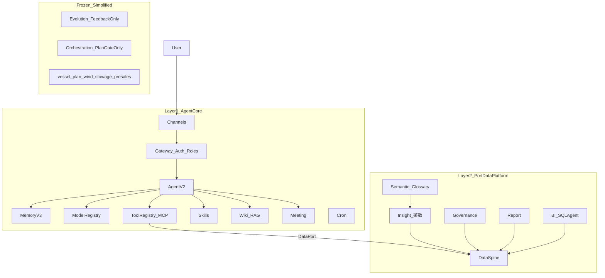

# TARS 港航垂直 Agent 两层架构设计

> 日期：2026-06-19
> 状态：设计已确认，待用户 review 后写实施计划
> 决策性质：**架构重整** —— 从「功能堆叠的单体」收敛为「Layer1 Agent Core + Layer2 Port Data Platform」
> 上游决策：
> - `docs/superpowers/specs/2026-06-18-argus-tars-fusion-strategy.md`（Argus 融入 TARS）
> - `docs/superpowers/specs/2026-06-18-governance-into-tars-design.md`（治理模块，Layer2 首批）
> - `docs/superpowers/specs/2026-05-20-insightforge-ins-2-redesign.md`（鉴数/问数，Layer2 核心）

---

## 〇、背景与问题

TARS 最初定位为**港航企业内网 AI Agent 平台**，但在迭代中积累了大量实验性功能（配载、船舶计划、售前、自进化、多 Agent DAG 等），与「Agent 核心 + 港航数据平台」的初期定位产生偏离。

**当前结构性问题**（已核实）：

| 问题 | 表现 | 影响 |
|------|------|------|
| 组合根膨胀 | `main.py` ~1700 行，所有模块 imperative 初始化 | 改一处牵全局，难以理解边界 |
| 全局单例耦合 | `tool_registry`、`module_registry` 被业务层直接 mutate | Layer2 工具注册侵入 Layer1 |
| 数据层互相 import | `report/service.py` → `governance/datasource_adapter.py` | Layer2 子模块耦合，无共享脊柱 |
| Schema 归属混乱 | insight migrations 写在 `database/connection.py` 内 | 核心 DB init 反向依赖业务模块 |
| 配置/registry 漂移 | `modules.yaml` 与 `registry.py` 核心模块列表不一致 | `knowledge` 为 phantom core |
| 前端导航扁平 | LeftPanel 17 项平铺，Agent 与数据平台未分组 | 产品叙事不清晰 |

**本设计目标**：在**保留现有 TARS 生产能力**的前提下，通过两层边界 + Port 接口 + 模块裁剪，让 TARS 重新对齐「港航垂直领域 Agent 核心」定位。

---

## 一、产品定位

### 1.1 一句话

**TARS = 港航企业内网的 Agent 核心（Layer1）+ 业务数据平台（Layer2）**

- **Layer1** 回答：「这个 Agent 怎么对话、记忆、选模型、调工具、开会、查 Wiki？」
- **Layer2** 回答：「港航业务数据从哪来、怎么理解、怎么问、怎么治理、怎么出报表？」

### 1.2 与现有五层架构的关系

TARS 文档中的 Channels / Gateway / Agent / Model / Execution 五层是 **Layer1 内部运行时视图**，本设计不废弃，仅在上层增加产品叙事：

```
对外（产品/客户）：Layer1 Agent Core  │  Layer2 Port Data Platform
对内（运行时）：   Channels → Gateway → Agent → Model → Execution
```

### 1.3 与 Argus 融合的关系

Argus 融合（governance + report + insight 鉴数）**即 Layer2 的落地路径**，不是平行项目。本设计在融合战略之上补充：

1. 明确的 Layer1/Layer2 边界与 Port 契约
2. 新增 `semantic/` 模块作为港航行业深度第一站
3. 裁剪实验模块，简化 evolution/orchestration

---

## 二、已确认的设计决策

| 决策项 | 选择 | 理由 |
|--------|------|------|
| 落地策略 | **渐进式 Port 重构**（方案 A） | 保留单体部署，风险可控，不打断 Argus 融合 |
| 裁剪范围 | 冻结 `vessel_plan` / `wind_stowage` / `presales`；简化 `evolution` / `orchestration` | 聚焦 Agent 核心 + 数据平台 |
| 行业深度（Phase 1） | **语义层 + 业务术语库** | 复用 insight forge/profile，不做重型 ontology |
| 数据脊柱 | 一个 `datasource_id` 贯穿问数/治理/报表/术语 | 延续 Argus 融合防割裂硬指标 |
| 前端 | LeftPanel 两组导航；governance/report API 统一 auth 拦截器 | 产品叙事 + 技术债清理 |

---

## 三、目标架构



### 3.1 层间依赖规则（硬约束）

| 规则 | 说明 |
|------|------|
| Layer2 → Layer1 | **允许**：通过 `DataPort` / `ToolContributor` 向 Agent 暴露能力；通过 Gateway 鉴权 |
| Layer1 → Layer2 | **禁止**：Agent/Memory/Tools 核心代码不得 import governance/report/insight 实现 |
| Layer2 内部 | **禁止**子模块互相 import；共享逻辑提升到 `data/spine.py` |
| 数据库 | Phase 0 仍共用 `Database` facade；Phase 1+ 各模块自持 migration，禁止在 `connection.py` 内 import 业务模块 |

---

## 四、Layer1：Agent Core

### 4.1 保留模块

| 模块 | 路径 | 职责 |
|------|------|------|
| Agent 循环 | `backend/tars/agent/` | 对话、子 Agent、handoff、slash commands |
| 记忆 | `backend/tars/memory/` | Core / Archival / Reflector / Scheduler |
| 工具 | `backend/tars/tools/` + `backend/tars/mcp/` | ToolRegistry、Dispatcher、MCP |
| 模型 | `backend/tars/models/` | Provider 插件、fallback、切换 API |
| Skills | `backend/tars/skills/` | 技能加载、路由、执行 |
| Wiki | `backend/tars/wiki/` | 知识库 + RAG |
| 会议 | `backend/tars/meeting/` | 会议助手 |
| Gateway | `backend/tars/gateway/` | JWT、Role Templates、模块 ACL |
| Cron | `backend/tars/cron/` | 定时任务 |
| Channels | `backend/tars/channels/` | WebSocket、出站路由 |

### 4.2 简化 / 冻结

#### Evolution → Feedback Only

| 保留 | 冻结 |
|------|------|
| `feedback_collector`（insight 采纳/👍👎） | `personality_optimizer` |
| insight adoption 降级逻辑 | `case_distiller` |
| | `memory_feedback_bridge` 复杂路径（保留最小桥接） |

配置：`backend/config/evolution.yaml` 新增 `mode: feedback_only`，默认关闭自进化路由。

#### Orchestration → Plan Gate Only

| 保留 | 冻结 |
|------|------|
| `plan_gate`（Superpowers） | `multi_agent_orchestrator` DAG |
| 简单 verification gate | 复杂 PDCA 多 Agent 编排 UI |

孪生 workflow **将来**在 orchestration 上扩展，本阶段不新建 Worker。

#### 冻结实验模块

| 模块 | 动作 |
|------|------|
| `vessel_plan` | `modules.yaml` 默认 `enabled: false`；代码移 `backend/tars/_archived/vessel_plan/` |
| `wind_stowage` | 同上 |
| `presales` | 同上 |

路由保留但默认不可达；role template 移除对应 `allowed_modules` 默认值。

### 4.3 Layer1 对外契约

新建 `backend/tars/core/ports.py`：

```python
from typing import Protocol

class DataPort(Protocol):
    """Layer2 暴露给 Layer1 的数据能力抽象。"""

    async def list_datasources(self, tenant_id: str) -> list[DataSourceSummary]: ...
    async def fetch_rows(
        self,
        datasource_id: str,
        *,
        table: str | None = None,
        sql: str | None = None,
        max_rows: int = 10_000,
    ) -> ResultSet: ...
    async def ask_metric(
        self, tenant_id: str, question: str, datasource_id: str
    ) -> MetricAnswer: ...


class ToolContributor(Protocol):
    """Layer2 模块向 Agent 注册工具的规范入口。"""

    module_name: str

    def register_tools(self, registry: ToolRegistry, ports: DataPort) -> None: ...
    def register_routes(self, app: FastAPI, db: Database) -> None: ...


class LayerBootstrap(Protocol):
    """模块/bootstrap 统一生命周期。"""

    def init(self, app: FastAPI, db: Database, deps: BootstrapDeps) -> None: ...
```

**迁移要求**：Insight 的 8 个 `insight_*` 工具（`insight/agent_tools.py`）改为实现 `ToolContributor`，由 `bootstrap/layer2.py` 调用，**禁止**在 `main.py` 直接 `init_insight_agent_tools()`。

### 4.4 Bootstrap 拆分

```
backend/tars/bootstrap/
├── deps.py          # BootstrapDeps 数据类（db, agent, tool_registry, ...）
├── layer1.py        # Agent core 初始化顺序
└── layer2.py        # Data platform 初始化 + ToolContributor 注册
```

`main.py` 终态目标：**< 200 行**，只做 app 创建 + 调用 `bootstrap_layer1()` + `bootstrap_layer2()`。

---

## 五、Layer2：Port Data Platform

### 5.1 能力映射

| 用户能力 | TARS 模块 | 状态 | API 前缀 |
|----------|-----------|------|----------|
| 数据接入 | `bi` + `database/bi_store` | 已有 | `/api/datasources`, `/api/bi` |
| Schema 理解 / 关系推断 | `insight` profile/forge | 已有 | `/api/insight` |
| 业务术语 / 字段语义 | **`semantic/`（新增）** | 待建 | `/api/semantic` |
| SQL 编辑 / NL2SQL | `bi` SQLAgent | 已有 | `/api/bi` |
| 问数 / 口径沉淀 | `insight` MetricQaEngine | 已有 | `/api/insight` |
| 数据治理 | `governance` | 进行中 | `/api/governance` |
| 数据报表 | `report` | 进行中 | `/api/report` |
| 口径 → 知识库 | insight adoption + wiki | 已有 | insight + wiki |

### 5.2 DataSpine（共享数据脊柱）

**问题**：`governance/datasource_adapter.fetch_rows` 被 report 直接 import，形成 Layer2 子模块耦合。

**方案**：提升到 `backend/tars/data/`：

```
data/
├── __init__.py
├── models.py        # DataSourceSummary, ResultSet, SchemaInfo
├── spine.py         # fetch_rows, get_schema, list_tables
└── connection.py    # 封装 bi_store + SQLAgent 只读查询
```

**接口签名**（与 governance 适配层兼容，便于平移）：

```python
def fetch_rows(
    datasource_id: str,
    *,
    table: str | None = None,
    sql: str | None = None,
    max_rows: int = 10_000,
    tenant_id: str | None = None,
) -> ResultSet:
    """返回 {rows, column_names, truncated}；只读 SELECT；table/sql 互斥。"""
```

**迁移顺序**：
1. 复制 `governance/datasource_adapter.py` → `data/spine.py`
2. governance/report/insight 改 import 路径
3. `governance/datasource_adapter.py` 变为 thin re-export（deprecated，下一版本删除）

### 5.3 Semantic Layer（港航行业深度 Phase 1）

**位置**：`backend/tars/semantic/`（Layer2 子包）

**不做**：完整 RDF/OWL 本体、自动血缘图、dbt 工程集成

**做**：
- 港航业务术语库（glossary）：泊位、TEU、在港时长、吞吐量等
- 字段→术语/口径绑定（field_semantics）：挂 insight profile 产出
- 预置 seed catalog（`catalog.py`）：可覆盖的初版术语，业务方后续扩充
- MetricQaEngine RAG 检索增强：问数时优先匹配已确认术语

```
semantic/
├── __init__.py
├── models.py           # GlossaryTerm, FieldSemantic, TermBinding
├── catalog.py          # PORT_GLOSSARY_SEED（~30-50 常用术语）
├── glossary.py         # 术语 CRUD 业务逻辑
├── field_semantics.py  # 字段绑定 + forge 建议
├── repository.py
├── service.py
└── api/router.py       # /api/semantic/*
```

**数据模型**：

| 表 | 用途 | 关键列 |
|----|------|--------|
| `glossary_terms` | 术语定义 | id, term, definition, domain(port/vessel/container/...), aliases_json, user_id |
| `field_semantics` | 字段绑定 | id, datasource_id, table_name, column_name, term_id, confidence, status(suggested/confirmed), user_id |

**与 insight 集成流程**：

```
insight forge/profile 完成
  → semantic.field_semantics.suggest_from_profile(profile)
  → Insight 工作台展示「建议术语映射」
  → 用户确认 → status=confirmed
  → MetricQaEngine.ask() 检索 glossary + field_semantics 增强 prompt
```

**Agent 工具（Phase 2 可选）**：`semantic_lookup_term`、`semantic_list_glossary` 注册为 Layer2 ToolContributor，供 Chat 直接查术语。

### 5.4 模块包结构规范

Layer2 所有模块统一四层：

```
{module}/
├── api/router.py       # FastAPI 路由，Depends(require_module)
├── service.py          # 业务编排
├── repository.py       # 数据访问
└── models.py           # @dataclass / Pydantic
```

新增表：**模块自持 migration 函数**，在 `bootstrap/layer2.py` 注册到 central migrator，**禁止**在 `connection.py` 内 `import insight.migrations`。

---

## 六、模块注册与配置

### 6.1 modules.yaml 目标结构

```yaml
modules:
  core:
    agent: true
    memory: true
    tools: true
    skills: true
    wiki: true
    meeting: true
    auth: true
    security: true
  optional:
    bi:
      enabled: true
      layer: 2
    insight:
      enabled: true
      layer: 2
      requires: [bi, wiki]
    semantic:
      enabled: true
      layer: 2
      requires: [bi, insight]
    governance:
      enabled: true
      layer: 2
      requires: [bi]
    report:
      enabled: true
      layer: 2
      requires: [bi]
    orchestration:
      enabled: true
      layer: 1
      mode: plan_gate_only
    # 冻结
    vessel_plan:
      enabled: false
      deprecated: true
    wind_stowage:
      enabled: false
      deprecated: true
    presales:
      enabled: false
      deprecated: true
```

### 6.2 registry.py 对齐

- 移除 phantom `knowledge` core；wiki 承担知识能力
- `CORE_MODULES` 与 YAML core 列表一致
- 新增 `get_modules_by_layer(layer: 1 | 2)` 供前端/role template 使用

### 6.3 Role Templates 更新

`gateway/role_template.py` 中 `allowed_modules` 按 layer 分组文档化：

| 角色 | Layer1 | Layer2 |
|------|--------|--------|
| `admin` | 全部 | 全部 |
| `insight_analyst` | chat, memory, wiki | insight, semantic |
| `business_analyst` | chat, memory, wiki, meeting | insight, semantic, report |
| `analyst` | chat, memory, tools | bi, insight, governance, report, semantic |
| `standard` | 基础 | bi, insight |

---

## 七、前端

### 7.1 导航分组

`frontend/src/components/layout/LeftPanel.vue`：

**Agent 核心**
- Chat · Memory · Models · Tools · Wiki · Meeting · Settings

**数据平台**
- BI · 鉴数(Insight) · 治理 · 报表 · 术语库(Semantic)

实现：`navItems` 增加 `group: 'core' | 'data'` 字段，渲染时分组 + 分隔线。

### 7.2 新页面

| 路由 | 视图 | module meta |
|------|------|-------------|
| `/semantic` | `SemanticView.vue` | `semantic` |

功能 MVP：术语列表、按 domain 筛选、字段绑定查看、forge 建议确认。

### 7.3 API 客户端统一

`governance.ts` / `report.ts` 独立 axios 实例 → 合并到 `api/index.ts` 或共用 `createApiClient()` factory，确保 auth 拦截器一致。

---

## 八、开源参考与方法论

### 8.1 Layer1 参考

| 项目 | 借鉴 | TARS 现状 |
|------|------|-----------|
| [OpenClaw](https://github.com/openclaw/openclaw) | 五层 Agent、workspace | 已采用 |
| [Letta](https://github.com/letta-ai/letta) | 分层记忆 | Memory V3 已实现 |
| Spring AI | ChatMemory、Tool、MCP Protocol | Port 接口设计参考 |

### 8.2 Layer2 参考

| 项目 | 借鉴 | TARS 对应 |
|------|------|-----------|
| [Spring AI Alibaba DataAgent](https://github.com/spring-ai-alibaba/dataagent) | StateGraph 分析流、RAG 元数据、Human-in-the-loop | insight workflow + adoption |
| [DB-GPT](https://github.com/eosphoros-ai/DB-GPT) | Agent + 数据分析一体 | bi + insight |
| [DB-GPT-Hub](https://github.com/eosphoros-ai/db-gpt-hub) | Text-to-SQL 评估基准 | SQLAgent eval |
| [Databao Agent](https://github.com/jetbrains/databao-agent) | Governed semantic layer | semantic/ + insight |
| Great Expectations | 数据质量期望 | governance builtin rules |

### 8.3 标准与方法论

| 标准 | 应用 |
|------|------|
| **MCP** | Layer1 工具互操作（已有） |
| **DAMA DMBOK** | 治理域划分：质量、元数据、血缘（血缘 Phase 2+） |
| **Semantic Layer 模式** | 维度 / 指标 / 口径三层 = insight metrics + semantic glossary |
| **Repository Pattern** | Layer2 统一 api → service → repository |
| **Port/Adapter** | Layer 边界 = `DataPort` + `ToolContributor` |

---

## 九、迁移阶段

### Phase 0：边界定义（~1 周）

**目标**：建立 Port 契约与 bootstrap 分层，不改动业务行为。

| 任务 | 产出 |
|------|------|
| 新建 `core/ports.py` | DataPort、ToolContributor 协议 |
| 新建 `data/spine.py` | fetch_rows 从 governance 提升（governance 保留 re-export） |
| 新建 `bootstrap/layer1.py` + `layer2.py` | 从 main.py 提取 init |
| 瘦身 `main.py` | < 500 行（Phase 0 目标，终态 < 200） |
| 对齐 modules.yaml / registry.py | 消除 knowledge phantom |
| 冻结实验模块 | vessel_plan / wind_stowage / presales 默认 off |

**验收**：全部现有测试绿；无功能行为变更。

### Phase 1：Layer2 脊柱统一（~1-2 周）

**目标**：完成 Argus 治理落地 + DataSpine 统一。

| 任务 | 产出 |
|------|------|
| governance/report → `data.spine` | 去除 cross-import |
| governance Vue 页完善 | Argus 阶段 1 完成 |
| insight migrations 迁出 connection.py | 模块自持 migration |
| semantic 模块骨架 | 空 router + module 注册 |

**验收**：同一 datasource_id 在 governance check + insight list 可用；governance 测试绿。

### Phase 2：Semantic Layer MVP（~1-2 周）

| 任务 | 产出 |
|------|------|
| glossary CRUD + seed catalog | ~30 港航术语 |
| forge 术语建议 + 确认流 | Insight 工作台集成 |
| MetricQaEngine RAG 接入 | 问数引用术语定义 |
| SemanticView.vue | `/semantic` 路由 |

**验收**：forge 完成后出现术语建议；确认后 ask 回答含术语定义引用。

### Phase 3：四模块联动 + 报表（~1-2 周）

| 任务 | 产出 |
|------|------|
| Report Vue3 + ECharts | Argus 阶段 2 |
| insight 荐图 → report | chart type 推荐 |
| 四模块串联验收 | datasource 贯穿 ask/govern/report/semantic |
| 前端导航分组 | LeftPanel 两组 |

**验收硬指标**（延续 Argus 融合）：

> 一个 datasource 建好后，能在报表画图、治理配规则、鉴数问数、术语库查字段含义——同一个 `datasource_id` 贯穿全平台。

### Phase 4：Layer1 收敛（可与 Phase 1-3 并行）

| 任务 | 产出 |
|------|------|
| Evolution feedback_only 模式 | config + 路由隐藏 |
| Orchestration plan_gate_only | DAG UI/API 标记 deprecated |
| ToolContributor 全面替换 | insight tools 不再 direct registry |
| `_archived/` 迁移 | 实验模块代码归档 |

---

## 十、测试策略

### 10.1 层隔离测试

```python
# tests/test_layer_boundaries.py
FORBIDDEN_LAYER2_IMPORTS_IN_LAYER1 = [
    "tars.governance.engine",
    "tars.report.service",
    "tars.insight.metric_qa_engine",
]

FORBIDDEN_LAYER1_IMPORTS_IN_LAYER2 = [
    "tars.agent.agent",
    "tars.memory.manager",
]
```

CI 静态检查：Layer2 包内不得 import Layer1 agent/memory 实现（gateway/auth 除外）。

### 10.2 脊柱集成测试

```python
async def test_datasource_spine_end_to_end(datasource_id):
    # 1. insight list sources 含 datasource_id
    # 2. governance create rule + run check
    # 3. report execute chart
    # 4. semantic list field_semantics for datasource
```

### 10.3 回归

- 现有 169+ backend tests 每 Phase 保持绿
- 新增：semantic、governance、report、layer_boundaries 测试

---

## 十一、风险与缓解

| 风险 | 严重度 | 缓解 |
|------|--------|------|
| main.py 动刀引发回归 | 高 | 分 PR；Phase 0 只做提取不改行为；每步 pytest |
| insight migrations 耦合 | 中 | Phase 1 优先迁出；迁移函数签名不变 |
| 港航术语 seed 不足 | 中 | catalog.py 可配置；业务方提供 CSV import 接口（Phase 2） |
| 前端 API 分裂 | 低 | Phase 3 统一 axios factory |
| 目录大搬家诱惑 | 中 | 坚持方案 A，layer1/layer2 目录为 Phase 4+ 可选 |

**回退基线**：`v5.2.0-pre-fusion` tag；每 Phase 打 tag（`v5.3.0-layer0` 等）。

---

## 十二、明确不做（YAGNI）

| 项 | 原因 | 何时 reconsider |
|----|------|-----------------|
| 物理分包 tars-core + tars-port-data | 当前单体部署足够 | 边界稳定 2-3 sprint 后 |
| 完整港航 ontology / 知识图谱 | Phase 1 语义层已够 | 有明确血缘/推理需求时 |
| 血缘追踪 | OpenMetadata 级复杂度 | Phase 3+ 四模块联动完成后 |
| 重建 Agent 内核 | Memory V3 + ToolDispatcher 已成熟 | 无 |
| CSV/Excel 连接器 | Argus 融合遗留项 | Layer2 脊柱稳定后 |
| 孪生 workflow | 用户未定义 | orchestration 简化完成后 |

---

## 十三、目录结构终态（方案 A）

```
backend/tars/
├── bootstrap/
│   ├── deps.py
│   ├── layer1.py
│   └── layer2.py
├── core/
│   └── ports.py
├── data/                    # Layer2 共享脊柱
│   ├── models.py
│   ├── spine.py
│   └── connection.py
├── agent/                   # Layer1（现有路径，渐进归类）
├── memory/
├── tools/
├── models/
├── skills/
├── wiki/
├── meeting/
├── gateway/
├── cron/
├── channels/
├── bi/                      # Layer2
├── insight/
├── semantic/                # Layer2 新增
├── governance/
├── report/
├── _archived/               # 冻结模块
│   ├── vessel_plan/
│   ├── wind_stowage/
│   └── presales/
└── main.py                  # 薄 composition root
```

---

## 十四、下一步

1. **用户 review 本 spec** — 确认无遗漏/矛盾
2. **Invoke writing-plans** — 生成 Phase 0 详细 implementation plan
3. **Phase 0 实施** — bootstrap + ports + spine 提取，测试绿后进 Phase 1

---

## 附录 A：当前 vs 目标对照

| 维度 | 当前 | 目标 |
|------|------|------|
| 产品叙事 | 17 个平铺功能 | Layer1 Agent + Layer2 Data |
| main.py | ~1700 行 | < 200 行 |
| 工具注册 | main.py direct inject | ToolContributor |
| 数据取数 | governance adapter 被 report import | data.spine 共享 |
| 行业深度 | insight profile only | + semantic glossary |
| 实验模块 | 默认 enabled | 默认 frozen |
| evolution | 全功能 | feedback_only |
| orchestration | DAG + plan_gate | plan_gate_only |

## 附录 B：相关文档索引

| 文档 | 关系 |
|------|------|
| `2026-06-18-argus-tars-fusion-strategy.md` | Layer2 战略上游 |
| `2026-06-18-governance-into-tars-design.md` | Phase 1 治理细节 |
| `2026-05-20-insightforge-ins-2-redesign.md` | 鉴数/问数设计 |
| `2026-05-24-data-copilot-phase1-design.md` | 数据 Copilot 历史 |
| `docs/02-技术方案/architecture/system-overview.md` | Layer1 五层运行时 |
